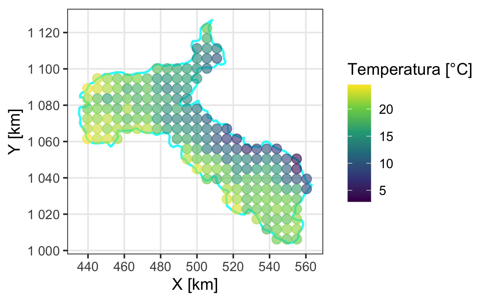
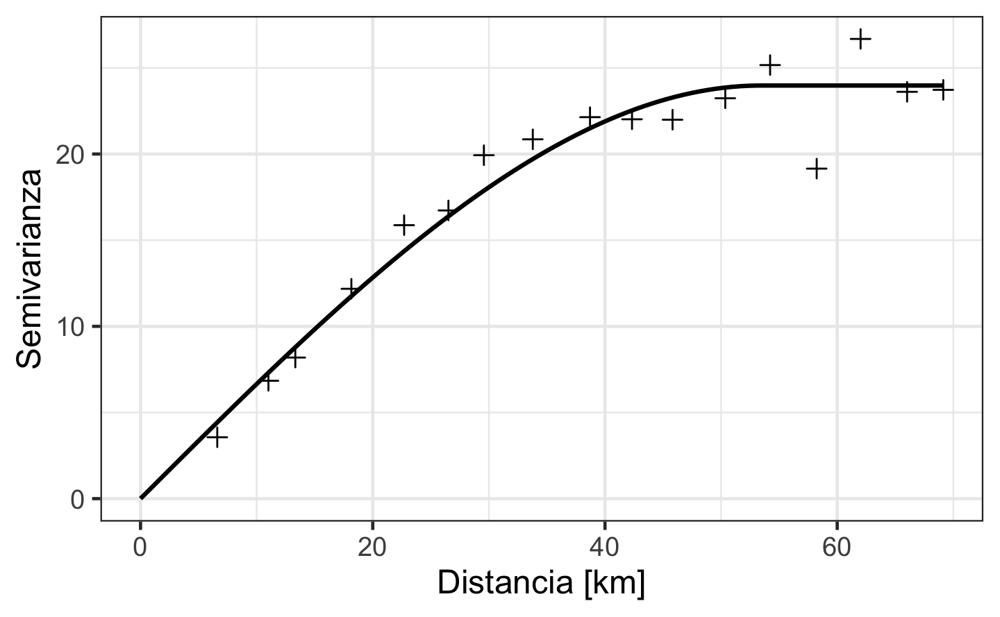

# Introducción

Este material extra muestra todo el código en **R** [@R-base] que se usó en la sección Análisis geoestadístico del artículo principal. Se limita únicamente a la explicación básica de cuál código se usó para qué, y de cómo se usa. Para la base teórica, interpretación y análisis se remite al lector al artículo principal.

# Análisis geoestadístico {#geostats-analisis}

Se va a hacer uso del paquete **gstat** [@R-gstat; @gstat2004; @gstat2016] para la parte geoestadística, y para la manipulación de los datos se usan **dplyr** [@R-dplyr], **tidyr** [@R-tidyr] y **broom** [@R-broom], para los gráficos se usa **ggplot2** [@R-ggplot2; @ggplot22016], para las tablas se usa **kableExtra** [@R-kableExtra], y para la creación y manipulación de objetos espaciales se usan **sf** [@R-sf; @sf2018], **sp** [@R-sp; @sp2005; @sp2013], y **stars** [@R-stars].

## Análisis Exploratorio de Datos

Los datos se encuentran en forma de documento de texto y con formato Geopackage. Para importar los datos ("clima_SJ_tidy.csv") en el objeto denominado `datos` (un data frame) se usa la función `import()` del paquete **rio** [@R-rio]. Como aquí se trabaja desde un proyecto de **R** (que es recomendado) se usa el paquete **here** [@R-here] para hacer referencia a archivos dentro del sistema de archivos del proyecto. Se usa la función `here()` donde la dirección del archivo a buscar se separa en sus partes por comas, donde en este caso busca en la carpeta "data" el archivo "clima_SJ_tidy.csv". Esto hace que sea más fácil de usar en diferentes computadoras con diferentes sistemas operativos.

La tabla contiene 5 columnas: "Lat", "Long", "TempC", "HumedadSuelo", "HumedadRelativa", donde las dos primeras corresponden con las coordenadas y el resto corresponden con variables que puede ser de interés, donde en este caso se analizará la temperatura. Para mayor facilidad se define la variable en un objeto `myvar`, que podrá ser reutilizado.

Se puede obtener un resumen estadístico de la variable por medio de la función `descr()` del paquete **summarytools** [@R-summarytools], el cual es trabajado para mostrar solo lo necesario. El Cuadro \@ref(tab:AED) se genera con la función `kable()` del paquete **kableExtra**, donde se pueden modificar aspectos como los nombres de las columnas, la cantidad de dígitos a usar, el alineado de las columnas, y el encabezado de la tabla. Adicionalmente se guarda la varianza de la variable en el objeto `S`.


```r
datos = import(here('data','clima_SJ_tidy.csv'), setclass = 'tbl')

myvar = 'TempC' # variable a modelar
myvar.lab = 'Temperatura [°C]'

descr(datos[myvar],style = 'rmarkdown',transpose = T) %>% 
  select(-c(5,7,10,12,13,15)) %>% 
  relocate(N.Valid) %>% 
  kable(col.names = c('N','Media','Desv. Est.','Min','Mediana',
                      'Max','MAD','CV','Asimetría'),
        digits = 2,
        # format = 'simple',
        align = 'c',
        caption = 'Resumen estadístico de los datos.') %>% 
  kable_styling(full_width = F)
```

<table class="table" style="width: auto !important; margin-left: auto; margin-right: auto;">
<caption>(\#tab:AED)Resumen estadístico de los datos.</caption>
 <thead>
  <tr>
   <th style="text-align:left;">   </th>
   <th style="text-align:center;"> N </th>
   <th style="text-align:center;"> Media </th>
   <th style="text-align:center;"> Desv. Est. </th>
   <th style="text-align:center;"> Min </th>
   <th style="text-align:center;"> Mediana </th>
   <th style="text-align:center;"> Max </th>
   <th style="text-align:center;"> MAD </th>
   <th style="text-align:center;"> CV </th>
   <th style="text-align:center;"> Asimetría </th>
  </tr>
 </thead>
<tbody>
  <tr>
   <td style="text-align:left;"> TempC </td>
   <td style="text-align:center;"> 178 </td>
   <td style="text-align:center;"> 16.96 </td>
   <td style="text-align:center;"> 4.39 </td>
   <td style="text-align:center;"> 2.9 </td>
   <td style="text-align:center;"> 14.1 </td>
   <td style="text-align:center;"> 20.1 </td>
   <td style="text-align:center;"> 4.23 </td>
   <td style="text-align:center;"> 5.95 </td>
   <td style="text-align:center;"> -0.73 </td>
  </tr>
</tbody>
</table>

```r
S = var(datos[[myvar]]) # varianza de la variable
S
```

```
## [1] 19.25791
```

```r
gg.hist = ggplot(datos, aes_string(myvar)) + 
  geom_histogram(aes(y = stat(density)), bins = 10, 
                 col = 'black', fill = 'orange') + 
  geom_vline(xintercept = mean(datos[[myvar]]), col = 'red', size=.75) +
  geom_density(col = 'blue', size=.75) +
  labs(x = myvar.lab, y = 'Densidad')
gg.hist
```

<div class="figure" style="text-align: center">

<p class="caption">(\#fig:AED)Histograma de la variable. La línea roja corresponde con la media, y la curva azul con la curva de densidad empírica.</p>
</div>

El histograma (Figura \@ref(fig:AED)) se construye con **ggplot2**, donde se remite al lector a consultar @garnier-villarreal2020 (Capítulo 4) para una guía de como usar este paquete de una forma más amplia. De manera general, hace uso de data frames (tablas) y sus variables de una forma directa, donde dependiendo de lo que se quiere graficar se emplean diferentes geomestrías (`geom_()*`), y tiene otra serie de funciones para personalizar el gráfico.

El primer paso es generar un objeto espacial. Para pasar los datos a formato espacial se usa la función `st_as_sf()` del paquete **sf**, donde se definen las columnas donde se ubican las coordenadas (`coords`, siempre primero 'x' y luego 'y'), y el sistema de referencia (`crs`). Para el 'crs' se usa el código *epsg* respectivo, en este caso 4326 para coordenadas geográficas, pero en caso de no tener se puede usar `NA`. Es recomendable trabajar en coordenadas planas por lo que se van a transformar con la función `st_transform()` que requiere del nuevo código *epsg* al cual se quiere transformar.

El resto de acciones son para pasos posteriores y no es necesario modificarlas. Se crean dos objetos espaciales, uno tipo **sf** y uno **sp** ya que a veces es necesario uno sobre otro, dependiendo de la función, pero en general se trabaja con el **sf**.


```r
datos_sf = st_as_sf(datos, coords = c('Long','Lat'), crs = 4326) %>% 
  st_transform(crs = 5367) %>% 
  mutate(X = st_coordinates(.)[,1], Y = st_coordinates(.)[,2]) %>% 
  relocate(X, Y)
datos_sp = as(datos_sf, 'Spatial')
coordnames(datos_sp) = c('X','Y')
```

Las distancias se determinan una vez se tiene el objeto espacial, usando `st_distance()` de **sf**. El resto del código es simple manipulación para obtener un vector con las distancias mínima, media, y máxima.


```r
dists = st_distance(datos_sf) %>% .[lower.tri(.)] %>% unclass()
distancias = signif(c(min(dists), mean(dists), max(dists)),3)/1000 # rango de distancias
names(distancias) = c('min', 'media', 'max') 
distancias
```

```
##    min  media    max 
##   5.48  53.20 142.00
```

Una forma de mostrar el área de influencia de los resultados es tener un polígono que encierra a los datos, ya que sería esta el área donde los resultados son realmente válidos. El siguiente código realiza el cálculo de dicho polígono, en caso de que no se tuviera.


```r
outline = st_convex_hull(st_union(datos_sf))
```

En este caso se tiene el polígono en el archivo `SJ.gpkg`, por lo que se puede importar de la siguiente forma:


```r
outline = st_read('data/SJ.gpkg',layer = 'SJ_poly')
```

```
## Reading layer `SJ_poly' from data source `/Users/maximiliano/Documents/UCR/Docencia/Extras/R/bookdown/intro_geostats/data/SJ.gpkg' using driver `GPKG'
## Simple feature collection with 1 feature and 1 field
## geometry type:  MULTIPOLYGON
## dimension:      XY
## bbox:           xmin: 434954.2 ymin: 1004025 xmax: 563136.4 ymax: 1126942
## CRS:            5367
```

La grilla a interpolar se crea con el siguiente código, generando objetos `stars` que son similares a objetos `raster` [@R-raster] pero más versátiles ya que permiten tener arreglos espaciales más complejos y diversos. Primeramente se genera una grilla regular (`datosint`) y a partir del polígono que encierra los datos (obtenido arriba) se recorta esta grilla en una grilla irregular (`datosint2`).


```r
bb = st_bbox(datos_sf)
dint = max(c(bb[3]-bb[1],bb[4]-bb[2])/nrow(datos_sf))
dx = seq(bb[1],bb[3],dint) # coordenadas x
dy = seq(bb[4],bb[2],-dint) # coordenadas y
st_as_stars(matrix(0, length(dx), length(dy))) %>%
  st_set_dimensions(1, dx) %>%
  st_set_dimensions(2, dy) %>%
  st_set_dimensions(names = c("X", "Y")) %>% 
  st_set_crs(st_crs(datos_sf)) -> datosint

datosint2 = st_crop(datosint, outline)
```

La distribución en el espacio de los datos se muestra en la Figura \@ref(fig:dist-espacial), donde los puntos se encuentran rellenados de acuerdo al valor de la variable (`aes_string(col = myvar)`), de nuevo haciendo uso de **ggplot2** y una geometría específica para datos **sf** (`geom_sf()`).


```r
gg.map.pts = ggplot() + 
  geom_sf(data = outline, col = 'cyan', alpha = .1, size = .75) + 
  geom_sf(data = datos_sf, aes_string(col = myvar), size = 3, alpha = 0.6) + 
  scale_color_viridis_c() + 
  scale_x_continuous(labels = scales::label_number(scale = 1/1000)) +
  scale_y_continuous(labels = scales::label_number(scale = 1/1000)) +
  labs(x = x_map, y = y_map, col = myvar.lab) +
  if (!is.na(st_crs(datos_sf))) {
    coord_sf(datum = st_crs(datos_sf))
  }
gg.map.pts
```

<div class="figure" style="text-align: center">

<p class="caption">(\#fig:dist-espacial)Mapa de puntos mostrando la distribución espacial de la variable.</p>
</div>

El siguiente código genera un mapa interactivo (que no se incluye en el artículo principal porque no se puede desplegar adecuadamente, pero se incluye aquí ya que el formato *html* sí permite interactividad). Para este mapa se usa el paquete **mapview** [@R-mapview] y para los colores se usa el paquete **RColorBrewer** [@R-RColorBrewer]. Consultar @garnier-villarreal2020 (Capítulo 6) para más información sobre el uso de **R** para datos espaciales.


```r
mapview(outline, alpha.regions = 0, layer.name='Borde', 
        homebutton = F, legend = F, native.crs = F) + 
  mapview(datos_sf, zcol = myvar, alpha=0.1, 
          layer.name = myvar, native.crs = F, 
          col.regions = brewer.pal(9,'YlOrRd'))
```

<!--html_preserve--><div id="htmlwidget-687444cc9da529419928" style="width:90%;height:296.64px;" class="leaflet html-widget"></div>
<script type="application/json" data-for="htmlwidget-687444cc9da529419928">{"x":{"options":{"minZoom":1,"maxZoom":52,"crs":{"crsClass":"L.CRS.EPSG3857","code":null,"proj4def":null,"projectedBounds":null,"options":{}},"preferCanvas":false,"bounceAtZoomLimits":false,"maxBounds":[[[-90,-370]],[[90,370]]]},"calls":[{"method":"addProviderTiles","args":["CartoDB.Positron",1,"CartoDB.Positron",{"errorTileUrl":"","noWrap":false,"detectRetina":false}]},{"method":"addProviderTiles","args":["CartoDB.DarkMatter",2,"CartoDB.DarkMatter",{"errorTileUrl":"","noWrap":false,"detectRetina":false}]},{"method":"addProviderTiles","args":["OpenStreetMap",3,"OpenStreetMap",{"errorTileUrl":"","noWrap":false,"detectRetina":false}]},{"method":"addProviderTiles","args":["Esri.WorldImagery",4,"Esri.WorldImagery",{"errorTileUrl":"","noWrap":false,"detectRetina":false}]},{"method":"addProviderTiles","args":["OpenTopoMap",5,"OpenTopoMap",{"errorTileUrl":"","noWrap":false,"detectRetina":false}]},{"method":"createMapPane","args":["polygon",420]},{"method":"addPolygons","args":[[[[{"lng":[-83.4251709,-83.43913269,-83.44835663,-83.46276093,-83.46788025,-83.47762299,-83.4870224,-83.49887085,-83.50758362,-83.5062027,-83.50833893,-83.51997375,-83.52071381,-83.51022339,-83.49619293,-83.4750824,-83.46897125,-83.46755219,-83.47570801,-83.49040222,-83.49075317,-83.49816132,-83.50788116,-83.5242691,-83.54562378,-83.55885315,-83.5716629,-83.60611725,-83.62271118,-83.64684296,-83.66568756,-83.67675781,-83.68863678,-83.70726776,-83.74076843,-83.74806976,-83.76328278,-83.78932953,-83.82296753,-83.85011292,-83.8531189,-83.85325623,-83.8427124,-83.85460663,-83.86547852,-83.87684631,-83.89051056,-83.90232849,-83.90550995,-83.92159271,-83.92951965,-83.93588257,-83.95448303,-83.97395325,-83.98332214,-83.99861145,-84.00624847,-84.00798798,-84.02768707,-84.04541779,-84.05895233,-84.07662964,-84.07836914,-84.07566833,-84.09763336,-84.11730957,-84.12888336,-84.14051056,-84.13729095,-84.13681793,-84.14195251,-84.15022278,-84.17167664,-84.18512726,-84.20336151,-84.2250824,-84.23861694,-84.25520325,-84.28321838,-84.30683136,-84.32398987,-84.33786011,-84.35562897,-84.37277222,-84.39608002,-84.40358734,-84.400383,-84.39521027,-84.4050827,-84.41703033,-84.43225861,-84.44243622,-84.44732666,-84.46417236,-84.48248291,-84.51381683,-84.53235626,-84.53938293,-84.55309296,-84.55808258,-84.55859375,-84.57348633,-84.58217621,-84.58705139,-84.58467102,-84.59282684,-84.58999634,-84.58318329,-84.559021,-84.5407486,-84.54737091,-84.56153107,-84.56674957,-84.56968689,-84.58686829,-84.58631134,-84.57576752,-84.56272125,-84.54852295,-84.54601288,-84.53463745,-84.52086639,-84.50501251,-84.49671936,-84.48242187,-84.47685242,-84.4626236,-84.44872284,-84.43073273,-84.40823364,-84.40766907,-84.3829422,-84.36929321,-84.35273743,-84.32833862,-84.30383301,-84.29058075,-84.26410675,-84.2470932,-84.23261261,-84.22528839,-84.21497345,-84.20007324,-84.18830109,-84.17677307,-84.1700592,-84.16520691,-84.1525116,-84.1447525,-84.1342926,-84.11916351,-84.11456299,-84.11157227,-84.10288239,-84.09571075,-84.08339691,-84.07745361,-84.0623703,-84.04714966,-84.0311203,-84.01822662,-84.01290131,-84.01027679,-84.01717377,-84.02279663,-84.02850342,-84.02594757,-84.02528381,-84.02097321,-84.00321198,-83.9912262,-83.98277283,-83.98209381,-83.98123932,-83.98188782,-83.9731369,-83.9553833,-83.94497681,-83.92482758,-83.92580414,-83.93060303,-83.94078827,-83.94243622,-83.93373108,-83.92825317,-83.92218781,-83.91108704,-83.89038086,-83.87463379,-83.86730194,-83.86656952,-83.86370087,-83.85668945,-83.86128235,-83.87921906,-83.88654327,-83.89565277,-83.90415192,-83.91448212,-83.93247986,-83.94732666,-83.96505737,-83.97976685,-83.99059296,-83.99742889,-83.99852753,-84.0111084,-84.02591705,-84.02734375,-84.01081085,-84.00084686,-83.99588776,-83.99597168,-84.0002594,-84.00485229,-84.01011658,-84.01418304,-84.02056122,-84.02433777,-84.0271225,-84.03752899,-84.05705261,-84.07579803,-84.08180237,-84.08022308,-84.08480072,-84.07411194,-84.05780029,-84.04042053,-84.027771,-84.00106049,-83.99360657,-83.98422241,-83.97640228,-83.97229004,-83.96101379,-83.94698334,-83.9462738,-83.9475174,-83.94376373,-83.93318176,-83.9224472,-83.91925049,-83.9140625,-83.90512848,-83.88996887,-83.88201904,-83.8711319,-83.86608124,-83.84912109,-83.84470367,-83.84480286,-83.83931732,-83.82640076,-83.81124115,-83.79994202,-83.78780365,-83.77342224,-83.76409912,-83.76708984,-83.76277924,-83.75541687,-83.74062347,-83.73612213,-83.72428131,-83.70359039,-83.69107056,-83.6750412,-83.66928101,-83.66190338,-83.65106964,-83.63858795,-83.62677765,-83.61638641,-83.59156799,-83.57274628,-83.55872345,-83.54547882,-83.52604675,-83.50376129,-83.48712158,-83.4845047,-83.48028564,-83.4781723,-83.46960449,-83.46008301,-83.4486084,-83.4358902,-83.4251709],"lat":[9.36912537,9.35048771,9.33493519,9.32074547,9.30920601,9.2897377,9.2804842,9.27236366,9.25952816,9.25326157,9.23159885,9.21538258,9.20936203,9.20034122,9.19441509,9.19468021,9.18043995,9.17207527,9.15025043,9.13545227,9.11473656,9.09863186,9.08997154,9.08232975,9.07995892,9.08980656,9.09516621,9.10924625,9.13190842,9.14296627,9.14876366,9.16797256,9.19526291,9.22627258,9.24968243,9.24078369,9.22267437,9.22707462,9.24417973,9.26656055,9.30039024,9.31689072,9.33967972,9.3447628,9.34537125,9.35346889,9.36780739,9.39269829,9.41001892,9.4134903,9.40547466,9.39510155,9.39160442,9.40908718,9.43224335,9.42883301,9.44393253,9.45258904,9.46736431,9.47619438,9.49713707,9.50416565,9.52422428,9.55880642,9.5678196,9.55949211,9.56338406,9.58107662,9.60726929,9.61238575,9.62395,9.62823009,9.63035679,9.62549496,9.61930466,9.63042736,9.6294632,9.62932014,9.63907242,9.6537447,9.64128304,9.64091206,9.64013386,9.63787556,9.64115334,9.62864685,9.62153244,9.60876656,9.59409809,9.578475,9.56156063,9.56999207,9.5839653,9.58171272,9.57822227,9.57738304,9.5828867,9.58570194,9.60213947,9.61971092,9.63860035,9.65470695,9.66377831,9.67685127,9.70062256,9.7241087,9.7535944,9.75797939,9.75682354,9.7729187,9.78354359,9.78316593,9.79772663,9.80605315999999,9.80559254,9.81881237,9.83049679,9.83067226,9.85235119,9.86051846,9.8752203,9.87919331,9.8949194,9.90083981,9.90752697,9.9133749,9.9224577,9.92163467,9.92512226,9.92992878,9.93144417,9.93121433,9.92768574,9.91763496,9.91859531,9.92645836,9.92741489,9.92963219,9.93609142,9.94727993,9.95557594,9.96455574,9.97125626,9.97067261,9.96768665,9.96487045,9.96380138,9.96264553,9.96525478,9.96883774,9.96684837,9.96397209,9.96495438,9.96698666,9.96958065,9.97141361,9.97457504,9.97438335,9.98049355,9.98992538,10.0046711,10.01951027,10.03458023,10.04428864,10.05253029,10.06258106,10.06894016,10.07765961,10.08617878,10.08726025,10.08998108,10.10071087,10.12082005,10.13464069,10.14782143,10.15915108,10.17163086,10.1776123,10.19165802,10.1897049,10.18011379,10.15398407,10.14978123,10.12813091,10.1027813,10.07865143,10.06935024,10.06151867,10.0472517,10.03215027,10.01567173,9.99835682,9.98384857,9.97472668,9.96914387,9.97224331,9.97499561,9.96576786,9.95709133,9.95360661,9.95650291,9.95422173,9.95202541,9.95083332,9.94704723,9.93142223,9.91668701,9.90638828,9.89165306,9.89389992,9.89356995,9.88800621,9.87990379,9.87079239,9.86196899,9.85582733,9.84972095,9.84025192,9.83475018,9.82597542,9.82029533,9.80566978,9.79646683,9.79510403,9.78135014,9.77192974,9.76651859,9.76546192,9.7695303,9.77017498,9.78619289,9.78939342,9.76505089,9.75387001,9.7467823,9.74198914,9.73576927,9.72049236,9.71055984,9.70496368,9.70405293,9.69714546,9.69033241,9.68777275,9.69221497,9.67733002,9.67334366,9.67183876,9.6746769,9.67183685,9.66415882,9.64525986,9.63131237,9.62176514,9.61857605,9.61318398,9.60991287,9.60408783,9.60524082,9.59225655,9.57707119,9.57247066,9.57197189,9.56099415,9.55801678,9.56308079,9.55712128,9.56746197,9.57841778,9.58462143,9.5861187,9.58165646,9.56787682,9.56305885,9.54783154,9.54324436,9.53762341,9.52688217,9.5100069,9.49981499,9.48510838,9.47318268,9.45391846,9.44892597,9.42870998,9.40832615,9.38610935,9.37689209,9.36912537]}]]],null,"Borde",{"crs":{"crsClass":"L.CRS.EPSG3857","code":null,"proj4def":null,"projectedBounds":null,"options":{}},"pane":"polygon","stroke":true,"color":"#333333","weight":1,"opacity":0.9,"fill":true,"fillColor":"#6666FF","fillOpacity":0,"smoothFactor":1,"noClip":false},"<html><head><link rel=\"stylesheet\" type=\"text/css\" href=\"lib/popup/popup.css\"><\/head><body><div class=\"scrollableContainer\"><table class=\"popup scrollable\" id=\"popup\"><tr class='coord'><td><\/td><td><b>Feature ID<\/b><\/td><td align='right'>1&emsp;<\/td><\/tr><tr class='alt'><td>1<\/td><td><b>NAME_1&emsp;<\/b><\/td><td align='right'>San José&emsp;<\/td><\/tr><tr><td>2<\/td><td><b>geom&emsp;<\/b><\/td><td align='right'>sfc_MULTIPOLYGON&emsp;<\/td><\/tr><\/table><\/div><\/body><\/html>",{"maxWidth":800,"minWidth":50,"autoPan":true,"keepInView":false,"closeButton":true,"closeOnClick":true,"className":""},"San José",{"interactive":false,"permanent":false,"direction":"auto","opacity":1,"offset":[0,0],"textsize":"10px","textOnly":false,"className":"","sticky":true},{"stroke":true,"weight":2,"opacity":0.9,"fillOpacity":0,"bringToFront":false,"sendToBack":false}]},{"method":"addScaleBar","args":[{"maxWidth":100,"metric":true,"imperial":true,"updateWhenIdle":true,"position":"bottomleft"}]},{"method":"createMapPane","args":["point",440]},{"method":"addCircleMarkers","args":[[10.15,10.1,10.05,10.05,10.05,10,10,10,9.95,9.95,9.95,9.95,9.95,9.95,9.9,9.9,9.9,9.9,9.9,9.9,9.9,9.9,9.9,9.9,9.9,9.85,9.85,9.85,9.85,9.85,9.85,9.85,9.85,9.85,9.85,9.85,9.8,9.8,9.8,9.8,9.8,9.8,9.8,9.8,9.8,9.8,9.8,9.75,9.75,9.75,9.75,9.75,9.75,9.75,9.75,9.75,9.75,9.75,9.75,9.7,9.7,9.7,9.7,9.7,9.7,9.7,9.7,9.7,9.7,9.7,9.7,9.7,9.65,9.65,9.65,9.65,9.65,9.65,9.65,9.65,9.65,9.65,9.65,9.65,9.65,9.65,9.65,9.6,9.6,9.6,9.6,9.6,9.6,9.6,9.6,9.6,9.6,9.6,9.55,9.55,9.55,9.55,9.55,9.55,9.55,9.55,9.55,9.55,9.5,9.5,9.5,9.5,9.5,9.5,9.5,9.5,9.5,9.5,9.5,9.5,9.45,9.45,9.44999999999999,9.45,9.45,9.45,9.45,9.44999999999999,9.45,9.45,9.45,9.4,9.4,9.4,9.4,9.4,9.4,9.4,9.4,9.4,9.4,9.4,9.35,9.35,9.35,9.35,9.35,9.35,9.35,9.35,9.35,9.3,9.3,9.3,9.3,9.3,9.3,9.3,9.3,9.25,9.25,9.25,9.25,9.25,9.25,9.25,9.2,9.2,9.2,9.2,9.2,9.15,9.15,9.15,9.15,9.1,9.1,9.1],[-83.95,-83.95,-84,-83.95,-83.9,-84,-83.95,-83.9,-84.2,-84.15,-84.1,-84.05,-84,-83.95,-84.5,-84.45,-84.4,-84.35,-84.3,-84.25,-84.2,-84.15,-84.1,-84.05,-84,-84.55,-84.5,-84.45,-84.4,-84.35,-84.3,-84.25,-84.2,-84.15,-84.1,-84.05,-84.55,-84.5,-84.45,-84.4,-84.35,-84.3,-84.25,-84.2,-84.15,-84.1,-84.05,-84.55,-84.5,-84.45,-84.4,-84.35,-84.3,-84.25,-84.2,-84.15,-84.1,-84.05,-84,-84.55,-84.5,-84.45,-84.4,-84.35,-84.3,-84.25,-84.2,-84.15,-84.1,-84.05,-84,-83.95,-84.55,-84.5,-84.45,-84.4,-84.35,-84.3,-84.25,-84.2,-84.15,-84.1,-84.05,-84,-83.95,-83.9,-83.85,-84.55,-84.5,-84.45,-84.4,-84.1,-84.05,-84,-83.95,-83.9,-83.85,-83.8,-84.05,-84,-83.95,-83.9,-83.85,-83.8,-83.75,-83.7,-83.65,-83.6,-84.05,-84,-83.95,-83.9,-83.85,-83.8,-83.75,-83.7,-83.65,-83.6,-83.55,-83.5,-84,-83.95,-83.9,-83.85,-83.8,-83.75,-83.7,-83.65,-83.6,-83.55,-83.5,-83.95,-83.9,-83.85,-83.8,-83.75,-83.7,-83.65,-83.6,-83.55,-83.5,-83.45,-83.85,-83.8,-83.75,-83.7,-83.65,-83.6,-83.55,-83.5,-83.45,-83.85,-83.8,-83.75,-83.7,-83.65,-83.6,-83.55,-83.5,-83.8,-83.75,-83.7,-83.65,-83.6,-83.55,-83.5,-83.7,-83.65,-83.6,-83.55,-83.5,-83.65,-83.6,-83.55,-83.5,-83.6,-83.55,-83.5],6,null,"TempC",{"crs":{"crsClass":"L.CRS.EPSG3857","code":null,"proj4def":null,"projectedBounds":null,"options":{}},"pane":"point","stroke":true,"color":"#333333","weight":2,"opacity":[0.1,0.1,0.1,0.1,0.1,0.1,0.1,0.1,0.1,0.1,0.1,0.1,0.1,0.1,0.1,0.1,0.1,0.1,0.1,0.1,0.1,0.1,0.1,0.1,0.1,0.1,0.1,0.1,0.1,0.1,0.1,0.1,0.1,0.1,0.1,0.1,0.1,0.1,0.1,0.1,0.1,0.1,0.1,0.1,0.1,0.1,0.1,0.1,0.1,0.1,0.1,0.1,0.1,0.1,0.1,0.1,0.1,0.1,0.1,0.1,0.1,0.1,0.1,0.1,0.1,0.1,0.1,0.1,0.1,0.1,0.1,0.1,0.1,0.1,0.1,0.1,0.1,0.1,0.1,0.1,0.1,0.1,0.1,0.1,0.1,0.1,0.1,0.1,0.1,0.1,0.1,0.1,0.1,0.1,0.1,0.1,0.1,0.1,0.1,0.1,0.1,0.1,0.1,0.1,0.1,0.1,0.1,0.1,0.1,0.1,0.1,0.1,0.1,0.1,0.1,0.1,0.1,0.1,0.1,0.1,0.1,0.1,0.1,0.1,0.1,0.1,0.1,0.1,0.1,0.1,0.1,0.1,0.1,0.1,0.1,0.1,0.1,0.1,0.1,0.1,0.1,0.1,0.1,0.1,0.1,0.1,0.1,0.1,0.1,0.1,0.1,0.1,0.1,0.1,0.1,0.1,0.1,0.1,0.1,0.1,0.1,0.1,0.1,0.1,0.1,0.1,0.1,0.1,0.1,0.1,0.1,0.1,0.1,0.1,0.1,0.1,0.1,0.1],"fill":true,"fillColor":["#E7221E","#F94728","#FD913D","#FC8138","#FD9640","#FC7D37","#FDA144","#FEBC56","#EC2D21","#F74427","#FC542B","#FC5D2E","#FC7836","#FDA646","#B40026","#CD0B21","#DE161D","#DE161D","#DB141D","#EC2D21","#FC6630","#FC7434","#FC582D","#FC5D2E","#FC6A32","#A70026","#B40026","#C80723","#DB141D","#F94728","#F33C25","#E8261F","#FC5D2E","#FD933E","#FC8138","#FC6F33","#C50523","#E8261F","#FC542B","#EE3122","#E7221E","#F54026","#EA2920","#F94728","#FC4F2A","#FC863A","#FC8A3B","#E0181C","#DB141D","#E51E1D","#F03523","#CB0922","#F13824","#F33C25","#FA4B29","#FC7434","#FA4B29","#FC8A3B","#FD9E43","#CD0B21","#D30F20","#C00225","#DB141D","#EE3122","#E51E1D","#DE161D","#FC5D2E","#FD8E3C","#FD913D","#FD9640","#FD9640","#FEB650","#C20324","#B90026","#D30F20","#C80723","#D5111F","#C20324","#C20324","#E7221E","#FC5D2E","#FC6A32","#FC7D37","#FC863A","#FD9941","#FDAE4A","#FED26F","#9A0026","#C00225","#B40026","#C80723","#F94728","#F94728","#FC7D37","#FD9941","#FEBF5A","#FED875","#FEDC7E","#DB141D","#F54026","#FD933E","#FEB34D","#FDA646","#FEC15D","#FEE793","#FED26F","#FEBC56","#FEDB7B","#C00225","#E0181C","#E51E1D","#F03523","#FDA144","#FC7D37","#FD8E3C","#FDAE4A","#FC863A","#FDA646","#FEC460","#FFF7B8","#AB0026","#D00D20","#D5111F","#E7221E","#FC7D37","#FD8E3C","#FC5D2E","#FA4B29","#FC6F33","#FDAB49","#FFF0A9","#E0181C","#F54026","#E7221E","#FC542B","#EC2D21","#EE3122","#F03523","#FC6630","#FDAE4A","#FEC15D","#FECD69","#C80723","#D5111F","#EA2920","#E7221E","#E51E1D","#EE3122","#FC582D","#FC4F2A","#FECA66","#B00026","#CD0B21","#EA2920","#E31A1C","#DB141D","#E31A1C","#E0181C","#EC2D21","#B00026","#EA2920","#E51E1D","#E31A1C","#D5111F","#DE161D","#DE161D","#C80723","#E7221E","#E8261F","#E8261F","#D30F20","#EE3122","#DE161D","#D30F20","#D30F20","#E0181C","#E7221E","#E31A1C"],"fillOpacity":[0.6,0.6,0.6,0.6,0.6,0.6,0.6,0.6,0.6,0.6,0.6,0.6,0.6,0.6,0.6,0.6,0.6,0.6,0.6,0.6,0.6,0.6,0.6,0.6,0.6,0.6,0.6,0.6,0.6,0.6,0.6,0.6,0.6,0.6,0.6,0.6,0.6,0.6,0.6,0.6,0.6,0.6,0.6,0.6,0.6,0.6,0.6,0.6,0.6,0.6,0.6,0.6,0.6,0.6,0.6,0.6,0.6,0.6,0.6,0.6,0.6,0.6,0.6,0.6,0.6,0.6,0.6,0.6,0.6,0.6,0.6,0.6,0.6,0.6,0.6,0.6,0.6,0.6,0.6,0.6,0.6,0.6,0.6,0.6,0.6,0.6,0.6,0.6,0.6,0.6,0.6,0.6,0.6,0.6,0.6,0.6,0.6,0.6,0.6,0.6,0.6,0.6,0.6,0.6,0.6,0.6,0.6,0.6,0.6,0.6,0.6,0.6,0.6,0.6,0.6,0.6,0.6,0.6,0.6,0.6,0.6,0.6,0.6,0.6,0.6,0.6,0.6,0.6,0.6,0.6,0.6,0.6,0.6,0.6,0.6,0.6,0.6,0.6,0.6,0.6,0.6,0.6,0.6,0.6,0.6,0.6,0.6,0.6,0.6,0.6,0.6,0.6,0.6,0.6,0.6,0.6,0.6,0.6,0.6,0.6,0.6,0.6,0.6,0.6,0.6,0.6,0.6,0.6,0.6,0.6,0.6,0.6,0.6,0.6,0.6,0.6,0.6,0.6]},null,null,["<html><head><link rel=\"stylesheet\" type=\"text/css\" href=\"lib/popup/popup.css\"><\/head><body><div class=\"scrollableContainer\"><table class=\"popup scrollable\" id=\"popup\"><tr class='coord'><td><\/td><td><b>Feature ID<\/b><\/td><td align='right'>1&emsp;<\/td><\/tr><tr class='alt'><td>1<\/td><td><b>X&emsp;<\/b><\/td><td align='right'>505478.888074414&emsp;<\/td><\/tr><tr><td>2<\/td><td><b>Y&emsp;<\/b><\/td><td align='right'>1122334.24964121&emsp;<\/td><\/tr><tr class='alt'><td>3<\/td><td><b>TempC&emsp;<\/b><\/td><td align='right'>19.2&emsp;<\/td><\/tr><tr><td>4<\/td><td><b>HumedadSuelo&emsp;<\/b><\/td><td align='right'>1.032&emsp;<\/td><\/tr><tr class='alt'><td>5<\/td><td><b>HumedadRelativa&emsp;<\/b><\/td><td align='right'>73.4&emsp;<\/td><\/tr><tr><td>6<\/td><td><b>NAME_1&emsp;<\/b><\/td><td align='right'>San José&emsp;<\/td><\/tr><tr class='alt'><td>7<\/td><td><b>geometry&emsp;<\/b><\/td><td align='right'>sfc_POINT&emsp;<\/td><\/tr><\/table><\/div><\/body><\/html>","<html><head><link rel=\"stylesheet\" type=\"text/css\" href=\"lib/popup/popup.css\"><\/head><body><div class=\"scrollableContainer\"><table class=\"popup scrollable\" id=\"popup\"><tr class='coord'><td><\/td><td><b>Feature ID<\/b><\/td><td align='right'>2&emsp;<\/td><\/tr><tr class='alt'><td>1<\/td><td><b>X&emsp;<\/b><\/td><td align='right'>505479.736419937&emsp;<\/td><\/tr><tr><td>2<\/td><td><b>Y&emsp;<\/b><\/td><td align='right'>1116804.37074244&emsp;<\/td><\/tr><tr class='alt'><td>3<\/td><td><b>TempC&emsp;<\/b><\/td><td align='right'>17&emsp;<\/td><\/tr><tr><td>4<\/td><td><b>HumedadSuelo&emsp;<\/b><\/td><td align='right'>0.823&emsp;<\/td><\/tr><tr class='alt'><td>5<\/td><td><b>HumedadRelativa&emsp;<\/b><\/td><td align='right'>81.9&emsp;<\/td><\/tr><tr><td>6<\/td><td><b>NAME_1&emsp;<\/b><\/td><td align='right'>San José&emsp;<\/td><\/tr><tr class='alt'><td>7<\/td><td><b>geometry&emsp;<\/b><\/td><td align='right'>sfc_POINT&emsp;<\/td><\/tr><\/table><\/div><\/body><\/html>","<html><head><link rel=\"stylesheet\" type=\"text/css\" href=\"lib/popup/popup.css\"><\/head><body><div class=\"scrollableContainer\"><table class=\"popup scrollable\" id=\"popup\"><tr class='coord'><td><\/td><td><b>Feature ID<\/b><\/td><td align='right'>3&emsp;<\/td><\/tr><tr class='alt'><td>1<\/td><td><b>X&emsp;<\/b><\/td><td align='right'>499999.999999999&emsp;<\/td><\/tr><tr><td>2<\/td><td><b>Y&emsp;<\/b><\/td><td align='right'>1111274.09126884&emsp;<\/td><\/tr><tr class='alt'><td>3<\/td><td><b>TempC&emsp;<\/b><\/td><td align='right'>13.4&emsp;<\/td><\/tr><tr><td>4<\/td><td><b>HumedadSuelo&emsp;<\/b><\/td><td align='right'>0.458&emsp;<\/td><\/tr><tr class='alt'><td>5<\/td><td><b>HumedadRelativa&emsp;<\/b><\/td><td align='right'>84.6&emsp;<\/td><\/tr><tr><td>6<\/td><td><b>NAME_1&emsp;<\/b><\/td><td align='right'>San José&emsp;<\/td><\/tr><tr class='alt'><td>7<\/td><td><b>geometry&emsp;<\/b><\/td><td align='right'>sfc_POINT&emsp;<\/td><\/tr><\/table><\/div><\/body><\/html>","<html><head><link rel=\"stylesheet\" type=\"text/css\" href=\"lib/popup/popup.css\"><\/head><body><div class=\"scrollableContainer\"><table class=\"popup scrollable\" id=\"popup\"><tr class='coord'><td><\/td><td><b>Feature ID<\/b><\/td><td align='right'>4&emsp;<\/td><\/tr><tr class='alt'><td>1<\/td><td><b>X&emsp;<\/b><\/td><td align='right'>505480.580616921&emsp;<\/td><\/tr><tr><td>2<\/td><td><b>Y&emsp;<\/b><\/td><td align='right'>1111274.50857824&emsp;<\/td><\/tr><tr class='alt'><td>3<\/td><td><b>TempC&emsp;<\/b><\/td><td align='right'>14.3&emsp;<\/td><\/tr><tr><td>4<\/td><td><b>HumedadSuelo&emsp;<\/b><\/td><td align='right'>0.458&emsp;<\/td><\/tr><tr class='alt'><td>5<\/td><td><b>HumedadRelativa&emsp;<\/b><\/td><td align='right'>84.1&emsp;<\/td><\/tr><tr><td>6<\/td><td><b>NAME_1&emsp;<\/b><\/td><td align='right'>San José&emsp;<\/td><\/tr><tr class='alt'><td>7<\/td><td><b>geometry&emsp;<\/b><\/td><td align='right'>sfc_POINT&emsp;<\/td><\/tr><\/table><\/div><\/body><\/html>","<html><head><link rel=\"stylesheet\" type=\"text/css\" href=\"lib/popup/popup.css\"><\/head><body><div class=\"scrollableContainer\"><table class=\"popup scrollable\" id=\"popup\"><tr class='coord'><td><\/td><td><b>Feature ID<\/b><\/td><td align='right'>5&emsp;<\/td><\/tr><tr class='alt'><td>1<\/td><td><b>X&emsp;<\/b><\/td><td align='right'>510961.165179787&emsp;<\/td><\/tr><tr><td>2<\/td><td><b>Y&emsp;<\/b><\/td><td align='right'>1111275.760508&emsp;<\/td><\/tr><tr class='alt'><td>3<\/td><td><b>TempC&emsp;<\/b><\/td><td align='right'>13&emsp;<\/td><\/tr><tr><td>4<\/td><td><b>HumedadSuelo&emsp;<\/b><\/td><td align='right'>0.543&emsp;<\/td><\/tr><tr class='alt'><td>5<\/td><td><b>HumedadRelativa&emsp;<\/b><\/td><td align='right'>82.1&emsp;<\/td><\/tr><tr><td>6<\/td><td><b>NAME_1&emsp;<\/b><\/td><td align='right'>San José&emsp;<\/td><\/tr><tr class='alt'><td>7<\/td><td><b>geometry&emsp;<\/b><\/td><td align='right'>sfc_POINT&emsp;<\/td><\/tr><\/table><\/div><\/body><\/html>","<html><head><link rel=\"stylesheet\" type=\"text/css\" href=\"lib/popup/popup.css\"><\/head><body><div class=\"scrollableContainer\"><table class=\"popup scrollable\" id=\"popup\"><tr class='coord'><td><\/td><td><b>Feature ID<\/b><\/td><td align='right'>6&emsp;<\/td><\/tr><tr class='alt'><td>1<\/td><td><b>X&emsp;<\/b><\/td><td align='right'>499999.999999999&emsp;<\/td><\/tr><tr><td>2<\/td><td><b>Y&emsp;<\/b><\/td><td align='right'>1105744.24775105&emsp;<\/td><\/tr><tr class='alt'><td>3<\/td><td><b>TempC&emsp;<\/b><\/td><td align='right'>14.4&emsp;<\/td><\/tr><tr><td>4<\/td><td><b>HumedadSuelo&emsp;<\/b><\/td><td align='right'>0.458&emsp;<\/td><\/tr><tr class='alt'><td>5<\/td><td><b>HumedadRelativa&emsp;<\/b><\/td><td align='right'>81.7&emsp;<\/td><\/tr><tr><td>6<\/td><td><b>NAME_1&emsp;<\/b><\/td><td align='right'>San José&emsp;<\/td><\/tr><tr class='alt'><td>7<\/td><td><b>geometry&emsp;<\/b><\/td><td align='right'>sfc_POINT&emsp;<\/td><\/tr><\/table><\/div><\/body><\/html>","<html><head><link rel=\"stylesheet\" type=\"text/css\" href=\"lib/popup/popup.css\"><\/head><body><div class=\"scrollableContainer\"><table class=\"popup scrollable\" id=\"popup\"><tr class='coord'><td><\/td><td><b>Feature ID<\/b><\/td><td align='right'>7&emsp;<\/td><\/tr><tr class='alt'><td>1<\/td><td><b>X&emsp;<\/b><\/td><td align='right'>505481.420664762&emsp;<\/td><\/tr><tr><td>2<\/td><td><b>Y&emsp;<\/b><\/td><td align='right'>1105744.66306911&emsp;<\/td><\/tr><tr class='alt'><td>3<\/td><td><b>TempC&emsp;<\/b><\/td><td align='right'>12.1&emsp;<\/td><\/tr><tr><td>4<\/td><td><b>HumedadSuelo&emsp;<\/b><\/td><td align='right'>0.458&emsp;<\/td><\/tr><tr class='alt'><td>5<\/td><td><b>HumedadRelativa&emsp;<\/b><\/td><td align='right'>81.6&emsp;<\/td><\/tr><tr><td>6<\/td><td><b>NAME_1&emsp;<\/b><\/td><td align='right'>San José&emsp;<\/td><\/tr><tr class='alt'><td>7<\/td><td><b>geometry&emsp;<\/b><\/td><td align='right'>sfc_POINT&emsp;<\/td><\/tr><\/table><\/div><\/body><\/html>","<html><head><link rel=\"stylesheet\" type=\"text/css\" href=\"lib/popup/popup.css\"><\/head><body><div class=\"scrollableContainer\"><table class=\"popup scrollable\" id=\"popup\"><tr class='coord'><td><\/td><td><b>Feature ID<\/b><\/td><td align='right'>8&emsp;<\/td><\/tr><tr class='alt'><td>1<\/td><td><b>X&emsp;<\/b><\/td><td align='right'>510962.845278587&emsp;<\/td><\/tr><tr><td>2<\/td><td><b>Y&emsp;<\/b><\/td><td align='right'>1105745.90902485&emsp;<\/td><\/tr><tr class='alt'><td>3<\/td><td><b>TempC&emsp;<\/b><\/td><td align='right'>9.9&emsp;<\/td><\/tr><tr><td>4<\/td><td><b>HumedadSuelo&emsp;<\/b><\/td><td align='right'>0.543&emsp;<\/td><\/tr><tr class='alt'><td>5<\/td><td><b>HumedadRelativa&emsp;<\/b><\/td><td align='right'>68.5&emsp;<\/td><\/tr><tr><td>6<\/td><td><b>NAME_1&emsp;<\/b><\/td><td align='right'>San José&emsp;<\/td><\/tr><tr class='alt'><td>7<\/td><td><b>geometry&emsp;<\/b><\/td><td align='right'>sfc_POINT&emsp;<\/td><\/tr><\/table><\/div><\/body><\/html>","<html><head><link rel=\"stylesheet\" type=\"text/css\" href=\"lib/popup/popup.css\"><\/head><body><div class=\"scrollableContainer\"><table class=\"popup scrollable\" id=\"popup\"><tr class='coord'><td><\/td><td><b>Feature ID<\/b><\/td><td align='right'>9&emsp;<\/td><\/tr><tr class='alt'><td>1<\/td><td><b>X&emsp;<\/b><\/td><td align='right'>478070.93422682&emsp;<\/td><\/tr><tr><td>2<\/td><td><b>Y&emsp;<\/b><\/td><td align='right'>1100221.03404821&emsp;<\/td><\/tr><tr class='alt'><td>3<\/td><td><b>TempC&emsp;<\/b><\/td><td align='right'>18.7&emsp;<\/td><\/tr><tr><td>4<\/td><td><b>HumedadSuelo&emsp;<\/b><\/td><td align='right'>0&emsp;<\/td><\/tr><tr class='alt'><td>5<\/td><td><b>HumedadRelativa&emsp;<\/b><\/td><td align='right'>60.4&emsp;<\/td><\/tr><tr><td>6<\/td><td><b>NAME_1&emsp;<\/b><\/td><td align='right'>San José&emsp;<\/td><\/tr><tr class='alt'><td>7<\/td><td><b>geometry&emsp;<\/b><\/td><td align='right'>sfc_POINT&emsp;<\/td><\/tr><\/table><\/div><\/body><\/html>","<html><head><link rel=\"stylesheet\" type=\"text/css\" href=\"lib/popup/popup.css\"><\/head><body><div class=\"scrollableContainer\"><table class=\"popup scrollable\" id=\"popup\"><tr class='coord'><td><\/td><td><b>Feature ID<\/b><\/td><td align='right'>10&emsp;<\/td><\/tr><tr class='alt'><td>1<\/td><td><b>X&emsp;<\/b><\/td><td align='right'>483553.214502745&emsp;<\/td><\/tr><tr><td>2<\/td><td><b>Y&emsp;<\/b><\/td><td align='right'>1100218.14074845&emsp;<\/td><\/tr><tr class='alt'><td>3<\/td><td><b>TempC&emsp;<\/b><\/td><td align='right'>17.4&emsp;<\/td><\/tr><tr><td>4<\/td><td><b>HumedadSuelo&emsp;<\/b><\/td><td align='right'>0&emsp;<\/td><\/tr><tr class='alt'><td>5<\/td><td><b>HumedadRelativa&emsp;<\/b><\/td><td align='right'>67.2&emsp;<\/td><\/tr><tr><td>6<\/td><td><b>NAME_1&emsp;<\/b><\/td><td align='right'>San José&emsp;<\/td><\/tr><tr class='alt'><td>7<\/td><td><b>geometry&emsp;<\/b><\/td><td align='right'>sfc_POINT&emsp;<\/td><\/tr><\/table><\/div><\/body><\/html>","<html><head><link rel=\"stylesheet\" type=\"text/css\" href=\"lib/popup/popup.css\"><\/head><body><div class=\"scrollableContainer\"><table class=\"popup scrollable\" id=\"popup\"><tr class='coord'><td><\/td><td><b>Feature ID<\/b><\/td><td align='right'>11&emsp;<\/td><\/tr><tr class='alt'><td>1<\/td><td><b>X&emsp;<\/b><\/td><td align='right'>489035.482922117&emsp;<\/td><\/tr><tr><td>2<\/td><td><b>Y&emsp;<\/b><\/td><td align='right'>1100216.07411345&emsp;<\/td><\/tr><tr class='alt'><td>3<\/td><td><b>TempC&emsp;<\/b><\/td><td align='right'>16.5&emsp;<\/td><\/tr><tr><td>4<\/td><td><b>HumedadSuelo&emsp;<\/b><\/td><td align='right'>0&emsp;<\/td><\/tr><tr class='alt'><td>5<\/td><td><b>HumedadRelativa&emsp;<\/b><\/td><td align='right'>72.5&emsp;<\/td><\/tr><tr><td>6<\/td><td><b>NAME_1&emsp;<\/b><\/td><td align='right'>San José&emsp;<\/td><\/tr><tr class='alt'><td>7<\/td><td><b>geometry&emsp;<\/b><\/td><td align='right'>sfc_POINT&emsp;<\/td><\/tr><\/table><\/div><\/body><\/html>","<html><head><link rel=\"stylesheet\" type=\"text/css\" href=\"lib/popup/popup.css\"><\/head><body><div class=\"scrollableContainer\"><table class=\"popup scrollable\" id=\"popup\"><tr class='coord'><td><\/td><td><b>Feature ID<\/b><\/td><td align='right'>12&emsp;<\/td><\/tr><tr class='alt'><td>1<\/td><td><b>X&emsp;<\/b><\/td><td align='right'>494517.743437141&emsp;<\/td><\/tr><tr><td>2<\/td><td><b>Y&emsp;<\/b><\/td><td align='right'>1100214.83413552&emsp;<\/td><\/tr><tr class='alt'><td>3<\/td><td><b>TempC&emsp;<\/b><\/td><td align='right'>15.9&emsp;<\/td><\/tr><tr><td>4<\/td><td><b>HumedadSuelo&emsp;<\/b><\/td><td align='right'>0&emsp;<\/td><\/tr><tr class='alt'><td>5<\/td><td><b>HumedadRelativa&emsp;<\/b><\/td><td align='right'>74.7&emsp;<\/td><\/tr><tr><td>6<\/td><td><b>NAME_1&emsp;<\/b><\/td><td align='right'>San José&emsp;<\/td><\/tr><tr class='alt'><td>7<\/td><td><b>geometry&emsp;<\/b><\/td><td align='right'>sfc_POINT&emsp;<\/td><\/tr><\/table><\/div><\/body><\/html>","<html><head><link rel=\"stylesheet\" type=\"text/css\" href=\"lib/popup/popup.css\"><\/head><body><div class=\"scrollableContainer\"><table class=\"popup scrollable\" id=\"popup\"><tr class='coord'><td><\/td><td><b>Feature ID<\/b><\/td><td align='right'>13&emsp;<\/td><\/tr><tr class='alt'><td>1<\/td><td><b>X&emsp;<\/b><\/td><td align='right'>499999.999999999&emsp;<\/td><\/tr><tr><td>2<\/td><td><b>Y&emsp;<\/b><\/td><td align='right'>1100214.42081005&emsp;<\/td><\/tr><tr class='alt'><td>3<\/td><td><b>TempC&emsp;<\/b><\/td><td align='right'>14.6&emsp;<\/td><\/tr><tr><td>4<\/td><td><b>HumedadSuelo&emsp;<\/b><\/td><td align='right'>0.458&emsp;<\/td><\/tr><tr class='alt'><td>5<\/td><td><b>HumedadRelativa&emsp;<\/b><\/td><td align='right'>77.4&emsp;<\/td><\/tr><tr><td>6<\/td><td><b>NAME_1&emsp;<\/b><\/td><td align='right'>San José&emsp;<\/td><\/tr><tr class='alt'><td>7<\/td><td><b>geometry&emsp;<\/b><\/td><td align='right'>sfc_POINT&emsp;<\/td><\/tr><\/table><\/div><\/body><\/html>","<html><head><link rel=\"stylesheet\" type=\"text/css\" href=\"lib/popup/popup.css\"><\/head><body><div class=\"scrollableContainer\"><table class=\"popup scrollable\" id=\"popup\"><tr class='coord'><td><\/td><td><b>Feature ID<\/b><\/td><td align='right'>14&emsp;<\/td><\/tr><tr class='alt'><td>1<\/td><td><b>X&emsp;<\/b><\/td><td align='right'>505482.256562856&emsp;<\/td><\/tr><tr><td>2<\/td><td><b>Y&emsp;<\/b><\/td><td align='right'>1100214.83413552&emsp;<\/td><\/tr><tr class='alt'><td>3<\/td><td><b>TempC&emsp;<\/b><\/td><td align='right'>11.6&emsp;<\/td><\/tr><tr><td>4<\/td><td><b>HumedadSuelo&emsp;<\/b><\/td><td align='right'>0.458&emsp;<\/td><\/tr><tr class='alt'><td>5<\/td><td><b>HumedadRelativa&emsp;<\/b><\/td><td align='right'>72.7&emsp;<\/td><\/tr><tr><td>6<\/td><td><b>NAME_1&emsp;<\/b><\/td><td align='right'>San José&emsp;<\/td><\/tr><tr class='alt'><td>7<\/td><td><b>geometry&emsp;<\/b><\/td><td align='right'>sfc_POINT&emsp;<\/td><\/tr><\/table><\/div><\/body><\/html>","<html><head><link rel=\"stylesheet\" type=\"text/css\" href=\"lib/popup/popup.css\"><\/head><body><div class=\"scrollableContainer\"><table class=\"popup scrollable\" id=\"popup\"><tr class='coord'><td><\/td><td><b>Feature ID<\/b><\/td><td align='right'>15&emsp;<\/td><\/tr><tr class='alt'><td>1<\/td><td><b>X&emsp;<\/b><\/td><td align='right'>445168.464265793&emsp;<\/td><\/tr><tr><td>2<\/td><td><b>Y&emsp;<\/b><\/td><td align='right'>1094725.7447888&emsp;<\/td><\/tr><tr class='alt'><td>3<\/td><td><b>TempC&emsp;<\/b><\/td><td align='right'>23.2&emsp;<\/td><\/tr><tr><td>4<\/td><td><b>HumedadSuelo&emsp;<\/b><\/td><td align='right'>0.054&emsp;<\/td><\/tr><tr class='alt'><td>5<\/td><td><b>HumedadRelativa&emsp;<\/b><\/td><td align='right'>45.7&emsp;<\/td><\/tr><tr><td>6<\/td><td><b>NAME_1&emsp;<\/b><\/td><td align='right'>San José&emsp;<\/td><\/tr><tr class='alt'><td>7<\/td><td><b>geometry&emsp;<\/b><\/td><td align='right'>sfc_POINT&emsp;<\/td><\/tr><\/table><\/div><\/body><\/html>","<html><head><link rel=\"stylesheet\" type=\"text/css\" href=\"lib/popup/popup.css\"><\/head><body><div class=\"scrollableContainer\"><table class=\"popup scrollable\" id=\"popup\"><tr class='coord'><td><\/td><td><b>Feature ID<\/b><\/td><td align='right'>16&emsp;<\/td><\/tr><tr class='alt'><td>1<\/td><td><b>X&emsp;<\/b><\/td><td align='right'>450651.730567441&emsp;<\/td><\/tr><tr><td>2<\/td><td><b>Y&emsp;<\/b><\/td><td align='right'>1094717.92905246&emsp;<\/td><\/tr><tr class='alt'><td>3<\/td><td><b>TempC&emsp;<\/b><\/td><td align='right'>21.4&emsp;<\/td><\/tr><tr><td>4<\/td><td><b>HumedadSuelo&emsp;<\/b><\/td><td align='right'>0.054&emsp;<\/td><\/tr><tr class='alt'><td>5<\/td><td><b>HumedadRelativa&emsp;<\/b><\/td><td align='right'>47.1&emsp;<\/td><\/tr><tr><td>6<\/td><td><b>NAME_1&emsp;<\/b><\/td><td align='right'>San José&emsp;<\/td><\/tr><tr class='alt'><td>7<\/td><td><b>geometry&emsp;<\/b><\/td><td align='right'>sfc_POINT&emsp;<\/td><\/tr><\/table><\/div><\/body><\/html>","<html><head><link rel=\"stylesheet\" type=\"text/css\" href=\"lib/popup/popup.css\"><\/head><body><div class=\"scrollableContainer\"><table class=\"popup scrollable\" id=\"popup\"><tr class='coord'><td><\/td><td><b>Feature ID<\/b><\/td><td align='right'>17&emsp;<\/td><\/tr><tr class='alt'><td>1<\/td><td><b>X&emsp;<\/b><\/td><td align='right'>456134.961270147&emsp;<\/td><\/tr><tr><td>2<\/td><td><b>Y&emsp;<\/b><\/td><td align='right'>1094710.93610317&emsp;<\/td><\/tr><tr class='alt'><td>3<\/td><td><b>TempC&emsp;<\/b><\/td><td align='right'>20.1&emsp;<\/td><\/tr><tr><td>4<\/td><td><b>HumedadSuelo&emsp;<\/b><\/td><td align='right'>0.133&emsp;<\/td><\/tr><tr class='alt'><td>5<\/td><td><b>HumedadRelativa&emsp;<\/b><\/td><td align='right'>49.5&emsp;<\/td><\/tr><tr><td>6<\/td><td><b>NAME_1&emsp;<\/b><\/td><td align='right'>San José&emsp;<\/td><\/tr><tr class='alt'><td>7<\/td><td><b>geometry&emsp;<\/b><\/td><td align='right'>sfc_POINT&emsp;<\/td><\/tr><\/table><\/div><\/body><\/html>","<html><head><link rel=\"stylesheet\" type=\"text/css\" href=\"lib/popup/popup.css\"><\/head><body><div class=\"scrollableContainer\"><table class=\"popup scrollable\" id=\"popup\"><tr class='coord'><td><\/td><td><b>Feature ID<\/b><\/td><td align='right'>18&emsp;<\/td><\/tr><tr class='alt'><td>1<\/td><td><b>X&emsp;<\/b><\/td><td align='right'>461618.160329661&emsp;<\/td><\/tr><tr><td>2<\/td><td><b>Y&emsp;<\/b><\/td><td align='right'>1094704.76591495&emsp;<\/td><\/tr><tr class='alt'><td>3<\/td><td><b>TempC&emsp;<\/b><\/td><td align='right'>20.1&emsp;<\/td><\/tr><tr><td>4<\/td><td><b>HumedadSuelo&emsp;<\/b><\/td><td align='right'>0.133&emsp;<\/td><\/tr><tr class='alt'><td>5<\/td><td><b>HumedadRelativa&emsp;<\/b><\/td><td align='right'>51.2&emsp;<\/td><\/tr><tr><td>6<\/td><td><b>NAME_1&emsp;<\/b><\/td><td align='right'>San José&emsp;<\/td><\/tr><tr class='alt'><td>7<\/td><td><b>geometry&emsp;<\/b><\/td><td align='right'>sfc_POINT&emsp;<\/td><\/tr><\/table><\/div><\/body><\/html>","<html><head><link rel=\"stylesheet\" type=\"text/css\" href=\"lib/popup/popup.css\"><\/head><body><div class=\"scrollableContainer\"><table class=\"popup scrollable\" id=\"popup\"><tr class='coord'><td><\/td><td><b>Feature ID<\/b><\/td><td align='right'>19&emsp;<\/td><\/tr><tr class='alt'><td>1<\/td><td><b>X&emsp;<\/b><\/td><td align='right'>467101.331701612&emsp;<\/td><\/tr><tr><td>2<\/td><td><b>Y&emsp;<\/b><\/td><td align='right'>1094699.41846486&emsp;<\/td><\/tr><tr class='alt'><td>3<\/td><td><b>TempC&emsp;<\/b><\/td><td align='right'>20.5&emsp;<\/td><\/tr><tr><td>4<\/td><td><b>HumedadSuelo&emsp;<\/b><\/td><td align='right'>0&emsp;<\/td><\/tr><tr class='alt'><td>5<\/td><td><b>HumedadRelativa&emsp;<\/b><\/td><td align='right'>52.6&emsp;<\/td><\/tr><tr><td>6<\/td><td><b>NAME_1&emsp;<\/b><\/td><td align='right'>San José&emsp;<\/td><\/tr><tr class='alt'><td>7<\/td><td><b>geometry&emsp;<\/b><\/td><td align='right'>sfc_POINT&emsp;<\/td><\/tr><\/table><\/div><\/body><\/html>","<html><head><link rel=\"stylesheet\" type=\"text/css\" href=\"lib/popup/popup.css\"><\/head><body><div class=\"scrollableContainer\"><table class=\"popup scrollable\" id=\"popup\"><tr class='coord'><td><\/td><td><b>Feature ID<\/b><\/td><td align='right'>20&emsp;<\/td><\/tr><tr class='alt'><td>1<\/td><td><b>X&emsp;<\/b><\/td><td align='right'>472584.479341547&emsp;<\/td><\/tr><tr><td>2<\/td><td><b>Y&emsp;<\/b><\/td><td align='right'>1094694.89373303&emsp;<\/td><\/tr><tr class='alt'><td>3<\/td><td><b>TempC&emsp;<\/b><\/td><td align='right'>18.6&emsp;<\/td><\/tr><tr><td>4<\/td><td><b>HumedadSuelo&emsp;<\/b><\/td><td align='right'>0&emsp;<\/td><\/tr><tr class='alt'><td>5<\/td><td><b>HumedadRelativa&emsp;<\/b><\/td><td align='right'>55.9&emsp;<\/td><\/tr><tr><td>6<\/td><td><b>NAME_1&emsp;<\/b><\/td><td align='right'>San José&emsp;<\/td><\/tr><tr class='alt'><td>7<\/td><td><b>geometry&emsp;<\/b><\/td><td align='right'>sfc_POINT&emsp;<\/td><\/tr><\/table><\/div><\/body><\/html>","<html><head><link rel=\"stylesheet\" type=\"text/css\" href=\"lib/popup/popup.css\"><\/head><body><div class=\"scrollableContainer\"><table class=\"popup scrollable\" id=\"popup\"><tr class='coord'><td><\/td><td><b>Feature ID<\/b><\/td><td align='right'>21&emsp;<\/td><\/tr><tr class='alt'><td>1<\/td><td><b>X&emsp;<\/b><\/td><td align='right'>478067.607204926&emsp;<\/td><\/tr><tr><td>2<\/td><td><b>Y&emsp;<\/b><\/td><td align='right'>1094691.19170264&emsp;<\/td><\/tr><tr class='alt'><td>3<\/td><td><b>TempC&emsp;<\/b><\/td><td align='right'>15.6&emsp;<\/td><\/tr><tr><td>4<\/td><td><b>HumedadSuelo&emsp;<\/b><\/td><td align='right'>0.038&emsp;<\/td><\/tr><tr class='alt'><td>5<\/td><td><b>HumedadRelativa&emsp;<\/b><\/td><td align='right'>50.4&emsp;<\/td><\/tr><tr><td>6<\/td><td><b>NAME_1&emsp;<\/b><\/td><td align='right'>San José&emsp;<\/td><\/tr><tr class='alt'><td>7<\/td><td><b>geometry&emsp;<\/b><\/td><td align='right'>sfc_POINT&emsp;<\/td><\/tr><\/table><\/div><\/body><\/html>","<html><head><link rel=\"stylesheet\" type=\"text/css\" href=\"lib/popup/popup.css\"><\/head><body><div class=\"scrollableContainer\"><table class=\"popup scrollable\" id=\"popup\"><tr class='coord'><td><\/td><td><b>Feature ID<\/b><\/td><td align='right'>22&emsp;<\/td><\/tr><tr class='alt'><td>1<\/td><td><b>X&emsp;<\/b><\/td><td align='right'>483550.71924714&emsp;<\/td><\/tr><tr><td>2<\/td><td><b>Y&emsp;<\/b><\/td><td align='right'>1094688.31235994&emsp;<\/td><\/tr><tr class='alt'><td>3<\/td><td><b>TempC&emsp;<\/b><\/td><td align='right'>15&emsp;<\/td><\/tr><tr><td>4<\/td><td><b>HumedadSuelo&emsp;<\/b><\/td><td align='right'>0.038&emsp;<\/td><\/tr><tr class='alt'><td>5<\/td><td><b>HumedadRelativa&emsp;<\/b><\/td><td align='right'>59.7&emsp;<\/td><\/tr><tr><td>6<\/td><td><b>NAME_1&emsp;<\/b><\/td><td align='right'>San José&emsp;<\/td><\/tr><tr class='alt'><td>7<\/td><td><b>geometry&emsp;<\/b><\/td><td align='right'>sfc_POINT&emsp;<\/td><\/tr><\/table><\/div><\/body><\/html>","<html><head><link rel=\"stylesheet\" type=\"text/css\" href=\"lib/popup/popup.css\"><\/head><body><div class=\"scrollableContainer\"><table class=\"popup scrollable\" id=\"popup\"><tr class='coord'><td><\/td><td><b>Feature ID<\/b><\/td><td align='right'>23&emsp;<\/td><\/tr><tr class='alt'><td>1<\/td><td><b>X&emsp;<\/b><\/td><td align='right'>489033.819423531&emsp;<\/td><\/tr><tr><td>2<\/td><td><b>Y&emsp;<\/b><\/td><td align='right'>1094686.25569423&emsp;<\/td><\/tr><tr class='alt'><td>3<\/td><td><b>TempC&emsp;<\/b><\/td><td align='right'>16.3&emsp;<\/td><\/tr><tr><td>4<\/td><td><b>HumedadSuelo&emsp;<\/b><\/td><td align='right'>0.059&emsp;<\/td><\/tr><tr class='alt'><td>5<\/td><td><b>HumedadRelativa&emsp;<\/b><\/td><td align='right'>70&emsp;<\/td><\/tr><tr><td>6<\/td><td><b>NAME_1&emsp;<\/b><\/td><td align='right'>San José&emsp;<\/td><\/tr><tr class='alt'><td>7<\/td><td><b>geometry&emsp;<\/b><\/td><td align='right'>sfc_POINT&emsp;<\/td><\/tr><\/table><\/div><\/body><\/html>","<html><head><link rel=\"stylesheet\" type=\"text/css\" href=\"lib/popup/popup.css\"><\/head><body><div class=\"scrollableContainer\"><table class=\"popup scrollable\" id=\"popup\"><tr class='coord'><td><\/td><td><b>Feature ID<\/b><\/td><td align='right'>24&emsp;<\/td><\/tr><tr class='alt'><td>1<\/td><td><b>X&emsp;<\/b><\/td><td align='right'>494516.911689393&emsp;<\/td><\/tr><tr><td>2<\/td><td><b>Y&emsp;<\/b><\/td><td align='right'>1094685.02169786&emsp;<\/td><\/tr><tr class='alt'><td>3<\/td><td><b>TempC&emsp;<\/b><\/td><td align='right'>16&emsp;<\/td><\/tr><tr><td>4<\/td><td><b>HumedadSuelo&emsp;<\/b><\/td><td align='right'>0.059&emsp;<\/td><\/tr><tr class='alt'><td>5<\/td><td><b>HumedadRelativa&emsp;<\/b><\/td><td align='right'>71.8&emsp;<\/td><\/tr><tr><td>6<\/td><td><b>NAME_1&emsp;<\/b><\/td><td align='right'>San José&emsp;<\/td><\/tr><tr class='alt'><td>7<\/td><td><b>geometry&emsp;<\/b><\/td><td align='right'>sfc_POINT&emsp;<\/td><\/tr><\/table><\/div><\/body><\/html>","<html><head><link rel=\"stylesheet\" type=\"text/css\" href=\"lib/popup/popup.css\"><\/head><body><div class=\"scrollableContainer\"><table class=\"popup scrollable\" id=\"popup\"><tr class='coord'><td><\/td><td><b>Feature ID<\/b><\/td><td align='right'>25&emsp;<\/td><\/tr><tr class='alt'><td>1<\/td><td><b>X&emsp;<\/b><\/td><td align='right'>499999.999999999&emsp;<\/td><\/tr><tr><td>2<\/td><td><b>Y&emsp;<\/b><\/td><td align='right'>1094684.61036624&emsp;<\/td><\/tr><tr class='alt'><td>3<\/td><td><b>TempC&emsp;<\/b><\/td><td align='right'>15.3&emsp;<\/td><\/tr><tr><td>4<\/td><td><b>HumedadSuelo&emsp;<\/b><\/td><td align='right'>0.252&emsp;<\/td><\/tr><tr class='alt'><td>5<\/td><td><b>HumedadRelativa&emsp;<\/b><\/td><td align='right'>73&emsp;<\/td><\/tr><tr><td>6<\/td><td><b>NAME_1&emsp;<\/b><\/td><td align='right'>San José&emsp;<\/td><\/tr><tr class='alt'><td>7<\/td><td><b>geometry&emsp;<\/b><\/td><td align='right'>sfc_POINT&emsp;<\/td><\/tr><\/table><\/div><\/body><\/html>","<html><head><link rel=\"stylesheet\" type=\"text/css\" href=\"lib/popup/popup.css\"><\/head><body><div class=\"scrollableContainer\"><table class=\"popup scrollable\" id=\"popup\"><tr class='coord'><td><\/td><td><b>Feature ID<\/b><\/td><td align='right'>26&emsp;<\/td><\/tr><tr class='alt'><td>1<\/td><td><b>X&emsp;<\/b><\/td><td align='right'>439676.054167697&emsp;<\/td><\/tr><tr><td>2<\/td><td><b>Y&emsp;<\/b><\/td><td align='right'>1089204.34789974&emsp;<\/td><\/tr><tr class='alt'><td>3<\/td><td><b>TempC&emsp;<\/b><\/td><td align='right'>24&emsp;<\/td><\/tr><tr><td>4<\/td><td><b>HumedadSuelo&emsp;<\/b><\/td><td align='right'>0&emsp;<\/td><\/tr><tr class='alt'><td>5<\/td><td><b>HumedadRelativa&emsp;<\/b><\/td><td align='right'>47.5&emsp;<\/td><\/tr><tr><td>6<\/td><td><b>NAME_1&emsp;<\/b><\/td><td align='right'>San José&emsp;<\/td><\/tr><tr class='alt'><td>7<\/td><td><b>geometry&emsp;<\/b><\/td><td align='right'>sfc_POINT&emsp;<\/td><\/tr><\/table><\/div><\/body><\/html>","<html><head><link rel=\"stylesheet\" type=\"text/css\" href=\"lib/popup/popup.css\"><\/head><body><div class=\"scrollableContainer\"><table class=\"popup scrollable\" id=\"popup\"><tr class='coord'><td><\/td><td><b>Feature ID<\/b><\/td><td align='right'>27&emsp;<\/td><\/tr><tr class='alt'><td>1<\/td><td><b>X&emsp;<\/b><\/td><td align='right'>445160.187790161&emsp;<\/td><\/tr><tr><td>2<\/td><td><b>Y&emsp;<\/b><\/td><td align='right'>1089195.75124701&emsp;<\/td><\/tr><tr class='alt'><td>3<\/td><td><b>TempC&emsp;<\/b><\/td><td align='right'>23.2&emsp;<\/td><\/tr><tr><td>4<\/td><td><b>HumedadSuelo&emsp;<\/b><\/td><td align='right'>0.421&emsp;<\/td><\/tr><tr class='alt'><td>5<\/td><td><b>HumedadRelativa&emsp;<\/b><\/td><td align='right'>49.7&emsp;<\/td><\/tr><tr><td>6<\/td><td><b>NAME_1&emsp;<\/b><\/td><td align='right'>San José&emsp;<\/td><\/tr><tr class='alt'><td>7<\/td><td><b>geometry&emsp;<\/b><\/td><td align='right'>sfc_POINT&emsp;<\/td><\/tr><\/table><\/div><\/body><\/html>","<html><head><link rel=\"stylesheet\" type=\"text/css\" href=\"lib/popup/popup.css\"><\/head><body><div class=\"scrollableContainer\"><table class=\"popup scrollable\" id=\"popup\"><tr class='coord'><td><\/td><td><b>Feature ID<\/b><\/td><td align='right'>28&emsp;<\/td><\/tr><tr class='alt'><td>1<\/td><td><b>X&emsp;<\/b><\/td><td align='right'>450644.28182705&emsp;<\/td><\/tr><tr><td>2<\/td><td><b>Y&emsp;<\/b><\/td><td align='right'>1089187.9734195&emsp;<\/td><\/tr><tr class='alt'><td>3<\/td><td><b>TempC&emsp;<\/b><\/td><td align='right'>22&emsp;<\/td><\/tr><tr><td>4<\/td><td><b>HumedadSuelo&emsp;<\/b><\/td><td align='right'>0.421&emsp;<\/td><\/tr><tr class='alt'><td>5<\/td><td><b>HumedadRelativa&emsp;<\/b><\/td><td align='right'>50.9&emsp;<\/td><\/tr><tr><td>6<\/td><td><b>NAME_1&emsp;<\/b><\/td><td align='right'>San José&emsp;<\/td><\/tr><tr class='alt'><td>7<\/td><td><b>geometry&emsp;<\/b><\/td><td align='right'>sfc_POINT&emsp;<\/td><\/tr><\/table><\/div><\/body><\/html>","<html><head><link rel=\"stylesheet\" type=\"text/css\" href=\"lib/popup/popup.css\"><\/head><body><div class=\"scrollableContainer\"><table class=\"popup scrollable\" id=\"popup\"><tr class='coord'><td><\/td><td><b>Feature ID<\/b><\/td><td align='right'>29&emsp;<\/td><\/tr><tr class='alt'><td>1<\/td><td><b>X&emsp;<\/b><\/td><td align='right'>456128.340237308&emsp;<\/td><\/tr><tr><td>2<\/td><td><b>Y&emsp;<\/b><\/td><td align='right'>1089181.01438829&emsp;<\/td><\/tr><tr class='alt'><td>3<\/td><td><b>TempC&emsp;<\/b><\/td><td align='right'>20.5&emsp;<\/td><\/tr><tr><td>4<\/td><td><b>HumedadSuelo&emsp;<\/b><\/td><td align='right'>0.361&emsp;<\/td><\/tr><tr class='alt'><td>5<\/td><td><b>HumedadRelativa&emsp;<\/b><\/td><td align='right'>54&emsp;<\/td><\/tr><tr><td>6<\/td><td><b>NAME_1&emsp;<\/b><\/td><td align='right'>San José&emsp;<\/td><\/tr><tr class='alt'><td>7<\/td><td><b>geometry&emsp;<\/b><\/td><td align='right'>sfc_POINT&emsp;<\/td><\/tr><\/table><\/div><\/body><\/html>","<html><head><link rel=\"stylesheet\" type=\"text/css\" href=\"lib/popup/popup.css\"><\/head><body><div class=\"scrollableContainer\"><table class=\"popup scrollable\" id=\"popup\"><tr class='coord'><td><\/td><td><b>Feature ID<\/b><\/td><td align='right'>30&emsp;<\/td><\/tr><tr class='alt'><td>1<\/td><td><b>X&emsp;<\/b><\/td><td align='right'>461612.366979762&emsp;<\/td><\/tr><tr><td>2<\/td><td><b>Y&emsp;<\/b><\/td><td align='right'>1089174.8741275&emsp;<\/td><\/tr><tr class='alt'><td>3<\/td><td><b>TempC&emsp;<\/b><\/td><td align='right'>17.1&emsp;<\/td><\/tr><tr><td>4<\/td><td><b>HumedadSuelo&emsp;<\/b><\/td><td align='right'>0.361&emsp;<\/td><\/tr><tr class='alt'><td>5<\/td><td><b>HumedadRelativa&emsp;<\/b><\/td><td align='right'>45.4&emsp;<\/td><\/tr><tr><td>6<\/td><td><b>NAME_1&emsp;<\/b><\/td><td align='right'>San José&emsp;<\/td><\/tr><tr class='alt'><td>7<\/td><td><b>geometry&emsp;<\/b><\/td><td align='right'>sfc_POINT&emsp;<\/td><\/tr><\/table><\/div><\/body><\/html>","<html><head><link rel=\"stylesheet\" type=\"text/css\" href=\"lib/popup/popup.css\"><\/head><body><div class=\"scrollableContainer\"><table class=\"popup scrollable\" id=\"popup\"><tr class='coord'><td><\/td><td><b>Feature ID<\/b><\/td><td align='right'>31&emsp;<\/td><\/tr><tr class='alt'><td>1<\/td><td><b>X&emsp;<\/b><\/td><td align='right'>467096.366013119&emsp;<\/td><\/tr><tr><td>2<\/td><td><b>Y&emsp;<\/b><\/td><td align='right'>1089169.55261432&emsp;<\/td><\/tr><tr class='alt'><td>3<\/td><td><b>TempC&emsp;<\/b><\/td><td align='right'>17.7&emsp;<\/td><\/tr><tr><td>4<\/td><td><b>HumedadSuelo&emsp;<\/b><\/td><td align='right'>0.649&emsp;<\/td><\/tr><tr class='alt'><td>5<\/td><td><b>HumedadRelativa&emsp;<\/b><\/td><td align='right'>50.6&emsp;<\/td><\/tr><tr><td>6<\/td><td><b>NAME_1&emsp;<\/b><\/td><td align='right'>San José&emsp;<\/td><\/tr><tr class='alt'><td>7<\/td><td><b>geometry&emsp;<\/b><\/td><td align='right'>sfc_POINT&emsp;<\/td><\/tr><\/table><\/div><\/body><\/html>","<html><head><link rel=\"stylesheet\" type=\"text/css\" href=\"lib/popup/popup.css\"><\/head><body><div class=\"scrollableContainer\"><table class=\"popup scrollable\" id=\"popup\"><tr class='coord'><td><\/td><td><b>Feature ID<\/b><\/td><td align='right'>32&emsp;<\/td><\/tr><tr class='alt'><td>1<\/td><td><b>X&emsp;<\/b><\/td><td align='right'>472580.341296001&emsp;<\/td><\/tr><tr><td>2<\/td><td><b>Y&emsp;<\/b><\/td><td align='right'>1089165.04982896&emsp;<\/td><\/tr><tr class='alt'><td>3<\/td><td><b>TempC&emsp;<\/b><\/td><td align='right'>19.1&emsp;<\/td><\/tr><tr><td>4<\/td><td><b>HumedadSuelo&emsp;<\/b><\/td><td align='right'>0.649&emsp;<\/td><\/tr><tr class='alt'><td>5<\/td><td><b>HumedadRelativa&emsp;<\/b><\/td><td align='right'>60.4&emsp;<\/td><\/tr><tr><td>6<\/td><td><b>NAME_1&emsp;<\/b><\/td><td align='right'>San José&emsp;<\/td><\/tr><tr class='alt'><td>7<\/td><td><b>geometry&emsp;<\/b><\/td><td align='right'>sfc_POINT&emsp;<\/td><\/tr><\/table><\/div><\/body><\/html>","<html><head><link rel=\"stylesheet\" type=\"text/css\" href=\"lib/popup/popup.css\"><\/head><body><div class=\"scrollableContainer\"><table class=\"popup scrollable\" id=\"popup\"><tr class='coord'><td><\/td><td><b>Feature ID<\/b><\/td><td align='right'>33&emsp;<\/td><\/tr><tr class='alt'><td>1<\/td><td><b>X&emsp;<\/b><\/td><td align='right'>478064.296786946&emsp;<\/td><\/tr><tr><td>2<\/td><td><b>Y&emsp;<\/b><\/td><td align='right'>1089161.36575466&emsp;<\/td><\/tr><tr class='alt'><td>3<\/td><td><b>TempC&emsp;<\/b><\/td><td align='right'>16&emsp;<\/td><\/tr><tr><td>4<\/td><td><b>HumedadSuelo&emsp;<\/b><\/td><td align='right'>0.372&emsp;<\/td><\/tr><tr class='alt'><td>5<\/td><td><b>HumedadRelativa&emsp;<\/b><\/td><td align='right'>55.2&emsp;<\/td><\/tr><tr><td>6<\/td><td><b>NAME_1&emsp;<\/b><\/td><td align='right'>San José&emsp;<\/td><\/tr><tr class='alt'><td>7<\/td><td><b>geometry&emsp;<\/b><\/td><td align='right'>sfc_POINT&emsp;<\/td><\/tr><\/table><\/div><\/body><\/html>","<html><head><link rel=\"stylesheet\" type=\"text/css\" href=\"lib/popup/popup.css\"><\/head><body><div class=\"scrollableContainer\"><table class=\"popup scrollable\" id=\"popup\"><tr class='coord'><td><\/td><td><b>Feature ID<\/b><\/td><td align='right'>34&emsp;<\/td><\/tr><tr class='alt'><td>1<\/td><td><b>X&emsp;<\/b><\/td><td align='right'>483548.236444422&emsp;<\/td><\/tr><tr><td>2<\/td><td><b>Y&emsp;<\/b><\/td><td align='right'>1089158.50037775&emsp;<\/td><\/tr><tr class='alt'><td>3<\/td><td><b>TempC&emsp;<\/b><\/td><td align='right'>13.2&emsp;<\/td><\/tr><tr><td>4<\/td><td><b>HumedadSuelo&emsp;<\/b><\/td><td align='right'>0.372&emsp;<\/td><\/tr><tr class='alt'><td>5<\/td><td><b>HumedadRelativa&emsp;<\/b><\/td><td align='right'>47.9&emsp;<\/td><\/tr><tr><td>6<\/td><td><b>NAME_1&emsp;<\/b><\/td><td align='right'>San José&emsp;<\/td><\/tr><tr class='alt'><td>7<\/td><td><b>geometry&emsp;<\/b><\/td><td align='right'>sfc_POINT&emsp;<\/td><\/tr><\/table><\/div><\/body><\/html>","<html><head><link rel=\"stylesheet\" type=\"text/css\" href=\"lib/popup/popup.css\"><\/head><body><div class=\"scrollableContainer\"><table class=\"popup scrollable\" id=\"popup\"><tr class='coord'><td><\/td><td><b>Feature ID<\/b><\/td><td align='right'>35&emsp;<\/td><\/tr><tr class='alt'><td>1<\/td><td><b>X&emsp;<\/b><\/td><td align='right'>489032.164226846&emsp;<\/td><\/tr><tr><td>2<\/td><td><b>Y&emsp;<\/b><\/td><td align='right'>1089156.45368757&emsp;<\/td><\/tr><tr class='alt'><td>3<\/td><td><b>TempC&emsp;<\/b><\/td><td align='right'>14.3&emsp;<\/td><\/tr><tr><td>4<\/td><td><b>HumedadSuelo&emsp;<\/b><\/td><td align='right'>0.155&emsp;<\/td><\/tr><tr class='alt'><td>5<\/td><td><b>HumedadRelativa&emsp;<\/b><\/td><td align='right'>70.3&emsp;<\/td><\/tr><tr><td>6<\/td><td><b>NAME_1&emsp;<\/b><\/td><td align='right'>San José&emsp;<\/td><\/tr><tr class='alt'><td>7<\/td><td><b>geometry&emsp;<\/b><\/td><td align='right'>sfc_POINT&emsp;<\/td><\/tr><\/table><\/div><\/body><\/html>","<html><head><link rel=\"stylesheet\" type=\"text/css\" href=\"lib/popup/popup.css\"><\/head><body><div class=\"scrollableContainer\"><table class=\"popup scrollable\" id=\"popup\"><tr class='coord'><td><\/td><td><b>Feature ID<\/b><\/td><td align='right'>36&emsp;<\/td><\/tr><tr class='alt'><td>1<\/td><td><b>X&emsp;<\/b><\/td><td align='right'>494516.084092589&emsp;<\/td><\/tr><tr><td>2<\/td><td><b>Y&emsp;<\/b><\/td><td align='right'>1089155.2256765&emsp;<\/td><\/tr><tr class='alt'><td>3<\/td><td><b>TempC&emsp;<\/b><\/td><td align='right'>15.2&emsp;<\/td><\/tr><tr><td>4<\/td><td><b>HumedadSuelo&emsp;<\/b><\/td><td align='right'>0.155&emsp;<\/td><\/tr><tr class='alt'><td>5<\/td><td><b>HumedadRelativa&emsp;<\/b><\/td><td align='right'>74&emsp;<\/td><\/tr><tr><td>6<\/td><td><b>NAME_1&emsp;<\/b><\/td><td align='right'>San José&emsp;<\/td><\/tr><tr class='alt'><td>7<\/td><td><b>geometry&emsp;<\/b><\/td><td align='right'>sfc_POINT&emsp;<\/td><\/tr><\/table><\/div><\/body><\/html>","<html><head><link rel=\"stylesheet\" type=\"text/css\" href=\"lib/popup/popup.css\"><\/head><body><div class=\"scrollableContainer\"><table class=\"popup scrollable\" id=\"popup\"><tr class='coord'><td><\/td><td><b>Feature ID<\/b><\/td><td align='right'>37&emsp;<\/td><\/tr><tr class='alt'><td>1<\/td><td><b>X&emsp;<\/b><\/td><td align='right'>439666.995596112&emsp;<\/td><\/tr><tr><td>2<\/td><td><b>Y&emsp;<\/b><\/td><td align='right'>1083674.32864591&emsp;<\/td><\/tr><tr class='alt'><td>3<\/td><td><b>TempC&emsp;<\/b><\/td><td align='right'>22.1&emsp;<\/td><\/tr><tr><td>4<\/td><td><b>HumedadSuelo&emsp;<\/b><\/td><td align='right'>0&emsp;<\/td><\/tr><tr class='alt'><td>5<\/td><td><b>HumedadRelativa&emsp;<\/b><\/td><td align='right'>47.5&emsp;<\/td><\/tr><tr><td>6<\/td><td><b>NAME_1&emsp;<\/b><\/td><td align='right'>San José&emsp;<\/td><\/tr><tr class='alt'><td>7<\/td><td><b>geometry&emsp;<\/b><\/td><td align='right'>sfc_POINT&emsp;<\/td><\/tr><\/table><\/div><\/body><\/html>","<html><head><link rel=\"stylesheet\" type=\"text/css\" href=\"lib/popup/popup.css\"><\/head><body><div class=\"scrollableContainer\"><table class=\"popup scrollable\" id=\"popup\"><tr class='coord'><td><\/td><td><b>Feature ID<\/b><\/td><td align='right'>38&emsp;<\/td><\/tr><tr class='alt'><td>1<\/td><td><b>X&emsp;<\/b><\/td><td align='right'>445151.952832259&emsp;<\/td><\/tr><tr><td>2<\/td><td><b>Y&emsp;<\/b><\/td><td align='right'>1083665.77391896&emsp;<\/td><\/tr><tr class='alt'><td>3<\/td><td><b>TempC&emsp;<\/b><\/td><td align='right'>19.1&emsp;<\/td><\/tr><tr><td>4<\/td><td><b>HumedadSuelo&emsp;<\/b><\/td><td align='right'>0.421&emsp;<\/td><\/tr><tr class='alt'><td>5<\/td><td><b>HumedadRelativa&emsp;<\/b><\/td><td align='right'>43.8&emsp;<\/td><\/tr><tr><td>6<\/td><td><b>NAME_1&emsp;<\/b><\/td><td align='right'>San José&emsp;<\/td><\/tr><tr class='alt'><td>7<\/td><td><b>geometry&emsp;<\/b><\/td><td align='right'>sfc_POINT&emsp;<\/td><\/tr><\/table><\/div><\/body><\/html>","<html><head><link rel=\"stylesheet\" type=\"text/css\" href=\"lib/popup/popup.css\"><\/head><body><div class=\"scrollableContainer\"><table class=\"popup scrollable\" id=\"popup\"><tr class='coord'><td><\/td><td><b>Feature ID<\/b><\/td><td align='right'>39&emsp;<\/td><\/tr><tr class='alt'><td>1<\/td><td><b>X&emsp;<\/b><\/td><td align='right'>450636.870452208&emsp;<\/td><\/tr><tr><td>2<\/td><td><b>Y&emsp;<\/b><\/td><td align='right'>1083658.03402386&emsp;<\/td><\/tr><tr class='alt'><td>3<\/td><td><b>TempC&emsp;<\/b><\/td><td align='right'>16.4&emsp;<\/td><\/tr><tr><td>4<\/td><td><b>HumedadSuelo&emsp;<\/b><\/td><td align='right'>0.421&emsp;<\/td><\/tr><tr class='alt'><td>5<\/td><td><b>HumedadRelativa&emsp;<\/b><\/td><td align='right'>40.2&emsp;<\/td><\/tr><tr><td>6<\/td><td><b>NAME_1&emsp;<\/b><\/td><td align='right'>San José&emsp;<\/td><\/tr><tr class='alt'><td>7<\/td><td><b>geometry&emsp;<\/b><\/td><td align='right'>sfc_POINT&emsp;<\/td><\/tr><\/table><\/div><\/body><\/html>","<html><head><link rel=\"stylesheet\" type=\"text/css\" href=\"lib/popup/popup.css\"><\/head><body><div class=\"scrollableContainer\"><table class=\"popup scrollable\" id=\"popup\"><tr class='coord'><td><\/td><td><b>Feature ID<\/b><\/td><td align='right'>40&emsp;<\/td><\/tr><tr class='alt'><td>1<\/td><td><b>X&emsp;<\/b><\/td><td align='right'>456121.752417966&emsp;<\/td><\/tr><tr><td>2<\/td><td><b>Y&emsp;<\/b><\/td><td align='right'>1083651.10893182&emsp;<\/td><\/tr><tr class='alt'><td>3<\/td><td><b>TempC&emsp;<\/b><\/td><td align='right'>18.4&emsp;<\/td><\/tr><tr><td>4<\/td><td><b>HumedadSuelo&emsp;<\/b><\/td><td align='right'>0.361&emsp;<\/td><\/tr><tr class='alt'><td>5<\/td><td><b>HumedadRelativa&emsp;<\/b><\/td><td align='right'>49&emsp;<\/td><\/tr><tr><td>6<\/td><td><b>NAME_1&emsp;<\/b><\/td><td align='right'>San José&emsp;<\/td><\/tr><tr class='alt'><td>7<\/td><td><b>geometry&emsp;<\/b><\/td><td align='right'>sfc_POINT&emsp;<\/td><\/tr><\/table><\/div><\/body><\/html>","<html><head><link rel=\"stylesheet\" type=\"text/css\" href=\"lib/popup/popup.css\"><\/head><body><div class=\"scrollableContainer\"><table class=\"popup scrollable\" id=\"popup\"><tr class='coord'><td><\/td><td><b>Feature ID<\/b><\/td><td align='right'>41&emsp;<\/td><\/tr><tr class='alt'><td>1<\/td><td><b>X&emsp;<\/b><\/td><td align='right'>461606.602691422&emsp;<\/td><\/tr><tr><td>2<\/td><td><b>Y&emsp;<\/b><\/td><td align='right'>1083644.9986171&emsp;<\/td><\/tr><tr class='alt'><td>3<\/td><td><b>TempC&emsp;<\/b><\/td><td align='right'>19.4&emsp;<\/td><\/tr><tr><td>4<\/td><td><b>HumedadSuelo&emsp;<\/b><\/td><td align='right'>0.361&emsp;<\/td><\/tr><tr class='alt'><td>5<\/td><td><b>HumedadRelativa&emsp;<\/b><\/td><td align='right'>57.9&emsp;<\/td><\/tr><tr><td>6<\/td><td><b>NAME_1&emsp;<\/b><\/td><td align='right'>San José&emsp;<\/td><\/tr><tr class='alt'><td>7<\/td><td><b>geometry&emsp;<\/b><\/td><td align='right'>sfc_POINT&emsp;<\/td><\/tr><\/table><\/div><\/body><\/html>","<html><head><link rel=\"stylesheet\" type=\"text/css\" href=\"lib/popup/popup.css\"><\/head><body><div class=\"scrollableContainer\"><table class=\"popup scrollable\" id=\"popup\"><tr class='coord'><td><\/td><td><b>Feature ID<\/b><\/td><td align='right'>42&emsp;<\/td><\/tr><tr class='alt'><td>1<\/td><td><b>X&emsp;<\/b><\/td><td align='right'>467091.425234348&emsp;<\/td><\/tr><tr><td>2<\/td><td><b>Y&emsp;<\/b><\/td><td align='right'>1083639.70305696&emsp;<\/td><\/tr><tr class='alt'><td>3<\/td><td><b>TempC&emsp;<\/b><\/td><td align='right'>17.5&emsp;<\/td><\/tr><tr><td>4<\/td><td><b>HumedadSuelo&emsp;<\/b><\/td><td align='right'>0.649&emsp;<\/td><\/tr><tr class='alt'><td>5<\/td><td><b>HumedadRelativa&emsp;<\/b><\/td><td align='right'>52.3&emsp;<\/td><\/tr><tr><td>6<\/td><td><b>NAME_1&emsp;<\/b><\/td><td align='right'>San José&emsp;<\/td><\/tr><tr class='alt'><td>7<\/td><td><b>geometry&emsp;<\/b><\/td><td align='right'>sfc_POINT&emsp;<\/td><\/tr><\/table><\/div><\/body><\/html>","<html><head><link rel=\"stylesheet\" type=\"text/css\" href=\"lib/popup/popup.css\"><\/head><body><div class=\"scrollableContainer\"><table class=\"popup scrollable\" id=\"popup\"><tr class='coord'><td><\/td><td><b>Feature ID<\/b><\/td><td align='right'>43&emsp;<\/td><\/tr><tr class='alt'><td>1<\/td><td><b>X&emsp;<\/b><\/td><td align='right'>472576.224008426&emsp;<\/td><\/tr><tr><td>2<\/td><td><b>Y&emsp;<\/b><\/td><td align='right'>1083635.22223171&emsp;<\/td><\/tr><tr class='alt'><td>3<\/td><td><b>TempC&emsp;<\/b><\/td><td align='right'>18.8&emsp;<\/td><\/tr><tr><td>4<\/td><td><b>HumedadSuelo&emsp;<\/b><\/td><td align='right'>0.649&emsp;<\/td><\/tr><tr class='alt'><td>5<\/td><td><b>HumedadRelativa&emsp;<\/b><\/td><td align='right'>66.5&emsp;<\/td><\/tr><tr><td>6<\/td><td><b>NAME_1&emsp;<\/b><\/td><td align='right'>San José&emsp;<\/td><\/tr><tr class='alt'><td>7<\/td><td><b>geometry&emsp;<\/b><\/td><td align='right'>sfc_POINT&emsp;<\/td><\/tr><\/table><\/div><\/body><\/html>","<html><head><link rel=\"stylesheet\" type=\"text/css\" href=\"lib/popup/popup.css\"><\/head><body><div class=\"scrollableContainer\"><table class=\"popup scrollable\" id=\"popup\"><tr class='coord'><td><\/td><td><b>Feature ID<\/b><\/td><td align='right'>44&emsp;<\/td><\/tr><tr class='alt'><td>1<\/td><td><b>X&emsp;<\/b><\/td><td align='right'>478061.002975258&emsp;<\/td><\/tr><tr><td>2<\/td><td><b>Y&emsp;<\/b><\/td><td align='right'>1083631.55612468&emsp;<\/td><\/tr><tr class='alt'><td>3<\/td><td><b>TempC&emsp;<\/b><\/td><td align='right'>17&emsp;<\/td><\/tr><tr><td>4<\/td><td><b>HumedadSuelo&emsp;<\/b><\/td><td align='right'>0.372&emsp;<\/td><\/tr><tr class='alt'><td>5<\/td><td><b>HumedadRelativa&emsp;<\/b><\/td><td align='right'>69.6&emsp;<\/td><\/tr><tr><td>6<\/td><td><b>NAME_1&emsp;<\/b><\/td><td align='right'>San José&emsp;<\/td><\/tr><tr class='alt'><td>7<\/td><td><b>geometry&emsp;<\/b><\/td><td align='right'>sfc_POINT&emsp;<\/td><\/tr><\/table><\/div><\/body><\/html>","<html><head><link rel=\"stylesheet\" type=\"text/css\" href=\"lib/popup/popup.css\"><\/head><body><div class=\"scrollableContainer\"><table class=\"popup scrollable\" id=\"popup\"><tr class='coord'><td><\/td><td><b>Feature ID<\/b><\/td><td align='right'>45&emsp;<\/td><\/tr><tr class='alt'><td>1<\/td><td><b>X&emsp;<\/b><\/td><td align='right'>483545.766096373&emsp;<\/td><\/tr><tr><td>2<\/td><td><b>Y&emsp;<\/b><\/td><td align='right'>1083628.70472224&emsp;<\/td><\/tr><tr class='alt'><td>3<\/td><td><b>TempC&emsp;<\/b><\/td><td align='right'>16.6&emsp;<\/td><\/tr><tr><td>4<\/td><td><b>HumedadSuelo&emsp;<\/b><\/td><td align='right'>0.372&emsp;<\/td><\/tr><tr class='alt'><td>5<\/td><td><b>HumedadRelativa&emsp;<\/b><\/td><td align='right'>75.1&emsp;<\/td><\/tr><tr><td>6<\/td><td><b>NAME_1&emsp;<\/b><\/td><td align='right'>San José&emsp;<\/td><\/tr><tr class='alt'><td>7<\/td><td><b>geometry&emsp;<\/b><\/td><td align='right'>sfc_POINT&emsp;<\/td><\/tr><\/table><\/div><\/body><\/html>","<html><head><link rel=\"stylesheet\" type=\"text/css\" href=\"lib/popup/popup.css\"><\/head><body><div class=\"scrollableContainer\"><table class=\"popup scrollable\" id=\"popup\"><tr class='coord'><td><\/td><td><b>Feature ID<\/b><\/td><td align='right'>46&emsp;<\/td><\/tr><tr class='alt'><td>1<\/td><td><b>X&emsp;<\/b><\/td><td align='right'>489030.51733325&emsp;<\/td><\/tr><tr><td>2<\/td><td><b>Y&emsp;<\/b><\/td><td align='right'>1083626.66801379&emsp;<\/td><\/tr><tr class='alt'><td>3<\/td><td><b>TempC&emsp;<\/b><\/td><td align='right'>14.1&emsp;<\/td><\/tr><tr><td>4<\/td><td><b>HumedadSuelo&emsp;<\/b><\/td><td align='right'>0.155&emsp;<\/td><\/tr><tr class='alt'><td>5<\/td><td><b>HumedadRelativa&emsp;<\/b><\/td><td align='right'>73.9&emsp;<\/td><\/tr><tr><td>6<\/td><td><b>NAME_1&emsp;<\/b><\/td><td align='right'>San José&emsp;<\/td><\/tr><tr class='alt'><td>7<\/td><td><b>geometry&emsp;<\/b><\/td><td align='right'>sfc_POINT&emsp;<\/td><\/tr><\/table><\/div><\/body><\/html>","<html><head><link rel=\"stylesheet\" type=\"text/css\" href=\"lib/popup/popup.css\"><\/head><body><div class=\"scrollableContainer\"><table class=\"popup scrollable\" id=\"popup\"><tr class='coord'><td><\/td><td><b>Feature ID<\/b><\/td><td align='right'>47&emsp;<\/td><\/tr><tr class='alt'><td>1<\/td><td><b>X&emsp;<\/b><\/td><td align='right'>494515.260647322&emsp;<\/td><\/tr><tr><td>2<\/td><td><b>Y&emsp;<\/b><\/td><td align='right'>1083625.44599175&emsp;<\/td><\/tr><tr class='alt'><td>3<\/td><td><b>TempC&emsp;<\/b><\/td><td align='right'>13.8&emsp;<\/td><\/tr><tr><td>4<\/td><td><b>HumedadSuelo&emsp;<\/b><\/td><td align='right'>0.155&emsp;<\/td><\/tr><tr class='alt'><td>5<\/td><td><b>HumedadRelativa&emsp;<\/b><\/td><td align='right'>78.4&emsp;<\/td><\/tr><tr><td>6<\/td><td><b>NAME_1&emsp;<\/b><\/td><td align='right'>San José&emsp;<\/td><\/tr><tr class='alt'><td>7<\/td><td><b>geometry&emsp;<\/b><\/td><td align='right'>sfc_POINT&emsp;<\/td><\/tr><\/table><\/div><\/body><\/html>","<html><head><link rel=\"stylesheet\" type=\"text/css\" href=\"lib/popup/popup.css\"><\/head><body><div class=\"scrollableContainer\"><table class=\"popup scrollable\" id=\"popup\"><tr class='coord'><td><\/td><td><b>Feature ID<\/b><\/td><td align='right'>48&emsp;<\/td><\/tr><tr class='alt'><td>1<\/td><td><b>X&emsp;<\/b><\/td><td align='right'>439657.982701082&emsp;<\/td><\/tr><tr><td>2<\/td><td><b>Y&emsp;<\/b><\/td><td align='right'>1078144.32550074&emsp;<\/td><\/tr><tr class='alt'><td>3<\/td><td><b>TempC&emsp;<\/b><\/td><td align='right'>20&emsp;<\/td><\/tr><tr><td>4<\/td><td><b>HumedadSuelo&emsp;<\/b><\/td><td align='right'>0&emsp;<\/td><\/tr><tr class='alt'><td>5<\/td><td><b>HumedadRelativa&emsp;<\/b><\/td><td align='right'>42&emsp;<\/td><\/tr><tr><td>6<\/td><td><b>NAME_1&emsp;<\/b><\/td><td align='right'>San José&emsp;<\/td><\/tr><tr class='alt'><td>7<\/td><td><b>geometry&emsp;<\/b><\/td><td align='right'>sfc_POINT&emsp;<\/td><\/tr><\/table><\/div><\/body><\/html>","<html><head><link rel=\"stylesheet\" type=\"text/css\" href=\"lib/popup/popup.css\"><\/head><body><div class=\"scrollableContainer\"><table class=\"popup scrollable\" id=\"popup\"><tr class='coord'><td><\/td><td><b>Feature ID<\/b><\/td><td align='right'>49&emsp;<\/td><\/tr><tr class='alt'><td>1<\/td><td><b>X&emsp;<\/b><\/td><td align='right'>445143.759397997&emsp;<\/td><\/tr><tr><td>2<\/td><td><b>Y&emsp;<\/b><\/td><td align='right'>1078135.81272551&emsp;<\/td><\/tr><tr class='alt'><td>3<\/td><td><b>TempC&emsp;<\/b><\/td><td align='right'>20.4&emsp;<\/td><\/tr><tr><td>4<\/td><td><b>HumedadSuelo&emsp;<\/b><\/td><td align='right'>0.502&emsp;<\/td><\/tr><tr class='alt'><td>5<\/td><td><b>HumedadRelativa&emsp;<\/b><\/td><td align='right'>52.6&emsp;<\/td><\/tr><tr><td>6<\/td><td><b>NAME_1&emsp;<\/b><\/td><td align='right'>San José&emsp;<\/td><\/tr><tr class='alt'><td>7<\/td><td><b>geometry&emsp;<\/b><\/td><td align='right'>sfc_POINT&emsp;<\/td><\/tr><\/table><\/div><\/body><\/html>","<html><head><link rel=\"stylesheet\" type=\"text/css\" href=\"lib/popup/popup.css\"><\/head><body><div class=\"scrollableContainer\"><table class=\"popup scrollable\" id=\"popup\"><tr class='coord'><td><\/td><td><b>Feature ID<\/b><\/td><td align='right'>50&emsp;<\/td><\/tr><tr class='alt'><td>1<\/td><td><b>X&emsp;<\/b><\/td><td align='right'>450629.496448233&emsp;<\/td><\/tr><tr><td>2<\/td><td><b>Y&emsp;<\/b><\/td><td align='right'>1078128.11078629&emsp;<\/td><\/tr><tr class='alt'><td>3<\/td><td><b>TempC&emsp;<\/b><\/td><td align='right'>19.6&emsp;<\/td><\/tr><tr><td>4<\/td><td><b>HumedadSuelo&emsp;<\/b><\/td><td align='right'>0.502&emsp;<\/td><\/tr><tr class='alt'><td>5<\/td><td><b>HumedadRelativa&emsp;<\/b><\/td><td align='right'>52.3&emsp;<\/td><\/tr><tr><td>6<\/td><td><b>NAME_1&emsp;<\/b><\/td><td align='right'>San José&emsp;<\/td><\/tr><tr class='alt'><td>7<\/td><td><b>geometry&emsp;<\/b><\/td><td align='right'>sfc_POINT&emsp;<\/td><\/tr><\/table><\/div><\/body><\/html>","<html><head><link rel=\"stylesheet\" type=\"text/css\" href=\"lib/popup/popup.css\"><\/head><body><div class=\"scrollableContainer\"><table class=\"popup scrollable\" id=\"popup\"><tr class='coord'><td><\/td><td><b>Feature ID<\/b><\/td><td align='right'>51&emsp;<\/td><\/tr><tr class='alt'><td>1<\/td><td><b>X&emsp;<\/b><\/td><td align='right'>456115.197816848&emsp;<\/td><\/tr><tr><td>2<\/td><td><b>Y&emsp;<\/b><\/td><td align='right'>1078121.21965443&emsp;<\/td><\/tr><tr class='alt'><td>3<\/td><td><b>TempC&emsp;<\/b><\/td><td align='right'>18.1&emsp;<\/td><\/tr><tr><td>4<\/td><td><b>HumedadSuelo&emsp;<\/b><\/td><td align='right'>0.491&emsp;<\/td><\/tr><tr class='alt'><td>5<\/td><td><b>HumedadRelativa&emsp;<\/b><\/td><td align='right'>46.4&emsp;<\/td><\/tr><tr><td>6<\/td><td><b>NAME_1&emsp;<\/b><\/td><td align='right'>San José&emsp;<\/td><\/tr><tr class='alt'><td>7<\/td><td><b>geometry&emsp;<\/b><\/td><td align='right'>sfc_POINT&emsp;<\/td><\/tr><\/table><\/div><\/body><\/html>","<html><head><link rel=\"stylesheet\" type=\"text/css\" href=\"lib/popup/popup.css\"><\/head><body><div class=\"scrollableContainer\"><table class=\"popup scrollable\" id=\"popup\"><tr class='coord'><td><\/td><td><b>Feature ID<\/b><\/td><td align='right'>52&emsp;<\/td><\/tr><tr class='alt'><td>1<\/td><td><b>X&emsp;<\/b><\/td><td align='right'>461600.867468779&emsp;<\/td><\/tr><tr><td>2<\/td><td><b>Y&emsp;<\/b><\/td><td align='right'>1078115.13930429&emsp;<\/td><\/tr><tr class='alt'><td>3<\/td><td><b>TempC&emsp;<\/b><\/td><td align='right'>21.8&emsp;<\/td><\/tr><tr><td>4<\/td><td><b>HumedadSuelo&emsp;<\/b><\/td><td align='right'>0.491&emsp;<\/td><\/tr><tr class='alt'><td>5<\/td><td><b>HumedadRelativa&emsp;<\/b><\/td><td align='right'>62.9&emsp;<\/td><\/tr><tr><td>6<\/td><td><b>NAME_1&emsp;<\/b><\/td><td align='right'>San José&emsp;<\/td><\/tr><tr class='alt'><td>7<\/td><td><b>geometry&emsp;<\/b><\/td><td align='right'>sfc_POINT&emsp;<\/td><\/tr><\/table><\/div><\/body><\/html>","<html><head><link rel=\"stylesheet\" type=\"text/css\" href=\"lib/popup/popup.css\"><\/head><body><div class=\"scrollableContainer\"><table class=\"popup scrollable\" id=\"popup\"><tr class='coord'><td><\/td><td><b>Feature ID<\/b><\/td><td align='right'>53&emsp;<\/td><\/tr><tr class='alt'><td>1<\/td><td><b>X&emsp;<\/b><\/td><td align='right'>467086.509368844&emsp;<\/td><\/tr><tr><td>2<\/td><td><b>Y&emsp;<\/b><\/td><td align='right'>1078109.86971325&emsp;<\/td><\/tr><tr class='alt'><td>3<\/td><td><b>TempC&emsp;<\/b><\/td><td align='right'>18&emsp;<\/td><\/tr><tr><td>4<\/td><td><b>HumedadSuelo&emsp;<\/b><\/td><td align='right'>0.652&emsp;<\/td><\/tr><tr class='alt'><td>5<\/td><td><b>HumedadRelativa&emsp;<\/b><\/td><td align='right'>54.3&emsp;<\/td><\/tr><tr><td>6<\/td><td><b>NAME_1&emsp;<\/b><\/td><td align='right'>San José&emsp;<\/td><\/tr><tr class='alt'><td>7<\/td><td><b>geometry&emsp;<\/b><\/td><td align='right'>sfc_POINT&emsp;<\/td><\/tr><\/table><\/div><\/body><\/html>","<html><head><link rel=\"stylesheet\" type=\"text/css\" href=\"lib/popup/popup.css\"><\/head><body><div class=\"scrollableContainer\"><table class=\"popup scrollable\" id=\"popup\"><tr class='coord'><td><\/td><td><b>Feature ID<\/b><\/td><td align='right'>54&emsp;<\/td><\/tr><tr class='alt'><td>1<\/td><td><b>X&emsp;<\/b><\/td><td align='right'>472572.127481776&emsp;<\/td><\/tr><tr><td>2<\/td><td><b>Y&emsp;<\/b><\/td><td align='right'>1078105.41086169&emsp;<\/td><\/tr><tr class='alt'><td>3<\/td><td><b>TempC&emsp;<\/b><\/td><td align='right'>17.8&emsp;<\/td><\/tr><tr><td>4<\/td><td><b>HumedadSuelo&emsp;<\/b><\/td><td align='right'>0.652&emsp;<\/td><\/tr><tr class='alt'><td>5<\/td><td><b>HumedadRelativa&emsp;<\/b><\/td><td align='right'>58.1&emsp;<\/td><\/tr><tr><td>6<\/td><td><b>NAME_1&emsp;<\/b><\/td><td align='right'>San José&emsp;<\/td><\/tr><tr class='alt'><td>7<\/td><td><b>geometry&emsp;<\/b><\/td><td align='right'>sfc_POINT&emsp;<\/td><\/tr><\/table><\/div><\/body><\/html>","<html><head><link rel=\"stylesheet\" type=\"text/css\" href=\"lib/popup/popup.css\"><\/head><body><div class=\"scrollableContainer\"><table class=\"popup scrollable\" id=\"popup\"><tr class='coord'><td><\/td><td><b>Feature ID<\/b><\/td><td align='right'>55&emsp;<\/td><\/tr><tr class='alt'><td>1<\/td><td><b>X&emsp;<\/b><\/td><td align='right'>478057.725772223&emsp;<\/td><\/tr><tr><td>2<\/td><td><b>Y&emsp;<\/b><\/td><td align='right'>1078101.76273305&emsp;<\/td><\/tr><tr class='alt'><td>3<\/td><td><b>TempC&emsp;<\/b><\/td><td align='right'>16.9&emsp;<\/td><\/tr><tr><td>4<\/td><td><b>HumedadSuelo&emsp;<\/b><\/td><td align='right'>0.669&emsp;<\/td><\/tr><tr class='alt'><td>5<\/td><td><b>HumedadRelativa&emsp;<\/b><\/td><td align='right'>59.8&emsp;<\/td><\/tr><tr><td>6<\/td><td><b>NAME_1&emsp;<\/b><\/td><td align='right'>San José&emsp;<\/td><\/tr><tr class='alt'><td>7<\/td><td><b>geometry&emsp;<\/b><\/td><td align='right'>sfc_POINT&emsp;<\/td><\/tr><\/table><\/div><\/body><\/html>","<html><head><link rel=\"stylesheet\" type=\"text/css\" href=\"lib/popup/popup.css\"><\/head><body><div class=\"scrollableContainer\"><table class=\"popup scrollable\" id=\"popup\"><tr class='coord'><td><\/td><td><b>Feature ID<\/b><\/td><td align='right'>56&emsp;<\/td><\/tr><tr class='alt'><td>1<\/td><td><b>X&emsp;<\/b><\/td><td align='right'>483543.308204763&emsp;<\/td><\/tr><tr><td>2<\/td><td><b>Y&emsp;<\/b><\/td><td align='right'>1078098.92531373&emsp;<\/td><\/tr><tr class='alt'><td>3<\/td><td><b>TempC&emsp;<\/b><\/td><td align='right'>14.8&emsp;<\/td><\/tr><tr><td>4<\/td><td><b>HumedadSuelo&emsp;<\/b><\/td><td align='right'>0.669&emsp;<\/td><\/tr><tr class='alt'><td>5<\/td><td><b>HumedadRelativa&emsp;<\/b><\/td><td align='right'>58.2&emsp;<\/td><\/tr><tr><td>6<\/td><td><b>NAME_1&emsp;<\/b><\/td><td align='right'>San José&emsp;<\/td><\/tr><tr class='alt'><td>7<\/td><td><b>geometry&emsp;<\/b><\/td><td align='right'>sfc_POINT&emsp;<\/td><\/tr><\/table><\/div><\/body><\/html>","<html><head><link rel=\"stylesheet\" type=\"text/css\" href=\"lib/popup/popup.css\"><\/head><body><div class=\"scrollableContainer\"><table class=\"popup scrollable\" id=\"popup\"><tr class='coord'><td><\/td><td><b>Feature ID<\/b><\/td><td align='right'>57&emsp;<\/td><\/tr><tr class='alt'><td>1<\/td><td><b>X&emsp;<\/b><\/td><td align='right'>489028.878743922&emsp;<\/td><\/tr><tr><td>2<\/td><td><b>Y&emsp;<\/b><\/td><td align='right'>1078096.89859319&emsp;<\/td><\/tr><tr class='alt'><td>3<\/td><td><b>TempC&emsp;<\/b><\/td><td align='right'>16.8&emsp;<\/td><\/tr><tr><td>4<\/td><td><b>HumedadSuelo&emsp;<\/b><\/td><td align='right'>0&emsp;<\/td><\/tr><tr class='alt'><td>5<\/td><td><b>HumedadRelativa&emsp;<\/b><\/td><td align='right'>70.5&emsp;<\/td><\/tr><tr><td>6<\/td><td><b>NAME_1&emsp;<\/b><\/td><td align='right'>San José&emsp;<\/td><\/tr><tr class='alt'><td>7<\/td><td><b>geometry&emsp;<\/b><\/td><td align='right'>sfc_POINT&emsp;<\/td><\/tr><\/table><\/div><\/body><\/html>","<html><head><link rel=\"stylesheet\" type=\"text/css\" href=\"lib/popup/popup.css\"><\/head><body><div class=\"scrollableContainer\"><table class=\"popup scrollable\" id=\"popup\"><tr class='coord'><td><\/td><td><b>Feature ID<\/b><\/td><td align='right'>58&emsp;<\/td><\/tr><tr class='alt'><td>1<\/td><td><b>X&emsp;<\/b><\/td><td align='right'>494514.441354182&emsp;<\/td><\/tr><tr><td>2<\/td><td><b>Y&emsp;<\/b><\/td><td align='right'>1078095.68256388&emsp;<\/td><\/tr><tr class='alt'><td>3<\/td><td><b>TempC&emsp;<\/b><\/td><td align='right'>13.9&emsp;<\/td><\/tr><tr><td>4<\/td><td><b>HumedadSuelo&emsp;<\/b><\/td><td align='right'>0&emsp;<\/td><\/tr><tr class='alt'><td>5<\/td><td><b>HumedadRelativa&emsp;<\/b><\/td><td align='right'>68.1&emsp;<\/td><\/tr><tr><td>6<\/td><td><b>NAME_1&emsp;<\/b><\/td><td align='right'>San José&emsp;<\/td><\/tr><tr class='alt'><td>7<\/td><td><b>geometry&emsp;<\/b><\/td><td align='right'>sfc_POINT&emsp;<\/td><\/tr><\/table><\/div><\/body><\/html>","<html><head><link rel=\"stylesheet\" type=\"text/css\" href=\"lib/popup/popup.css\"><\/head><body><div class=\"scrollableContainer\"><table class=\"popup scrollable\" id=\"popup\"><tr class='coord'><td><\/td><td><b>Feature ID<\/b><\/td><td align='right'>59&emsp;<\/td><\/tr><tr class='alt'><td>1<\/td><td><b>X&emsp;<\/b><\/td><td align='right'>499999.999999999&emsp;<\/td><\/tr><tr><td>2<\/td><td><b>Y&emsp;<\/b><\/td><td align='right'>1078095.27722127&emsp;<\/td><\/tr><tr class='alt'><td>3<\/td><td><b>TempC&emsp;<\/b><\/td><td align='right'>12.2&emsp;<\/td><\/tr><tr><td>4<\/td><td><b>HumedadSuelo&emsp;<\/b><\/td><td align='right'>0.39&emsp;<\/td><\/tr><tr class='alt'><td>5<\/td><td><b>HumedadRelativa&emsp;<\/b><\/td><td align='right'>64.6&emsp;<\/td><\/tr><tr><td>6<\/td><td><b>NAME_1&emsp;<\/b><\/td><td align='right'>San José&emsp;<\/td><\/tr><tr class='alt'><td>7<\/td><td><b>geometry&emsp;<\/b><\/td><td align='right'>sfc_POINT&emsp;<\/td><\/tr><\/table><\/div><\/body><\/html>","<html><head><link rel=\"stylesheet\" type=\"text/css\" href=\"lib/popup/popup.css\"><\/head><body><div class=\"scrollableContainer\"><table class=\"popup scrollable\" id=\"popup\"><tr class='coord'><td><\/td><td><b>Feature ID<\/b><\/td><td align='right'>60&emsp;<\/td><\/tr><tr class='alt'><td>1<\/td><td><b>X&emsp;<\/b><\/td><td align='right'>439649.015489078&emsp;<\/td><\/tr><tr><td>2<\/td><td><b>Y&emsp;<\/b><\/td><td align='right'>1072614.33838518&emsp;<\/td><\/tr><tr class='alt'><td>3<\/td><td><b>TempC&emsp;<\/b><\/td><td align='right'>21.5&emsp;<\/td><\/tr><tr><td>4<\/td><td><b>HumedadSuelo&emsp;<\/b><\/td><td align='right'>0&emsp;<\/td><\/tr><tr class='alt'><td>5<\/td><td><b>HumedadRelativa&emsp;<\/b><\/td><td align='right'>49.4&emsp;<\/td><\/tr><tr><td>6<\/td><td><b>NAME_1&emsp;<\/b><\/td><td align='right'>San José&emsp;<\/td><\/tr><tr class='alt'><td>7<\/td><td><b>geometry&emsp;<\/b><\/td><td align='right'>sfc_POINT&emsp;<\/td><\/tr><\/table><\/div><\/body><\/html>","<html><head><link rel=\"stylesheet\" type=\"text/css\" href=\"lib/popup/popup.css\"><\/head><body><div class=\"scrollableContainer\"><table class=\"popup scrollable\" id=\"popup\"><tr class='coord'><td><\/td><td><b>Feature ID<\/b><\/td><td align='right'>61&emsp;<\/td><\/tr><tr class='alt'><td>1<\/td><td><b>X&emsp;<\/b><\/td><td align='right'>445135.607493256&emsp;<\/td><\/tr><tr><td>2<\/td><td><b>Y&emsp;<\/b><\/td><td align='right'>1072605.86758747&emsp;<\/td><\/tr><tr class='alt'><td>3<\/td><td><b>TempC&emsp;<\/b><\/td><td align='right'>21.1&emsp;<\/td><\/tr><tr><td>4<\/td><td><b>HumedadSuelo&emsp;<\/b><\/td><td align='right'>0.502&emsp;<\/td><\/tr><tr class='alt'><td>5<\/td><td><b>HumedadRelativa&emsp;<\/b><\/td><td align='right'>57&emsp;<\/td><\/tr><tr><td>6<\/td><td><b>NAME_1&emsp;<\/b><\/td><td align='right'>San José&emsp;<\/td><\/tr><tr class='alt'><td>7<\/td><td><b>geometry&emsp;<\/b><\/td><td align='right'>sfc_POINT&emsp;<\/td><\/tr><\/table><\/div><\/body><\/html>","<html><head><link rel=\"stylesheet\" type=\"text/css\" href=\"lib/popup/popup.css\"><\/head><body><div class=\"scrollableContainer\"><table class=\"popup scrollable\" id=\"popup\"><tr class='coord'><td><\/td><td><b>Feature ID<\/b><\/td><td align='right'>62&emsp;<\/td><\/tr><tr class='alt'><td>1<\/td><td><b>X&emsp;<\/b><\/td><td align='right'>450622.159820419&emsp;<\/td><\/tr><tr><td>2<\/td><td><b>Y&emsp;<\/b><\/td><td align='right'>1072598.20362749&emsp;<\/td><\/tr><tr class='alt'><td>3<\/td><td><b>TempC&emsp;<\/b><\/td><td align='right'>22.5&emsp;<\/td><\/tr><tr><td>4<\/td><td><b>HumedadSuelo&emsp;<\/b><\/td><td align='right'>0.502&emsp;<\/td><\/tr><tr class='alt'><td>5<\/td><td><b>HumedadRelativa&emsp;<\/b><\/td><td align='right'>64.7&emsp;<\/td><\/tr><tr><td>6<\/td><td><b>NAME_1&emsp;<\/b><\/td><td align='right'>San José&emsp;<\/td><\/tr><tr class='alt'><td>7<\/td><td><b>geometry&emsp;<\/b><\/td><td align='right'>sfc_POINT&emsp;<\/td><\/tr><\/table><\/div><\/body><\/html>","<html><head><link rel=\"stylesheet\" type=\"text/css\" href=\"lib/popup/popup.css\"><\/head><body><div class=\"scrollableContainer\"><table class=\"popup scrollable\" id=\"popup\"><tr class='coord'><td><\/td><td><b>Feature ID<\/b><\/td><td align='right'>63&emsp;<\/td><\/tr><tr class='alt'><td>1<\/td><td><b>X&emsp;<\/b><\/td><td align='right'>456108.676438659&emsp;<\/td><\/tr><tr><td>2<\/td><td><b>Y&emsp;<\/b><\/td><td align='right'>1072591.34647669&emsp;<\/td><\/tr><tr class='alt'><td>3<\/td><td><b>TempC&emsp;<\/b><\/td><td align='right'>20.3&emsp;<\/td><\/tr><tr><td>4<\/td><td><b>HumedadSuelo&emsp;<\/b><\/td><td align='right'>0.491&emsp;<\/td><\/tr><tr class='alt'><td>5<\/td><td><b>HumedadRelativa&emsp;<\/b><\/td><td align='right'>56.2&emsp;<\/td><\/tr><tr><td>6<\/td><td><b>NAME_1&emsp;<\/b><\/td><td align='right'>San José&emsp;<\/td><\/tr><tr class='alt'><td>7<\/td><td><b>geometry&emsp;<\/b><\/td><td align='right'>sfc_POINT&emsp;<\/td><\/tr><\/table><\/div><\/body><\/html>","<html><head><link rel=\"stylesheet\" type=\"text/css\" href=\"lib/popup/popup.css\"><\/head><body><div class=\"scrollableContainer\"><table class=\"popup scrollable\" id=\"popup\"><tr class='coord'><td><\/td><td><b>Feature ID<\/b><\/td><td align='right'>64&emsp;<\/td><\/tr><tr class='alt'><td>1<\/td><td><b>X&emsp;<\/b><\/td><td align='right'>461595.161315946&emsp;<\/td><\/tr><tr><td>2<\/td><td><b>Y&emsp;<\/b><\/td><td align='right'>1072585.29610957&emsp;<\/td><\/tr><tr class='alt'><td>3<\/td><td><b>TempC&emsp;<\/b><\/td><td align='right'>18.4&emsp;<\/td><\/tr><tr><td>4<\/td><td><b>HumedadSuelo&emsp;<\/b><\/td><td align='right'>0.491&emsp;<\/td><\/tr><tr class='alt'><td>5<\/td><td><b>HumedadRelativa&emsp;<\/b><\/td><td align='right'>50.3&emsp;<\/td><\/tr><tr><td>6<\/td><td><b>NAME_1&emsp;<\/b><\/td><td align='right'>San José&emsp;<\/td><\/tr><tr class='alt'><td>7<\/td><td><b>geometry&emsp;<\/b><\/td><td align='right'>sfc_POINT&emsp;<\/td><\/tr><\/table><\/div><\/body><\/html>","<html><head><link rel=\"stylesheet\" type=\"text/css\" href=\"lib/popup/popup.css\"><\/head><body><div class=\"scrollableContainer\"><table class=\"popup scrollable\" id=\"popup\"><tr class='coord'><td><\/td><td><b>Feature ID<\/b><\/td><td align='right'>65&emsp;<\/td><\/tr><tr class='alt'><td>1<\/td><td><b>X&emsp;<\/b><\/td><td align='right'>467081.618420135&emsp;<\/td><\/tr><tr><td>2<\/td><td><b>Y&emsp;<\/b><\/td><td align='right'>1072580.0525036&emsp;<\/td><\/tr><tr class='alt'><td>3<\/td><td><b>TempC&emsp;<\/b><\/td><td align='right'>19.6&emsp;<\/td><\/tr><tr><td>4<\/td><td><b>HumedadSuelo&emsp;<\/b><\/td><td align='right'>0.652&emsp;<\/td><\/tr><tr class='alt'><td>5<\/td><td><b>HumedadRelativa&emsp;<\/b><\/td><td align='right'>57.9&emsp;<\/td><\/tr><tr><td>6<\/td><td><b>NAME_1&emsp;<\/b><\/td><td align='right'>San José&emsp;<\/td><\/tr><tr class='alt'><td>7<\/td><td><b>geometry&emsp;<\/b><\/td><td align='right'>sfc_POINT&emsp;<\/td><\/tr><\/table><\/div><\/body><\/html>","<html><head><link rel=\"stylesheet\" type=\"text/css\" href=\"lib/popup/popup.css\"><\/head><body><div class=\"scrollableContainer\"><table class=\"popup scrollable\" id=\"popup\"><tr class='coord'><td><\/td><td><b>Feature ID<\/b><\/td><td align='right'>66&emsp;<\/td><\/tr><tr class='alt'><td>1<\/td><td><b>X&emsp;<\/b><\/td><td align='right'>472568.05171899&emsp;<\/td><\/tr><tr><td>2<\/td><td><b>Y&emsp;<\/b><\/td><td align='right'>1072575.61563927&emsp;<\/td><\/tr><tr class='alt'><td>3<\/td><td><b>TempC&emsp;<\/b><\/td><td align='right'>20.1&emsp;<\/td><\/tr><tr><td>4<\/td><td><b>HumedadSuelo&emsp;<\/b><\/td><td align='right'>0.652&emsp;<\/td><\/tr><tr class='alt'><td>5<\/td><td><b>HumedadRelativa&emsp;<\/b><\/td><td align='right'>57.9&emsp;<\/td><\/tr><tr><td>6<\/td><td><b>NAME_1&emsp;<\/b><\/td><td align='right'>San José&emsp;<\/td><\/tr><tr class='alt'><td>7<\/td><td><b>geometry&emsp;<\/b><\/td><td align='right'>sfc_POINT&emsp;<\/td><\/tr><\/table><\/div><\/body><\/html>","<html><head><link rel=\"stylesheet\" type=\"text/css\" href=\"lib/popup/popup.css\"><\/head><body><div class=\"scrollableContainer\"><table class=\"popup scrollable\" id=\"popup\"><tr class='coord'><td><\/td><td><b>Feature ID<\/b><\/td><td align='right'>67&emsp;<\/td><\/tr><tr class='alt'><td>1<\/td><td><b>X&emsp;<\/b><\/td><td align='right'>478054.465180194&emsp;<\/td><\/tr><tr><td>2<\/td><td><b>Y&emsp;<\/b><\/td><td align='right'>1072571.98550006&emsp;<\/td><\/tr><tr class='alt'><td>3<\/td><td><b>TempC&emsp;<\/b><\/td><td align='right'>16.1&emsp;<\/td><\/tr><tr><td>4<\/td><td><b>HumedadSuelo&emsp;<\/b><\/td><td align='right'>0.669&emsp;<\/td><\/tr><tr class='alt'><td>5<\/td><td><b>HumedadRelativa&emsp;<\/b><\/td><td align='right'>48.1&emsp;<\/td><\/tr><tr><td>6<\/td><td><b>NAME_1&emsp;<\/b><\/td><td align='right'>San José&emsp;<\/td><\/tr><tr class='alt'><td>7<\/td><td><b>geometry&emsp;<\/b><\/td><td align='right'>sfc_POINT&emsp;<\/td><\/tr><\/table><\/div><\/body><\/html>","<html><head><link rel=\"stylesheet\" type=\"text/css\" href=\"lib/popup/popup.css\"><\/head><body><div class=\"scrollableContainer\"><table class=\"popup scrollable\" id=\"popup\"><tr class='coord'><td><\/td><td><b>Feature ID<\/b><\/td><td align='right'>68&emsp;<\/td><\/tr><tr class='alt'><td>1<\/td><td><b>X&emsp;<\/b><\/td><td align='right'>483540.862771357&emsp;<\/td><\/tr><tr><td>2<\/td><td><b>Y&emsp;<\/b><\/td><td align='right'>1072569.16207247&emsp;<\/td><\/tr><tr class='alt'><td>3<\/td><td><b>TempC&emsp;<\/b><\/td><td align='right'>13.6&emsp;<\/td><\/tr><tr><td>4<\/td><td><b>HumedadSuelo&emsp;<\/b><\/td><td align='right'>0.669&emsp;<\/td><\/tr><tr class='alt'><td>5<\/td><td><b>HumedadRelativa&emsp;<\/b><\/td><td align='right'>47.4&emsp;<\/td><\/tr><tr><td>6<\/td><td><b>NAME_1&emsp;<\/b><\/td><td align='right'>San José&emsp;<\/td><\/tr><tr class='alt'><td>7<\/td><td><b>geometry&emsp;<\/b><\/td><td align='right'>sfc_POINT&emsp;<\/td><\/tr><\/table><\/div><\/body><\/html>","<html><head><link rel=\"stylesheet\" type=\"text/css\" href=\"lib/popup/popup.css\"><\/head><body><div class=\"scrollableContainer\"><table class=\"popup scrollable\" id=\"popup\"><tr class='coord'><td><\/td><td><b>Feature ID<\/b><\/td><td align='right'>69&emsp;<\/td><\/tr><tr class='alt'><td>1<\/td><td><b>X&emsp;<\/b><\/td><td align='right'>489027.248460041&emsp;<\/td><\/tr><tr><td>2<\/td><td><b>Y&emsp;<\/b><\/td><td align='right'>1072567.14534598&emsp;<\/td><\/tr><tr class='alt'><td>3<\/td><td><b>TempC&emsp;<\/b><\/td><td align='right'>13.4&emsp;<\/td><\/tr><tr><td>4<\/td><td><b>HumedadSuelo&emsp;<\/b><\/td><td align='right'>0&emsp;<\/td><\/tr><tr class='alt'><td>5<\/td><td><b>HumedadRelativa&emsp;<\/b><\/td><td align='right'>47&emsp;<\/td><\/tr><tr><td>6<\/td><td><b>NAME_1&emsp;<\/b><\/td><td align='right'>San José&emsp;<\/td><\/tr><tr class='alt'><td>7<\/td><td><b>geometry&emsp;<\/b><\/td><td align='right'>sfc_POINT&emsp;<\/td><\/tr><\/table><\/div><\/body><\/html>","<html><head><link rel=\"stylesheet\" type=\"text/css\" href=\"lib/popup/popup.css\"><\/head><body><div class=\"scrollableContainer\"><table class=\"popup scrollable\" id=\"popup\"><tr class='coord'><td><\/td><td><b>Feature ID<\/b><\/td><td align='right'>70&emsp;<\/td><\/tr><tr class='alt'><td>1<\/td><td><b>X&emsp;<\/b><\/td><td align='right'>494513.626213757&emsp;<\/td><\/tr><tr><td>2<\/td><td><b>Y&emsp;<\/b><\/td><td align='right'>1072565.93531309&emsp;<\/td><\/tr><tr class='alt'><td>3<\/td><td><b>TempC&emsp;<\/b><\/td><td align='right'>13&emsp;<\/td><\/tr><tr><td>4<\/td><td><b>HumedadSuelo&emsp;<\/b><\/td><td align='right'>0&emsp;<\/td><\/tr><tr class='alt'><td>5<\/td><td><b>HumedadRelativa&emsp;<\/b><\/td><td align='right'>53.7&emsp;<\/td><\/tr><tr><td>6<\/td><td><b>NAME_1&emsp;<\/b><\/td><td align='right'>San José&emsp;<\/td><\/tr><tr class='alt'><td>7<\/td><td><b>geometry&emsp;<\/b><\/td><td align='right'>sfc_POINT&emsp;<\/td><\/tr><\/table><\/div><\/body><\/html>","<html><head><link rel=\"stylesheet\" type=\"text/css\" href=\"lib/popup/popup.css\"><\/head><body><div class=\"scrollableContainer\"><table class=\"popup scrollable\" id=\"popup\"><tr class='coord'><td><\/td><td><b>Feature ID<\/b><\/td><td align='right'>71&emsp;<\/td><\/tr><tr class='alt'><td>1<\/td><td><b>X&emsp;<\/b><\/td><td align='right'>499999.999999999&emsp;<\/td><\/tr><tr><td>2<\/td><td><b>Y&emsp;<\/b><\/td><td align='right'>1072565.53196929&emsp;<\/td><\/tr><tr class='alt'><td>3<\/td><td><b>TempC&emsp;<\/b><\/td><td align='right'>12.9&emsp;<\/td><\/tr><tr><td>4<\/td><td><b>HumedadSuelo&emsp;<\/b><\/td><td align='right'>0.39&emsp;<\/td><\/tr><tr class='alt'><td>5<\/td><td><b>HumedadRelativa&emsp;<\/b><\/td><td align='right'>59.3&emsp;<\/td><\/tr><tr><td>6<\/td><td><b>NAME_1&emsp;<\/b><\/td><td align='right'>San José&emsp;<\/td><\/tr><tr class='alt'><td>7<\/td><td><b>geometry&emsp;<\/b><\/td><td align='right'>sfc_POINT&emsp;<\/td><\/tr><\/table><\/div><\/body><\/html>","<html><head><link rel=\"stylesheet\" type=\"text/css\" href=\"lib/popup/popup.css\"><\/head><body><div class=\"scrollableContainer\"><table class=\"popup scrollable\" id=\"popup\"><tr class='coord'><td><\/td><td><b>Feature ID<\/b><\/td><td align='right'>72&emsp;<\/td><\/tr><tr class='alt'><td>1<\/td><td><b>X&emsp;<\/b><\/td><td align='right'>505486.37378624&emsp;<\/td><\/tr><tr><td>2<\/td><td><b>Y&emsp;<\/b><\/td><td align='right'>1072565.93531309&emsp;<\/td><\/tr><tr class='alt'><td>3<\/td><td><b>TempC&emsp;<\/b><\/td><td align='right'>10.2&emsp;<\/td><\/tr><tr><td>4<\/td><td><b>HumedadSuelo&emsp;<\/b><\/td><td align='right'>0.39&emsp;<\/td><\/tr><tr class='alt'><td>5<\/td><td><b>HumedadRelativa&emsp;<\/b><\/td><td align='right'>52.9&emsp;<\/td><\/tr><tr><td>6<\/td><td><b>NAME_1&emsp;<\/b><\/td><td align='right'>San José&emsp;<\/td><\/tr><tr class='alt'><td>7<\/td><td><b>geometry&emsp;<\/b><\/td><td align='right'>sfc_POINT&emsp;<\/td><\/tr><\/table><\/div><\/body><\/html>","<html><head><link rel=\"stylesheet\" type=\"text/css\" href=\"lib/popup/popup.css\"><\/head><body><div class=\"scrollableContainer\"><table class=\"popup scrollable\" id=\"popup\"><tr class='coord'><td><\/td><td><b>Feature ID<\/b><\/td><td align='right'>73&emsp;<\/td><\/tr><tr class='alt'><td>1<\/td><td><b>X&emsp;<\/b><\/td><td align='right'>439640.093966535&emsp;<\/td><\/tr><tr><td>2<\/td><td><b>Y&emsp;<\/b><\/td><td align='right'>1067084.36722011&emsp;<\/td><\/tr><tr class='alt'><td>3<\/td><td><b>TempC&emsp;<\/b><\/td><td align='right'>22.3&emsp;<\/td><\/tr><tr><td>4<\/td><td><b>HumedadSuelo&emsp;<\/b><\/td><td align='right'>0&emsp;<\/td><\/tr><tr class='alt'><td>5<\/td><td><b>HumedadRelativa&emsp;<\/b><\/td><td align='right'>53.1&emsp;<\/td><\/tr><tr><td>6<\/td><td><b>NAME_1&emsp;<\/b><\/td><td align='right'>San José&emsp;<\/td><\/tr><tr class='alt'><td>7<\/td><td><b>geometry&emsp;<\/b><\/td><td align='right'>sfc_POINT&emsp;<\/td><\/tr><\/table><\/div><\/body><\/html>","<html><head><link rel=\"stylesheet\" type=\"text/css\" href=\"lib/popup/popup.css\"><\/head><body><div class=\"scrollableContainer\"><table class=\"popup scrollable\" id=\"popup\"><tr class='coord'><td><\/td><td><b>Feature ID<\/b><\/td><td align='right'>74&emsp;<\/td><\/tr><tr class='alt'><td>1<\/td><td><b>X&emsp;<\/b><\/td><td align='right'>445127.497123886&emsp;<\/td><\/tr><tr><td>2<\/td><td><b>Y&emsp;<\/b><\/td><td align='right'>1067075.93842562&emsp;<\/td><\/tr><tr class='alt'><td>3<\/td><td><b>TempC&emsp;<\/b><\/td><td align='right'>23&emsp;<\/td><\/tr><tr><td>4<\/td><td><b>HumedadSuelo&emsp;<\/b><\/td><td align='right'>0.502&emsp;<\/td><\/tr><tr class='alt'><td>5<\/td><td><b>HumedadRelativa&emsp;<\/b><\/td><td align='right'>55.9&emsp;<\/td><\/tr><tr><td>6<\/td><td><b>NAME_1&emsp;<\/b><\/td><td align='right'>San José&emsp;<\/td><\/tr><tr class='alt'><td>7<\/td><td><b>geometry&emsp;<\/b><\/td><td align='right'>sfc_POINT&emsp;<\/td><\/tr><\/table><\/div><\/body><\/html>","<html><head><link rel=\"stylesheet\" type=\"text/css\" href=\"lib/popup/popup.css\"><\/head><body><div class=\"scrollableContainer\"><table class=\"popup scrollable\" id=\"popup\"><tr class='coord'><td><\/td><td><b>Feature ID<\/b><\/td><td align='right'>75&emsp;<\/td><\/tr><tr class='alt'><td>1<\/td><td><b>X&emsp;<\/b><\/td><td align='right'>450614.86057403&emsp;<\/td><\/tr><tr><td>2<\/td><td><b>Y&emsp;<\/b><\/td><td align='right'>1067068.3124681&emsp;<\/td><\/tr><tr class='alt'><td>3<\/td><td><b>TempC&emsp;<\/b><\/td><td align='right'>21.1&emsp;<\/td><\/tr><tr><td>4<\/td><td><b>HumedadSuelo&emsp;<\/b><\/td><td align='right'>0.502&emsp;<\/td><\/tr><tr class='alt'><td>5<\/td><td><b>HumedadRelativa&emsp;<\/b><\/td><td align='right'>54.4&emsp;<\/td><\/tr><tr><td>6<\/td><td><b>NAME_1&emsp;<\/b><\/td><td align='right'>San José&emsp;<\/td><\/tr><tr class='alt'><td>7<\/td><td><b>geometry&emsp;<\/b><\/td><td align='right'>sfc_POINT&emsp;<\/td><\/tr><\/table><\/div><\/body><\/html>","<html><head><link rel=\"stylesheet\" type=\"text/css\" href=\"lib/popup/popup.css\"><\/head><body><div class=\"scrollableContainer\"><table class=\"popup scrollable\" id=\"popup\"><tr class='coord'><td><\/td><td><b>Feature ID<\/b><\/td><td align='right'>76&emsp;<\/td><\/tr><tr class='alt'><td>1<\/td><td><b>X&emsp;<\/b><\/td><td align='right'>456102.188288077&emsp;<\/td><\/tr><tr><td>2<\/td><td><b>Y&emsp;<\/b><\/td><td align='right'>1067061.48931917&emsp;<\/td><\/tr><tr class='alt'><td>3<\/td><td><b>TempC&emsp;<\/b><\/td><td align='right'>22&emsp;<\/td><\/tr><tr><td>4<\/td><td><b>HumedadSuelo&emsp;<\/b><\/td><td align='right'>0.491&emsp;<\/td><\/tr><tr class='alt'><td>5<\/td><td><b>HumedadRelativa&emsp;<\/b><\/td><td align='right'>58.5&emsp;<\/td><\/tr><tr><td>6<\/td><td><b>NAME_1&emsp;<\/b><\/td><td align='right'>San José&emsp;<\/td><\/tr><tr class='alt'><td>7<\/td><td><b>geometry&emsp;<\/b><\/td><td align='right'>sfc_POINT&emsp;<\/td><\/tr><\/table><\/div><\/body><\/html>","<html><head><link rel=\"stylesheet\" type=\"text/css\" href=\"lib/popup/popup.css\"><\/head><body><div class=\"scrollableContainer\"><table class=\"popup scrollable\" id=\"popup\"><tr class='coord'><td><\/td><td><b>Feature ID<\/b><\/td><td align='right'>77&emsp;<\/td><\/tr><tr class='alt'><td>1<\/td><td><b>X&emsp;<\/b><\/td><td align='right'>461589.48423702&emsp;<\/td><\/tr><tr><td>2<\/td><td><b>Y&emsp;<\/b><\/td><td align='right'>1067055.46895341&emsp;<\/td><\/tr><tr class='alt'><td>3<\/td><td><b>TempC&emsp;<\/b><\/td><td align='right'>20.9&emsp;<\/td><\/tr><tr><td>4<\/td><td><b>HumedadSuelo&emsp;<\/b><\/td><td align='right'>0.491&emsp;<\/td><\/tr><tr class='alt'><td>5<\/td><td><b>HumedadRelativa&emsp;<\/b><\/td><td align='right'>56.6&emsp;<\/td><\/tr><tr><td>6<\/td><td><b>NAME_1&emsp;<\/b><\/td><td align='right'>San José&emsp;<\/td><\/tr><tr class='alt'><td>7<\/td><td><b>geometry&emsp;<\/b><\/td><td align='right'>sfc_POINT&emsp;<\/td><\/tr><\/table><\/div><\/body><\/html>","<html><head><link rel=\"stylesheet\" type=\"text/css\" href=\"lib/popup/popup.css\"><\/head><body><div class=\"scrollableContainer\"><table class=\"popup scrollable\" id=\"popup\"><tr class='coord'><td><\/td><td><b>Feature ID<\/b><\/td><td align='right'>78&emsp;<\/td><\/tr><tr class='alt'><td>1<\/td><td><b>X&emsp;<\/b><\/td><td align='right'>467076.75239173&emsp;<\/td><\/tr><tr><td>2<\/td><td><b>Y&emsp;<\/b><\/td><td align='right'>1067050.25134841&emsp;<\/td><\/tr><tr class='alt'><td>3<\/td><td><b>TempC&emsp;<\/b><\/td><td align='right'>22.4&emsp;<\/td><\/tr><tr><td>4<\/td><td><b>HumedadSuelo&emsp;<\/b><\/td><td align='right'>0.652&emsp;<\/td><\/tr><tr class='alt'><td>5<\/td><td><b>HumedadRelativa&emsp;<\/b><\/td><td align='right'>64&emsp;<\/td><\/tr><tr><td>6<\/td><td><b>NAME_1&emsp;<\/b><\/td><td align='right'>San José&emsp;<\/td><\/tr><tr class='alt'><td>7<\/td><td><b>geometry&emsp;<\/b><\/td><td align='right'>sfc_POINT&emsp;<\/td><\/tr><\/table><\/div><\/body><\/html>","<html><head><link rel=\"stylesheet\" type=\"text/css\" href=\"lib/popup/popup.css\"><\/head><body><div class=\"scrollableContainer\"><table class=\"popup scrollable\" id=\"popup\"><tr class='coord'><td><\/td><td><b>Feature ID<\/b><\/td><td align='right'>79&emsp;<\/td><\/tr><tr class='alt'><td>1<\/td><td><b>X&emsp;<\/b><\/td><td align='right'>472563.996722993&emsp;<\/td><\/tr><tr><td>2<\/td><td><b>Y&emsp;<\/b><\/td><td align='right'>1067045.83648475&emsp;<\/td><\/tr><tr class='alt'><td>3<\/td><td><b>TempC&emsp;<\/b><\/td><td align='right'>22.3&emsp;<\/td><\/tr><tr><td>4<\/td><td><b>HumedadSuelo&emsp;<\/b><\/td><td align='right'>0.652&emsp;<\/td><\/tr><tr class='alt'><td>5<\/td><td><b>HumedadRelativa&emsp;<\/b><\/td><td align='right'>64.6&emsp;<\/td><\/tr><tr><td>6<\/td><td><b>NAME_1&emsp;<\/b><\/td><td align='right'>San José&emsp;<\/td><\/tr><tr class='alt'><td>7<\/td><td><b>geometry&emsp;<\/b><\/td><td align='right'>sfc_POINT&emsp;<\/td><\/tr><\/table><\/div><\/body><\/html>","<html><head><link rel=\"stylesheet\" type=\"text/css\" href=\"lib/popup/popup.css\"><\/head><body><div class=\"scrollableContainer\"><table class=\"popup scrollable\" id=\"popup\"><tr class='coord'><td><\/td><td><b>Feature ID<\/b><\/td><td align='right'>80&emsp;<\/td><\/tr><tr class='alt'><td>1<\/td><td><b>X&emsp;<\/b><\/td><td align='right'>478051.221201509&emsp;<\/td><\/tr><tr><td>2<\/td><td><b>Y&emsp;<\/b><\/td><td align='right'>1067042.22434599&emsp;<\/td><\/tr><tr class='alt'><td>3<\/td><td><b>TempC&emsp;<\/b><\/td><td align='right'>19.3&emsp;<\/td><\/tr><tr><td>4<\/td><td><b>HumedadSuelo&emsp;<\/b><\/td><td align='right'>0.669&emsp;<\/td><\/tr><tr class='alt'><td>5<\/td><td><b>HumedadRelativa&emsp;<\/b><\/td><td align='right'>56.5&emsp;<\/td><\/tr><tr><td>6<\/td><td><b>NAME_1&emsp;<\/b><\/td><td align='right'>San José&emsp;<\/td><\/tr><tr class='alt'><td>7<\/td><td><b>geometry&emsp;<\/b><\/td><td align='right'>sfc_POINT&emsp;<\/td><\/tr><\/table><\/div><\/body><\/html>","<html><head><link rel=\"stylesheet\" type=\"text/css\" href=\"lib/popup/popup.css\"><\/head><body><div class=\"scrollableContainer\"><table class=\"popup scrollable\" id=\"popup\"><tr class='coord'><td><\/td><td><b>Feature ID<\/b><\/td><td align='right'>81&emsp;<\/td><\/tr><tr class='alt'><td>1<\/td><td><b>X&emsp;<\/b><\/td><td align='right'>483538.42979791&emsp;<\/td><\/tr><tr><td>2<\/td><td><b>Y&emsp;<\/b><\/td><td align='right'>1067039.41491868&emsp;<\/td><\/tr><tr class='alt'><td>3<\/td><td><b>TempC&emsp;<\/b><\/td><td align='right'>16.1&emsp;<\/td><\/tr><tr><td>4<\/td><td><b>HumedadSuelo&emsp;<\/b><\/td><td align='right'>0.669&emsp;<\/td><\/tr><tr class='alt'><td>5<\/td><td><b>HumedadRelativa&emsp;<\/b><\/td><td align='right'>51.9&emsp;<\/td><\/tr><tr><td>6<\/td><td><b>NAME_1&emsp;<\/b><\/td><td align='right'>San José&emsp;<\/td><\/tr><tr class='alt'><td>7<\/td><td><b>geometry&emsp;<\/b><\/td><td align='right'>sfc_POINT&emsp;<\/td><\/tr><\/table><\/div><\/body><\/html>","<html><head><link rel=\"stylesheet\" type=\"text/css\" href=\"lib/popup/popup.css\"><\/head><body><div class=\"scrollableContainer\"><table class=\"popup scrollable\" id=\"popup\"><tr class='coord'><td><\/td><td><b>Feature ID<\/b><\/td><td align='right'>82&emsp;<\/td><\/tr><tr class='alt'><td>1<\/td><td><b>X&emsp;<\/b><\/td><td align='right'>489025.626482774&emsp;<\/td><\/tr><tr><td>2<\/td><td><b>Y&emsp;<\/b><\/td><td align='right'>1067037.40819235&emsp;<\/td><\/tr><tr class='alt'><td>3<\/td><td><b>TempC&emsp;<\/b><\/td><td align='right'>15.4&emsp;<\/td><\/tr><tr><td>4<\/td><td><b>HumedadSuelo&emsp;<\/b><\/td><td align='right'>0&emsp;<\/td><\/tr><tr class='alt'><td>5<\/td><td><b>HumedadRelativa&emsp;<\/b><\/td><td align='right'>53.6&emsp;<\/td><\/tr><tr><td>6<\/td><td><b>NAME_1&emsp;<\/b><\/td><td align='right'>San José&emsp;<\/td><\/tr><tr class='alt'><td>7<\/td><td><b>geometry&emsp;<\/b><\/td><td align='right'>sfc_POINT&emsp;<\/td><\/tr><\/table><\/div><\/body><\/html>","<html><head><link rel=\"stylesheet\" type=\"text/css\" href=\"lib/popup/popup.css\"><\/head><body><div class=\"scrollableContainer\"><table class=\"popup scrollable\" id=\"popup\"><tr class='coord'><td><\/td><td><b>Feature ID<\/b><\/td><td align='right'>83&emsp;<\/td><\/tr><tr class='alt'><td>1<\/td><td><b>X&emsp;<\/b><\/td><td align='right'>494512.815226633&emsp;<\/td><\/tr><tr><td>2<\/td><td><b>Y&emsp;<\/b><\/td><td align='right'>1067036.20415955&emsp;<\/td><\/tr><tr class='alt'><td>3<\/td><td><b>TempC&emsp;<\/b><\/td><td align='right'>14.5&emsp;<\/td><\/tr><tr><td>4<\/td><td><b>HumedadSuelo&emsp;<\/b><\/td><td align='right'>0&emsp;<\/td><\/tr><tr class='alt'><td>5<\/td><td><b>HumedadRelativa&emsp;<\/b><\/td><td align='right'>55.4&emsp;<\/td><\/tr><tr><td>6<\/td><td><b>NAME_1&emsp;<\/b><\/td><td align='right'>San José&emsp;<\/td><\/tr><tr class='alt'><td>7<\/td><td><b>geometry&emsp;<\/b><\/td><td align='right'>sfc_POINT&emsp;<\/td><\/tr><\/table><\/div><\/body><\/html>","<html><head><link rel=\"stylesheet\" type=\"text/css\" href=\"lib/popup/popup.css\"><\/head><body><div class=\"scrollableContainer\"><table class=\"popup scrollable\" id=\"popup\"><tr class='coord'><td><\/td><td><b>Feature ID<\/b><\/td><td align='right'>84&emsp;<\/td><\/tr><tr class='alt'><td>1<\/td><td><b>X&emsp;<\/b><\/td><td align='right'>499999.999999999&emsp;<\/td><\/tr><tr><td>2<\/td><td><b>Y&emsp;<\/b><\/td><td align='right'>1067035.80281578&emsp;<\/td><\/tr><tr class='alt'><td>3<\/td><td><b>TempC&emsp;<\/b><\/td><td align='right'>14.1&emsp;<\/td><\/tr><tr><td>4<\/td><td><b>HumedadSuelo&emsp;<\/b><\/td><td align='right'>0.39&emsp;<\/td><\/tr><tr class='alt'><td>5<\/td><td><b>HumedadRelativa&emsp;<\/b><\/td><td align='right'>59.2&emsp;<\/td><\/tr><tr><td>6<\/td><td><b>NAME_1&emsp;<\/b><\/td><td align='right'>San José&emsp;<\/td><\/tr><tr class='alt'><td>7<\/td><td><b>geometry&emsp;<\/b><\/td><td align='right'>sfc_POINT&emsp;<\/td><\/tr><\/table><\/div><\/body><\/html>","<html><head><link rel=\"stylesheet\" type=\"text/css\" href=\"lib/popup/popup.css\"><\/head><body><div class=\"scrollableContainer\"><table class=\"popup scrollable\" id=\"popup\"><tr class='coord'><td><\/td><td><b>Feature ID<\/b><\/td><td align='right'>85&emsp;<\/td><\/tr><tr class='alt'><td>1<\/td><td><b>X&emsp;<\/b><\/td><td align='right'>505487.184773364&emsp;<\/td><\/tr><tr><td>2<\/td><td><b>Y&emsp;<\/b><\/td><td align='right'>1067036.20415955&emsp;<\/td><\/tr><tr class='alt'><td>3<\/td><td><b>TempC&emsp;<\/b><\/td><td align='right'>12.7&emsp;<\/td><\/tr><tr><td>4<\/td><td><b>HumedadSuelo&emsp;<\/b><\/td><td align='right'>0.39&emsp;<\/td><\/tr><tr class='alt'><td>5<\/td><td><b>HumedadRelativa&emsp;<\/b><\/td><td align='right'>59.7&emsp;<\/td><\/tr><tr><td>6<\/td><td><b>NAME_1&emsp;<\/b><\/td><td align='right'>San José&emsp;<\/td><\/tr><tr class='alt'><td>7<\/td><td><b>geometry&emsp;<\/b><\/td><td align='right'>sfc_POINT&emsp;<\/td><\/tr><\/table><\/div><\/body><\/html>","<html><head><link rel=\"stylesheet\" type=\"text/css\" href=\"lib/popup/popup.css\"><\/head><body><div class=\"scrollableContainer\"><table class=\"popup scrollable\" id=\"popup\"><tr class='coord'><td><\/td><td><b>Feature ID<\/b><\/td><td align='right'>86&emsp;<\/td><\/tr><tr class='alt'><td>1<\/td><td><b>X&emsp;<\/b><\/td><td align='right'>510974.373517224&emsp;<\/td><\/tr><tr><td>2<\/td><td><b>Y&emsp;<\/b><\/td><td align='right'>1067037.40819235&emsp;<\/td><\/tr><tr class='alt'><td>3<\/td><td><b>TempC&emsp;<\/b><\/td><td align='right'>10.9&emsp;<\/td><\/tr><tr><td>4<\/td><td><b>HumedadSuelo&emsp;<\/b><\/td><td align='right'>0.649&emsp;<\/td><\/tr><tr class='alt'><td>5<\/td><td><b>HumedadRelativa&emsp;<\/b><\/td><td align='right'>61.3&emsp;<\/td><\/tr><tr><td>6<\/td><td><b>NAME_1&emsp;<\/b><\/td><td align='right'>San José&emsp;<\/td><\/tr><tr class='alt'><td>7<\/td><td><b>geometry&emsp;<\/b><\/td><td align='right'>sfc_POINT&emsp;<\/td><\/tr><\/table><\/div><\/body><\/html>","<html><head><link rel=\"stylesheet\" type=\"text/css\" href=\"lib/popup/popup.css\"><\/head><body><div class=\"scrollableContainer\"><table class=\"popup scrollable\" id=\"popup\"><tr class='coord'><td><\/td><td><b>Feature ID<\/b><\/td><td align='right'>87&emsp;<\/td><\/tr><tr class='alt'><td>1<\/td><td><b>X&emsp;<\/b><\/td><td align='right'>516461.570202088&emsp;<\/td><\/tr><tr><td>2<\/td><td><b>Y&emsp;<\/b><\/td><td align='right'>1067039.41491868&emsp;<\/td><\/tr><tr class='alt'><td>3<\/td><td><b>TempC&emsp;<\/b><\/td><td align='right'>8&emsp;<\/td><\/tr><tr><td>4<\/td><td><b>HumedadSuelo&emsp;<\/b><\/td><td align='right'>0.649&emsp;<\/td><\/tr><tr class='alt'><td>5<\/td><td><b>HumedadRelativa&emsp;<\/b><\/td><td align='right'>56.5&emsp;<\/td><\/tr><tr><td>6<\/td><td><b>NAME_1&emsp;<\/b><\/td><td align='right'>San José&emsp;<\/td><\/tr><tr class='alt'><td>7<\/td><td><b>geometry&emsp;<\/b><\/td><td align='right'>sfc_POINT&emsp;<\/td><\/tr><\/table><\/div><\/body><\/html>","<html><head><link rel=\"stylesheet\" type=\"text/css\" href=\"lib/popup/popup.css\"><\/head><body><div class=\"scrollableContainer\"><table class=\"popup scrollable\" id=\"popup\"><tr class='coord'><td><\/td><td><b>Feature ID<\/b><\/td><td align='right'>88&emsp;<\/td><\/tr><tr class='alt'><td>1<\/td><td><b>X&emsp;<\/b><\/td><td align='right'>439631.218139858&emsp;<\/td><\/tr><tr><td>2<\/td><td><b>Y&emsp;<\/b><\/td><td align='right'>1061554.41192638&emsp;<\/td><\/tr><tr class='alt'><td>3<\/td><td><b>TempC&emsp;<\/b><\/td><td align='right'>24.5&emsp;<\/td><\/tr><tr><td>4<\/td><td><b>HumedadSuelo&emsp;<\/b><\/td><td align='right'>0&emsp;<\/td><\/tr><tr class='alt'><td>5<\/td><td><b>HumedadRelativa&emsp;<\/b><\/td><td align='right'>55.3&emsp;<\/td><\/tr><tr><td>6<\/td><td><b>NAME_1&emsp;<\/b><\/td><td align='right'>San José&emsp;<\/td><\/tr><tr class='alt'><td>7<\/td><td><b>geometry&emsp;<\/b><\/td><td align='right'>sfc_POINT&emsp;<\/td><\/tr><\/table><\/div><\/body><\/html>","<html><head><link rel=\"stylesheet\" type=\"text/css\" href=\"lib/popup/popup.css\"><\/head><body><div class=\"scrollableContainer\"><table class=\"popup scrollable\" id=\"popup\"><tr class='coord'><td><\/td><td><b>Feature ID<\/b><\/td><td align='right'>89&emsp;<\/td><\/tr><tr class='alt'><td>1<\/td><td><b>X&emsp;<\/b><\/td><td align='right'>445119.42829571&emsp;<\/td><\/tr><tr><td>2<\/td><td><b>Y&emsp;<\/b><\/td><td align='right'>1061546.02516066&emsp;<\/td><\/tr><tr class='alt'><td>3<\/td><td><b>TempC&emsp;<\/b><\/td><td align='right'>22.7&emsp;<\/td><\/tr><tr><td>4<\/td><td><b>HumedadSuelo&emsp;<\/b><\/td><td align='right'>0&emsp;<\/td><\/tr><tr class='alt'><td>5<\/td><td><b>HumedadRelativa&emsp;<\/b><\/td><td align='right'>52.8&emsp;<\/td><\/tr><tr><td>6<\/td><td><b>NAME_1&emsp;<\/b><\/td><td align='right'>San José&emsp;<\/td><\/tr><tr class='alt'><td>7<\/td><td><b>geometry&emsp;<\/b><\/td><td align='right'>sfc_POINT&emsp;<\/td><\/tr><\/table><\/div><\/body><\/html>","<html><head><link rel=\"stylesheet\" type=\"text/css\" href=\"lib/popup/popup.css\"><\/head><body><div class=\"scrollableContainer\"><table class=\"popup scrollable\" id=\"popup\"><tr class='coord'><td><\/td><td><b>Feature ID<\/b><\/td><td align='right'>90&emsp;<\/td><\/tr><tr class='alt'><td>1<\/td><td><b>X&emsp;<\/b><\/td><td align='right'>450607.598714304&emsp;<\/td><\/tr><tr><td>2<\/td><td><b>Y&emsp;<\/b><\/td><td align='right'>1061538.43722874&emsp;<\/td><\/tr><tr class='alt'><td>3<\/td><td><b>TempC&emsp;<\/b><\/td><td align='right'>23.3&emsp;<\/td><\/tr><tr><td>4<\/td><td><b>HumedadSuelo&emsp;<\/b><\/td><td align='right'>0&emsp;<\/td><\/tr><tr class='alt'><td>5<\/td><td><b>HumedadRelativa&emsp;<\/b><\/td><td align='right'>54.9&emsp;<\/td><\/tr><tr><td>6<\/td><td><b>NAME_1&emsp;<\/b><\/td><td align='right'>San José&emsp;<\/td><\/tr><tr class='alt'><td>7<\/td><td><b>geometry&emsp;<\/b><\/td><td align='right'>sfc_POINT&emsp;<\/td><\/tr><\/table><\/div><\/body><\/html>","<html><head><link rel=\"stylesheet\" type=\"text/css\" href=\"lib/popup/popup.css\"><\/head><body><div class=\"scrollableContainer\"><table class=\"popup scrollable\" id=\"popup\"><tr class='coord'><td><\/td><td><b>Feature ID<\/b><\/td><td align='right'>91&emsp;<\/td><\/tr><tr class='alt'><td>1<\/td><td><b>X&emsp;<\/b><\/td><td align='right'>456095.73336976&emsp;<\/td><\/tr><tr><td>2<\/td><td><b>Y&emsp;<\/b><\/td><td align='right'>1061531.64810235&emsp;<\/td><\/tr><tr class='alt'><td>3<\/td><td><b>TempC&emsp;<\/b><\/td><td align='right'>21.9&emsp;<\/td><\/tr><tr><td>4<\/td><td><b>HumedadSuelo&emsp;<\/b><\/td><td align='right'>0.002&emsp;<\/td><\/tr><tr class='alt'><td>5<\/td><td><b>HumedadRelativa&emsp;<\/b><\/td><td align='right'>57.9&emsp;<\/td><\/tr><tr><td>6<\/td><td><b>NAME_1&emsp;<\/b><\/td><td align='right'>San José&emsp;<\/td><\/tr><tr class='alt'><td>7<\/td><td><b>geometry&emsp;<\/b><\/td><td align='right'>sfc_POINT&emsp;<\/td><\/tr><\/table><\/div><\/body><\/html>","<html><head><link rel=\"stylesheet\" type=\"text/css\" href=\"lib/popup/popup.css\"><\/head><body><div class=\"scrollableContainer\"><table class=\"popup scrollable\" id=\"popup\"><tr class='coord'><td><\/td><td><b>Feature ID<\/b><\/td><td align='right'>92&emsp;<\/td><\/tr><tr class='alt'><td>1<\/td><td><b>X&emsp;<\/b><\/td><td align='right'>489024.012813285&emsp;<\/td><\/tr><tr><td>2<\/td><td><b>Y&emsp;<\/b><\/td><td align='right'>1061507.68705245&emsp;<\/td><\/tr><tr class='alt'><td>3<\/td><td><b>TempC&emsp;<\/b><\/td><td align='right'>17&emsp;<\/td><\/tr><tr><td>4<\/td><td><b>HumedadSuelo&emsp;<\/b><\/td><td align='right'>0.737&emsp;<\/td><\/tr><tr class='alt'><td>5<\/td><td><b>HumedadRelativa&emsp;<\/b><\/td><td align='right'>51.9&emsp;<\/td><\/tr><tr><td>6<\/td><td><b>NAME_1&emsp;<\/b><\/td><td align='right'>San José&emsp;<\/td><\/tr><tr class='alt'><td>7<\/td><td><b>geometry&emsp;<\/b><\/td><td align='right'>sfc_POINT&emsp;<\/td><\/tr><\/table><\/div><\/body><\/html>","<html><head><link rel=\"stylesheet\" type=\"text/css\" href=\"lib/popup/popup.css\"><\/head><body><div class=\"scrollableContainer\"><table class=\"popup scrollable\" id=\"popup\"><tr class='coord'><td><\/td><td><b>Feature ID<\/b><\/td><td align='right'>93&emsp;<\/td><\/tr><tr class='alt'><td>1<\/td><td><b>X&emsp;<\/b><\/td><td align='right'>494512.008393391&emsp;<\/td><\/tr><tr><td>2<\/td><td><b>Y&emsp;<\/b><\/td><td align='right'>1061506.48902338&emsp;<\/td><\/tr><tr class='alt'><td>3<\/td><td><b>TempC&emsp;<\/b><\/td><td align='right'>17&emsp;<\/td><\/tr><tr><td>4<\/td><td><b>HumedadSuelo&emsp;<\/b><\/td><td align='right'>0.737&emsp;<\/td><\/tr><tr class='alt'><td>5<\/td><td><b>HumedadRelativa&emsp;<\/b><\/td><td align='right'>55.9&emsp;<\/td><\/tr><tr><td>6<\/td><td><b>NAME_1&emsp;<\/b><\/td><td align='right'>San José&emsp;<\/td><\/tr><tr class='alt'><td>7<\/td><td><b>geometry&emsp;<\/b><\/td><td align='right'>sfc_POINT&emsp;<\/td><\/tr><\/table><\/div><\/body><\/html>","<html><head><link rel=\"stylesheet\" type=\"text/css\" href=\"lib/popup/popup.css\"><\/head><body><div class=\"scrollableContainer\"><table class=\"popup scrollable\" id=\"popup\"><tr class='coord'><td><\/td><td><b>Feature ID<\/b><\/td><td align='right'>94&emsp;<\/td><\/tr><tr class='alt'><td>1<\/td><td><b>X&emsp;<\/b><\/td><td align='right'>499999.999999999&emsp;<\/td><\/tr><tr><td>2<\/td><td><b>Y&emsp;<\/b><\/td><td align='right'>1061506.08968085&emsp;<\/td><\/tr><tr class='alt'><td>3<\/td><td><b>TempC&emsp;<\/b><\/td><td align='right'>14.4&emsp;<\/td><\/tr><tr><td>4<\/td><td><b>HumedadSuelo&emsp;<\/b><\/td><td align='right'>0.99&emsp;<\/td><\/tr><tr class='alt'><td>5<\/td><td><b>HumedadRelativa&emsp;<\/b><\/td><td align='right'>57.2&emsp;<\/td><\/tr><tr><td>6<\/td><td><b>NAME_1&emsp;<\/b><\/td><td align='right'>San José&emsp;<\/td><\/tr><tr class='alt'><td>7<\/td><td><b>geometry&emsp;<\/b><\/td><td align='right'>sfc_POINT&emsp;<\/td><\/tr><\/table><\/div><\/body><\/html>","<html><head><link rel=\"stylesheet\" type=\"text/css\" href=\"lib/popup/popup.css\"><\/head><body><div class=\"scrollableContainer\"><table class=\"popup scrollable\" id=\"popup\"><tr class='coord'><td><\/td><td><b>Feature ID<\/b><\/td><td align='right'>95&emsp;<\/td><\/tr><tr class='alt'><td>1<\/td><td><b>X&emsp;<\/b><\/td><td align='right'>505487.991606606&emsp;<\/td><\/tr><tr><td>2<\/td><td><b>Y&emsp;<\/b><\/td><td align='right'>1061506.48902338&emsp;<\/td><\/tr><tr class='alt'><td>3<\/td><td><b>TempC&emsp;<\/b><\/td><td align='right'>12.8&emsp;<\/td><\/tr><tr><td>4<\/td><td><b>HumedadSuelo&emsp;<\/b><\/td><td align='right'>0.99&emsp;<\/td><\/tr><tr class='alt'><td>5<\/td><td><b>HumedadRelativa&emsp;<\/b><\/td><td align='right'>58.6&emsp;<\/td><\/tr><tr><td>6<\/td><td><b>NAME_1&emsp;<\/b><\/td><td align='right'>San José&emsp;<\/td><\/tr><tr class='alt'><td>7<\/td><td><b>geometry&emsp;<\/b><\/td><td align='right'>sfc_POINT&emsp;<\/td><\/tr><\/table><\/div><\/body><\/html>","<html><head><link rel=\"stylesheet\" type=\"text/css\" href=\"lib/popup/popup.css\"><\/head><body><div class=\"scrollableContainer\"><table class=\"popup scrollable\" id=\"popup\"><tr class='coord'><td><\/td><td><b>Feature ID<\/b><\/td><td align='right'>96&emsp;<\/td><\/tr><tr class='alt'><td>1<\/td><td><b>X&emsp;<\/b><\/td><td align='right'>510975.987186712&emsp;<\/td><\/tr><tr><td>2<\/td><td><b>Y&emsp;<\/b><\/td><td align='right'>1061507.68705245&emsp;<\/td><\/tr><tr class='alt'><td>3<\/td><td><b>TempC&emsp;<\/b><\/td><td align='right'>9.7&emsp;<\/td><\/tr><tr><td>4<\/td><td><b>HumedadSuelo&emsp;<\/b><\/td><td align='right'>0.987&emsp;<\/td><\/tr><tr class='alt'><td>5<\/td><td><b>HumedadRelativa&emsp;<\/b><\/td><td align='right'>56.6&emsp;<\/td><\/tr><tr><td>6<\/td><td><b>NAME_1&emsp;<\/b><\/td><td align='right'>San José&emsp;<\/td><\/tr><tr class='alt'><td>7<\/td><td><b>geometry&emsp;<\/b><\/td><td align='right'>sfc_POINT&emsp;<\/td><\/tr><\/table><\/div><\/body><\/html>","<html><head><link rel=\"stylesheet\" type=\"text/css\" href=\"lib/popup/popup.css\"><\/head><body><div class=\"scrollableContainer\"><table class=\"popup scrollable\" id=\"popup\"><tr class='coord'><td><\/td><td><b>Feature ID<\/b><\/td><td align='right'>97&emsp;<\/td><\/tr><tr class='alt'><td>1<\/td><td><b>X&emsp;<\/b><\/td><td align='right'>516463.990713832&emsp;<\/td><\/tr><tr><td>2<\/td><td><b>Y&emsp;<\/b><\/td><td align='right'>1061509.68377252&emsp;<\/td><\/tr><tr class='alt'><td>3<\/td><td><b>TempC&emsp;<\/b><\/td><td align='right'>7.6&emsp;<\/td><\/tr><tr><td>4<\/td><td><b>HumedadSuelo&emsp;<\/b><\/td><td align='right'>0.987&emsp;<\/td><\/tr><tr class='alt'><td>5<\/td><td><b>HumedadRelativa&emsp;<\/b><\/td><td align='right'>59.7&emsp;<\/td><\/tr><tr><td>6<\/td><td><b>NAME_1&emsp;<\/b><\/td><td align='right'>San José&emsp;<\/td><\/tr><tr class='alt'><td>7<\/td><td><b>geometry&emsp;<\/b><\/td><td align='right'>sfc_POINT&emsp;<\/td><\/tr><\/table><\/div><\/body><\/html>","<html><head><link rel=\"stylesheet\" type=\"text/css\" href=\"lib/popup/popup.css\"><\/head><body><div class=\"scrollableContainer\"><table class=\"popup scrollable\" id=\"popup\"><tr class='coord'><td><\/td><td><b>Feature ID<\/b><\/td><td align='right'>98&emsp;<\/td><\/tr><tr class='alt'><td>1<\/td><td><b>X&emsp;<\/b><\/td><td align='right'>521952.006161501&emsp;<\/td><\/tr><tr><td>2<\/td><td><b>Y&emsp;<\/b><\/td><td align='right'>1061512.47919103&emsp;<\/td><\/tr><tr class='alt'><td>3<\/td><td><b>TempC&emsp;<\/b><\/td><td align='right'>7&emsp;<\/td><\/tr><tr><td>4<\/td><td><b>HumedadSuelo&emsp;<\/b><\/td><td align='right'>0.782&emsp;<\/td><\/tr><tr class='alt'><td>5<\/td><td><b>HumedadRelativa&emsp;<\/b><\/td><td align='right'>70.2&emsp;<\/td><\/tr><tr><td>6<\/td><td><b>NAME_1&emsp;<\/b><\/td><td align='right'>San José&emsp;<\/td><\/tr><tr class='alt'><td>7<\/td><td><b>geometry&emsp;<\/b><\/td><td align='right'>sfc_POINT&emsp;<\/td><\/tr><\/table><\/div><\/body><\/html>","<html><head><link rel=\"stylesheet\" type=\"text/css\" href=\"lib/popup/popup.css\"><\/head><body><div class=\"scrollableContainer\"><table class=\"popup scrollable\" id=\"popup\"><tr class='coord'><td><\/td><td><b>Feature ID<\/b><\/td><td align='right'>99&emsp;<\/td><\/tr><tr class='alt'><td>1<\/td><td><b>X&emsp;<\/b><\/td><td align='right'>494511.20571461&emsp;<\/td><\/tr><tr><td>2<\/td><td><b>Y&emsp;<\/b><\/td><td align='right'>1055976.78982465&emsp;<\/td><\/tr><tr class='alt'><td>3<\/td><td><b>TempC&emsp;<\/b><\/td><td align='right'>20.4&emsp;<\/td><\/tr><tr><td>4<\/td><td><b>HumedadSuelo&emsp;<\/b><\/td><td align='right'>0.119&emsp;<\/td><\/tr><tr class='alt'><td>5<\/td><td><b>HumedadRelativa&emsp;<\/b><\/td><td align='right'>58.1&emsp;<\/td><\/tr><tr><td>6<\/td><td><b>NAME_1&emsp;<\/b><\/td><td align='right'>San José&emsp;<\/td><\/tr><tr class='alt'><td>7<\/td><td><b>geometry&emsp;<\/b><\/td><td align='right'>sfc_POINT&emsp;<\/td><\/tr><\/table><\/div><\/body><\/html>","<html><head><link rel=\"stylesheet\" type=\"text/css\" href=\"lib/popup/popup.css\"><\/head><body><div class=\"scrollableContainer\"><table class=\"popup scrollable\" id=\"popup\"><tr class='coord'><td><\/td><td><b>Feature ID<\/b><\/td><td align='right'>100&emsp;<\/td><\/tr><tr class='alt'><td>1<\/td><td><b>X&emsp;<\/b><\/td><td align='right'>499999.999999999&emsp;<\/td><\/tr><tr><td>2<\/td><td><b>Y&emsp;<\/b><\/td><td align='right'>1055976.39248458&emsp;<\/td><\/tr><tr class='alt'><td>3<\/td><td><b>TempC&emsp;<\/b><\/td><td align='right'>17.6&emsp;<\/td><\/tr><tr><td>4<\/td><td><b>HumedadSuelo&emsp;<\/b><\/td><td align='right'>0.704&emsp;<\/td><\/tr><tr class='alt'><td>5<\/td><td><b>HumedadRelativa&emsp;<\/b><\/td><td align='right'>61.9&emsp;<\/td><\/tr><tr><td>6<\/td><td><b>NAME_1&emsp;<\/b><\/td><td align='right'>San José&emsp;<\/td><\/tr><tr class='alt'><td>7<\/td><td><b>geometry&emsp;<\/b><\/td><td align='right'>sfc_POINT&emsp;<\/td><\/tr><\/table><\/div><\/body><\/html>","<html><head><link rel=\"stylesheet\" type=\"text/css\" href=\"lib/popup/popup.css\"><\/head><body><div class=\"scrollableContainer\"><table class=\"popup scrollable\" id=\"popup\"><tr class='coord'><td><\/td><td><b>Feature ID<\/b><\/td><td align='right'>101&emsp;<\/td><\/tr><tr class='alt'><td>1<\/td><td><b>X&emsp;<\/b><\/td><td align='right'>505488.794285387&emsp;<\/td><\/tr><tr><td>2<\/td><td><b>Y&emsp;<\/b><\/td><td align='right'>1055976.78982465&emsp;<\/td><\/tr><tr class='alt'><td>3<\/td><td><b>TempC&emsp;<\/b><\/td><td align='right'>13.1&emsp;<\/td><\/tr><tr><td>4<\/td><td><b>HumedadSuelo&emsp;<\/b><\/td><td align='right'>0.704&emsp;<\/td><\/tr><tr class='alt'><td>5<\/td><td><b>HumedadRelativa&emsp;<\/b><\/td><td align='right'>60.4&emsp;<\/td><\/tr><tr><td>6<\/td><td><b>NAME_1&emsp;<\/b><\/td><td align='right'>San José&emsp;<\/td><\/tr><tr class='alt'><td>7<\/td><td><b>geometry&emsp;<\/b><\/td><td align='right'>sfc_POINT&emsp;<\/td><\/tr><\/table><\/div><\/body><\/html>","<html><head><link rel=\"stylesheet\" type=\"text/css\" href=\"lib/popup/popup.css\"><\/head><body><div class=\"scrollableContainer\"><table class=\"popup scrollable\" id=\"popup\"><tr class='coord'><td><\/td><td><b>Feature ID<\/b><\/td><td align='right'>102&emsp;<\/td><\/tr><tr class='alt'><td>1<\/td><td><b>X&emsp;<\/b><\/td><td align='right'>510977.592547265&emsp;<\/td><\/tr><tr><td>2<\/td><td><b>Y&emsp;<\/b><\/td><td align='right'>1055977.98184635&emsp;<\/td><\/tr><tr class='alt'><td>3<\/td><td><b>TempC&emsp;<\/b><\/td><td align='right'>10.6&emsp;<\/td><\/tr><tr><td>4<\/td><td><b>HumedadSuelo&emsp;<\/b><\/td><td align='right'>1.003&emsp;<\/td><\/tr><tr class='alt'><td>5<\/td><td><b>HumedadRelativa&emsp;<\/b><\/td><td align='right'>59.3&emsp;<\/td><\/tr><tr><td>6<\/td><td><b>NAME_1&emsp;<\/b><\/td><td align='right'>San José&emsp;<\/td><\/tr><tr class='alt'><td>7<\/td><td><b>geometry&emsp;<\/b><\/td><td align='right'>sfc_POINT&emsp;<\/td><\/tr><\/table><\/div><\/body><\/html>","<html><head><link rel=\"stylesheet\" type=\"text/css\" href=\"lib/popup/popup.css\"><\/head><body><div class=\"scrollableContainer\"><table class=\"popup scrollable\" id=\"popup\"><tr class='coord'><td><\/td><td><b>Feature ID<\/b><\/td><td align='right'>103&emsp;<\/td><\/tr><tr class='alt'><td>1<\/td><td><b>X&emsp;<\/b><\/td><td align='right'>516466.398762136&emsp;<\/td><\/tr><tr><td>2<\/td><td><b>Y&emsp;<\/b><\/td><td align='right'>1055979.96855412&emsp;<\/td><\/tr><tr class='alt'><td>3<\/td><td><b>TempC&emsp;<\/b><\/td><td align='right'>11.7&emsp;<\/td><\/tr><tr><td>4<\/td><td><b>HumedadSuelo&emsp;<\/b><\/td><td align='right'>1.003&emsp;<\/td><\/tr><tr class='alt'><td>5<\/td><td><b>HumedadRelativa&emsp;<\/b><\/td><td align='right'>63.6&emsp;<\/td><\/tr><tr><td>6<\/td><td><b>NAME_1&emsp;<\/b><\/td><td align='right'>San José&emsp;<\/td><\/tr><tr class='alt'><td>7<\/td><td><b>geometry&emsp;<\/b><\/td><td align='right'>sfc_POINT&emsp;<\/td><\/tr><\/table><\/div><\/body><\/html>","<html><head><link rel=\"stylesheet\" type=\"text/css\" href=\"lib/popup/popup.css\"><\/head><body><div class=\"scrollableContainer\"><table class=\"popup scrollable\" id=\"popup\"><tr class='coord'><td><\/td><td><b>Feature ID<\/b><\/td><td align='right'>104&emsp;<\/td><\/tr><tr class='alt'><td>1<\/td><td><b>X&emsp;<\/b><\/td><td align='right'>521955.216906527&emsp;<\/td><\/tr><tr><td>2<\/td><td><b>Y&emsp;<\/b><\/td><td align='right'>1055982.74995536&emsp;<\/td><\/tr><tr class='alt'><td>3<\/td><td><b>TempC&emsp;<\/b><\/td><td align='right'>9.5&emsp;<\/td><\/tr><tr><td>4<\/td><td><b>HumedadSuelo&emsp;<\/b><\/td><td align='right'>0.817&emsp;<\/td><\/tr><tr class='alt'><td>5<\/td><td><b>HumedadRelativa&emsp;<\/b><\/td><td align='right'>60.5&emsp;<\/td><\/tr><tr><td>6<\/td><td><b>NAME_1&emsp;<\/b><\/td><td align='right'>San José&emsp;<\/td><\/tr><tr class='alt'><td>7<\/td><td><b>geometry&emsp;<\/b><\/td><td align='right'>sfc_POINT&emsp;<\/td><\/tr><\/table><\/div><\/body><\/html>","<html><head><link rel=\"stylesheet\" type=\"text/css\" href=\"lib/popup/popup.css\"><\/head><body><div class=\"scrollableContainer\"><table class=\"popup scrollable\" id=\"popup\"><tr class='coord'><td><\/td><td><b>Feature ID<\/b><\/td><td align='right'>105&emsp;<\/td><\/tr><tr class='alt'><td>1<\/td><td><b>X&emsp;<\/b><\/td><td align='right'>527444.050957013&emsp;<\/td><\/tr><tr><td>2<\/td><td><b>Y&emsp;<\/b><\/td><td align='right'>1055986.32606043&emsp;<\/td><\/tr><tr class='alt'><td>3<\/td><td><b>TempC&emsp;<\/b><\/td><td align='right'>5.4&emsp;<\/td><\/tr><tr><td>4<\/td><td><b>HumedadSuelo&emsp;<\/b><\/td><td align='right'>0.817&emsp;<\/td><\/tr><tr class='alt'><td>5<\/td><td><b>HumedadRelativa&emsp;<\/b><\/td><td align='right'>47.9&emsp;<\/td><\/tr><tr><td>6<\/td><td><b>NAME_1&emsp;<\/b><\/td><td align='right'>San José&emsp;<\/td><\/tr><tr class='alt'><td>7<\/td><td><b>geometry&emsp;<\/b><\/td><td align='right'>sfc_POINT&emsp;<\/td><\/tr><\/table><\/div><\/body><\/html>","<html><head><link rel=\"stylesheet\" type=\"text/css\" href=\"lib/popup/popup.css\"><\/head><body><div class=\"scrollableContainer\"><table class=\"popup scrollable\" id=\"popup\"><tr class='coord'><td><\/td><td><b>Feature ID<\/b><\/td><td align='right'>106&emsp;<\/td><\/tr><tr class='alt'><td>1<\/td><td><b>X&emsp;<\/b><\/td><td align='right'>532932.904890219&emsp;<\/td><\/tr><tr><td>2<\/td><td><b>Y&emsp;<\/b><\/td><td align='right'>1055990.69688266&emsp;<\/td><\/tr><tr class='alt'><td>3<\/td><td><b>TempC&emsp;<\/b><\/td><td align='right'>8.1&emsp;<\/td><\/tr><tr><td>4<\/td><td><b>HumedadSuelo&emsp;<\/b><\/td><td align='right'>0.76&emsp;<\/td><\/tr><tr class='alt'><td>5<\/td><td><b>HumedadRelativa&emsp;<\/b><\/td><td align='right'>58.2&emsp;<\/td><\/tr><tr><td>6<\/td><td><b>NAME_1&emsp;<\/b><\/td><td align='right'>San José&emsp;<\/td><\/tr><tr class='alt'><td>7<\/td><td><b>geometry&emsp;<\/b><\/td><td align='right'>sfc_POINT&emsp;<\/td><\/tr><\/table><\/div><\/body><\/html>","<html><head><link rel=\"stylesheet\" type=\"text/css\" href=\"lib/popup/popup.css\"><\/head><body><div class=\"scrollableContainer\"><table class=\"popup scrollable\" id=\"popup\"><tr class='coord'><td><\/td><td><b>Feature ID<\/b><\/td><td align='right'>107&emsp;<\/td><\/tr><tr class='alt'><td>1<\/td><td><b>X&emsp;<\/b><\/td><td align='right'>538421.78268284&emsp;<\/td><\/tr><tr><td>2<\/td><td><b>Y&emsp;<\/b><\/td><td align='right'>1055995.86243833&emsp;<\/td><\/tr><tr class='alt'><td>3<\/td><td><b>TempC&emsp;<\/b><\/td><td align='right'>9.8&emsp;<\/td><\/tr><tr><td>4<\/td><td><b>HumedadSuelo&emsp;<\/b><\/td><td align='right'>0.76&emsp;<\/td><\/tr><tr class='alt'><td>5<\/td><td><b>HumedadRelativa&emsp;<\/b><\/td><td align='right'>68.1&emsp;<\/td><\/tr><tr><td>6<\/td><td><b>NAME_1&emsp;<\/b><\/td><td align='right'>San José&emsp;<\/td><\/tr><tr class='alt'><td>7<\/td><td><b>geometry&emsp;<\/b><\/td><td align='right'>sfc_POINT&emsp;<\/td><\/tr><\/table><\/div><\/body><\/html>","<html><head><link rel=\"stylesheet\" type=\"text/css\" href=\"lib/popup/popup.css\"><\/head><body><div class=\"scrollableContainer\"><table class=\"popup scrollable\" id=\"popup\"><tr class='coord'><td><\/td><td><b>Feature ID<\/b><\/td><td align='right'>108&emsp;<\/td><\/tr><tr class='alt'><td>1<\/td><td><b>X&emsp;<\/b><\/td><td align='right'>543910.688311658&emsp;<\/td><\/tr><tr><td>2<\/td><td><b>Y&emsp;<\/b><\/td><td align='right'>1056001.82274669&emsp;<\/td><\/tr><tr class='alt'><td>3<\/td><td><b>TempC&emsp;<\/b><\/td><td align='right'>7.3&emsp;<\/td><\/tr><tr><td>4<\/td><td><b>HumedadSuelo&emsp;<\/b><\/td><td align='right'>0.642&emsp;<\/td><\/tr><tr class='alt'><td>5<\/td><td><b>HumedadRelativa&emsp;<\/b><\/td><td align='right'>61.2&emsp;<\/td><\/tr><tr><td>6<\/td><td><b>NAME_1&emsp;<\/b><\/td><td align='right'>San José&emsp;<\/td><\/tr><tr class='alt'><td>7<\/td><td><b>geometry&emsp;<\/b><\/td><td align='right'>sfc_POINT&emsp;<\/td><\/tr><\/table><\/div><\/body><\/html>","<html><head><link rel=\"stylesheet\" type=\"text/css\" href=\"lib/popup/popup.css\"><\/head><body><div class=\"scrollableContainer\"><table class=\"popup scrollable\" id=\"popup\"><tr class='coord'><td><\/td><td><b>Feature ID<\/b><\/td><td align='right'>109&emsp;<\/td><\/tr><tr class='alt'><td>1<\/td><td><b>X&emsp;<\/b><\/td><td align='right'>494510.407190865&emsp;<\/td><\/tr><tr><td>2<\/td><td><b>Y&emsp;<\/b><\/td><td align='right'>1050447.10648338&emsp;<\/td><\/tr><tr class='alt'><td>3<\/td><td><b>TempC&emsp;<\/b><\/td><td align='right'>22.5&emsp;<\/td><\/tr><tr><td>4<\/td><td><b>HumedadSuelo&emsp;<\/b><\/td><td align='right'>0.119&emsp;<\/td><\/tr><tr class='alt'><td>5<\/td><td><b>HumedadRelativa&emsp;<\/b><\/td><td align='right'>57.3&emsp;<\/td><\/tr><tr><td>6<\/td><td><b>NAME_1&emsp;<\/b><\/td><td align='right'>San José&emsp;<\/td><\/tr><tr class='alt'><td>7<\/td><td><b>geometry&emsp;<\/b><\/td><td align='right'>sfc_POINT&emsp;<\/td><\/tr><\/table><\/div><\/body><\/html>","<html><head><link rel=\"stylesheet\" type=\"text/css\" href=\"lib/popup/popup.css\"><\/head><body><div class=\"scrollableContainer\"><table class=\"popup scrollable\" id=\"popup\"><tr class='coord'><td><\/td><td><b>Feature ID<\/b><\/td><td align='right'>110&emsp;<\/td><\/tr><tr class='alt'><td>1<\/td><td><b>X&emsp;<\/b><\/td><td align='right'>499999.999999999&emsp;<\/td><\/tr><tr><td>2<\/td><td><b>Y&emsp;<\/b><\/td><td align='right'>1050446.71114697&emsp;<\/td><\/tr><tr class='alt'><td>3<\/td><td><b>TempC&emsp;<\/b><\/td><td align='right'>20&emsp;<\/td><\/tr><tr><td>4<\/td><td><b>HumedadSuelo&emsp;<\/b><\/td><td align='right'>0.704&emsp;<\/td><\/tr><tr class='alt'><td>5<\/td><td><b>HumedadRelativa&emsp;<\/b><\/td><td align='right'>66.8&emsp;<\/td><\/tr><tr><td>6<\/td><td><b>NAME_1&emsp;<\/b><\/td><td align='right'>San José&emsp;<\/td><\/tr><tr class='alt'><td>7<\/td><td><b>geometry&emsp;<\/b><\/td><td align='right'>sfc_POINT&emsp;<\/td><\/tr><\/table><\/div><\/body><\/html>","<html><head><link rel=\"stylesheet\" type=\"text/css\" href=\"lib/popup/popup.css\"><\/head><body><div class=\"scrollableContainer\"><table class=\"popup scrollable\" id=\"popup\"><tr class='coord'><td><\/td><td><b>Feature ID<\/b><\/td><td align='right'>111&emsp;<\/td><\/tr><tr class='alt'><td>1<\/td><td><b>X&emsp;<\/b><\/td><td align='right'>505489.592809132&emsp;<\/td><\/tr><tr><td>2<\/td><td><b>Y&emsp;<\/b><\/td><td align='right'>1050447.10648338&emsp;<\/td><\/tr><tr class='alt'><td>3<\/td><td><b>TempC&emsp;<\/b><\/td><td align='right'>19.6&emsp;<\/td><\/tr><tr><td>4<\/td><td><b>HumedadSuelo&emsp;<\/b><\/td><td align='right'>0.704&emsp;<\/td><\/tr><tr class='alt'><td>5<\/td><td><b>HumedadRelativa&emsp;<\/b><\/td><td align='right'>67.8&emsp;<\/td><\/tr><tr><td>6<\/td><td><b>NAME_1&emsp;<\/b><\/td><td align='right'>San José&emsp;<\/td><\/tr><tr class='alt'><td>7<\/td><td><b>geometry&emsp;<\/b><\/td><td align='right'>sfc_POINT&emsp;<\/td><\/tr><\/table><\/div><\/body><\/html>","<html><head><link rel=\"stylesheet\" type=\"text/css\" href=\"lib/popup/popup.css\"><\/head><body><div class=\"scrollableContainer\"><table class=\"popup scrollable\" id=\"popup\"><tr class='coord'><td><\/td><td><b>Feature ID<\/b><\/td><td align='right'>112&emsp;<\/td><\/tr><tr class='alt'><td>1<\/td><td><b>X&emsp;<\/b><\/td><td align='right'>510979.18959773&emsp;<\/td><\/tr><tr><td>2<\/td><td><b>Y&emsp;<\/b><\/td><td align='right'>1050448.2924941&emsp;<\/td><\/tr><tr class='alt'><td>3<\/td><td><b>TempC&emsp;<\/b><\/td><td align='right'>18.3&emsp;<\/td><\/tr><tr><td>4<\/td><td><b>HumedadSuelo&emsp;<\/b><\/td><td align='right'>1.003&emsp;<\/td><\/tr><tr class='alt'><td>5<\/td><td><b>HumedadRelativa&emsp;<\/b><\/td><td align='right'>66.1&emsp;<\/td><\/tr><tr><td>6<\/td><td><b>NAME_1&emsp;<\/b><\/td><td align='right'>San José&emsp;<\/td><\/tr><tr class='alt'><td>7<\/td><td><b>geometry&emsp;<\/b><\/td><td align='right'>sfc_POINT&emsp;<\/td><\/tr><\/table><\/div><\/body><\/html>","<html><head><link rel=\"stylesheet\" type=\"text/css\" href=\"lib/popup/popup.css\"><\/head><body><div class=\"scrollableContainer\"><table class=\"popup scrollable\" id=\"popup\"><tr class='coord'><td><\/td><td><b>Feature ID<\/b><\/td><td align='right'>113&emsp;<\/td><\/tr><tr class='alt'><td>1<\/td><td><b>X&emsp;<\/b><\/td><td align='right'>516468.794345272&emsp;<\/td><\/tr><tr><td>2<\/td><td><b>Y&emsp;<\/b><\/td><td align='right'>1050450.26918354&emsp;<\/td><\/tr><tr class='alt'><td>3<\/td><td><b>TempC&emsp;<\/b><\/td><td align='right'>12&emsp;<\/td><\/tr><tr><td>4<\/td><td><b>HumedadSuelo&emsp;<\/b><\/td><td align='right'>1.003&emsp;<\/td><\/tr><tr class='alt'><td>5<\/td><td><b>HumedadRelativa&emsp;<\/b><\/td><td align='right'>56.6&emsp;<\/td><\/tr><tr><td>6<\/td><td><b>NAME_1&emsp;<\/b><\/td><td align='right'>San José&emsp;<\/td><\/tr><tr class='alt'><td>7<\/td><td><b>geometry&emsp;<\/b><\/td><td align='right'>sfc_POINT&emsp;<\/td><\/tr><\/table><\/div><\/body><\/html>","<html><head><link rel=\"stylesheet\" type=\"text/css\" href=\"lib/popup/popup.css\"><\/head><body><div class=\"scrollableContainer\"><table class=\"popup scrollable\" id=\"popup\"><tr class='coord'><td><\/td><td><b>Feature ID<\/b><\/td><td align='right'>114&emsp;<\/td><\/tr><tr class='alt'><td>1<\/td><td><b>X&emsp;<\/b><\/td><td align='right'>521958.411031263&emsp;<\/td><\/tr><tr><td>2<\/td><td><b>Y&emsp;<\/b><\/td><td align='right'>1050453.03655908&emsp;<\/td><\/tr><tr class='alt'><td>3<\/td><td><b>TempC&emsp;<\/b><\/td><td align='right'>14.4&emsp;<\/td><\/tr><tr><td>4<\/td><td><b>HumedadSuelo&emsp;<\/b><\/td><td align='right'>0.817&emsp;<\/td><\/tr><tr class='alt'><td>5<\/td><td><b>HumedadRelativa&emsp;<\/b><\/td><td align='right'>58.8&emsp;<\/td><\/tr><tr><td>6<\/td><td><b>NAME_1&emsp;<\/b><\/td><td align='right'>San José&emsp;<\/td><\/tr><tr class='alt'><td>7<\/td><td><b>geometry&emsp;<\/b><\/td><td align='right'>sfc_POINT&emsp;<\/td><\/tr><\/table><\/div><\/body><\/html>","<html><head><link rel=\"stylesheet\" type=\"text/css\" href=\"lib/popup/popup.css\"><\/head><body><div class=\"scrollableContainer\"><table class=\"popup scrollable\" id=\"popup\"><tr class='coord'><td><\/td><td><b>Feature ID<\/b><\/td><td align='right'>115&emsp;<\/td><\/tr><tr class='alt'><td>1<\/td><td><b>X&emsp;<\/b><\/td><td align='right'>527448.043635249&emsp;<\/td><\/tr><tr><td>2<\/td><td><b>Y&emsp;<\/b><\/td><td align='right'>1050456.59463101&emsp;<\/td><\/tr><tr class='alt'><td>3<\/td><td><b>TempC&emsp;<\/b><\/td><td align='right'>13.6&emsp;<\/td><\/tr><tr><td>4<\/td><td><b>HumedadSuelo&emsp;<\/b><\/td><td align='right'>0.817&emsp;<\/td><\/tr><tr class='alt'><td>5<\/td><td><b>HumedadRelativa&emsp;<\/b><\/td><td align='right'>59.4&emsp;<\/td><\/tr><tr><td>6<\/td><td><b>NAME_1&emsp;<\/b><\/td><td align='right'>San José&emsp;<\/td><\/tr><tr class='alt'><td>7<\/td><td><b>geometry&emsp;<\/b><\/td><td align='right'>sfc_POINT&emsp;<\/td><\/tr><\/table><\/div><\/body><\/html>","<html><head><link rel=\"stylesheet\" type=\"text/css\" href=\"lib/popup/popup.css\"><\/head><body><div class=\"scrollableContainer\"><table class=\"popup scrollable\" id=\"popup\"><tr class='coord'><td><\/td><td><b>Feature ID<\/b><\/td><td align='right'>116&emsp;<\/td><\/tr><tr class='alt'><td>1<\/td><td><b>X&emsp;<\/b><\/td><td align='right'>532937.696136835&emsp;<\/td><\/tr><tr><td>2<\/td><td><b>Y&emsp;<\/b><\/td><td align='right'>1050460.94341262&emsp;<\/td><\/tr><tr class='alt'><td>3<\/td><td><b>TempC&emsp;<\/b><\/td><td align='right'>10.9&emsp;<\/td><\/tr><tr><td>4<\/td><td><b>HumedadSuelo&emsp;<\/b><\/td><td align='right'>0.76&emsp;<\/td><\/tr><tr class='alt'><td>5<\/td><td><b>HumedadRelativa&emsp;<\/b><\/td><td align='right'>54.1&emsp;<\/td><\/tr><tr><td>6<\/td><td><b>NAME_1&emsp;<\/b><\/td><td align='right'>San José&emsp;<\/td><\/tr><tr class='alt'><td>7<\/td><td><b>geometry&emsp;<\/b><\/td><td align='right'>sfc_POINT&emsp;<\/td><\/tr><\/table><\/div><\/body><\/html>","<html><head><link rel=\"stylesheet\" type=\"text/css\" href=\"lib/popup/popup.css\"><\/head><body><div class=\"scrollableContainer\"><table class=\"popup scrollable\" id=\"popup\"><tr class='coord'><td><\/td><td><b>Feature ID<\/b><\/td><td align='right'>117&emsp;<\/td><\/tr><tr class='alt'><td>1<\/td><td><b>X&emsp;<\/b><\/td><td align='right'>538427.372515692&emsp;<\/td><\/tr><tr><td>2<\/td><td><b>Y&emsp;<\/b><\/td><td align='right'>1050466.0829201&emsp;<\/td><\/tr><tr class='alt'><td>3<\/td><td><b>TempC&emsp;<\/b><\/td><td align='right'>14&emsp;<\/td><\/tr><tr><td>4<\/td><td><b>HumedadSuelo&emsp;<\/b><\/td><td align='right'>0.76&emsp;<\/td><\/tr><tr class='alt'><td>5<\/td><td><b>HumedadRelativa&emsp;<\/b><\/td><td align='right'>69.8&emsp;<\/td><\/tr><tr><td>6<\/td><td><b>NAME_1&emsp;<\/b><\/td><td align='right'>San José&emsp;<\/td><\/tr><tr class='alt'><td>7<\/td><td><b>geometry&emsp;<\/b><\/td><td align='right'>sfc_POINT&emsp;<\/td><\/tr><\/table><\/div><\/body><\/html>","<html><head><link rel=\"stylesheet\" type=\"text/css\" href=\"lib/popup/popup.css\"><\/head><body><div class=\"scrollableContainer\"><table class=\"popup scrollable\" id=\"popup\"><tr class='coord'><td><\/td><td><b>Feature ID<\/b><\/td><td align='right'>118&emsp;<\/td><\/tr><tr class='alt'><td>1<\/td><td><b>X&emsp;<\/b><\/td><td align='right'>543917.076751576&emsp;<\/td><\/tr><tr><td>2<\/td><td><b>Y&emsp;<\/b><\/td><td align='right'>1050472.01317261&emsp;<\/td><\/tr><tr class='alt'><td>3<\/td><td><b>TempC&emsp;<\/b><\/td><td align='right'>11.6&emsp;<\/td><\/tr><tr><td>4<\/td><td><b>HumedadSuelo&emsp;<\/b><\/td><td align='right'>0.642&emsp;<\/td><\/tr><tr class='alt'><td>5<\/td><td><b>HumedadRelativa&emsp;<\/b><\/td><td align='right'>77.5&emsp;<\/td><\/tr><tr><td>6<\/td><td><b>NAME_1&emsp;<\/b><\/td><td align='right'>San José&emsp;<\/td><\/tr><tr class='alt'><td>7<\/td><td><b>geometry&emsp;<\/b><\/td><td align='right'>sfc_POINT&emsp;<\/td><\/tr><\/table><\/div><\/body><\/html>","<html><head><link rel=\"stylesheet\" type=\"text/css\" href=\"lib/popup/popup.css\"><\/head><body><div class=\"scrollableContainer\"><table class=\"popup scrollable\" id=\"popup\"><tr class='coord'><td><\/td><td><b>Feature ID<\/b><\/td><td align='right'>119&emsp;<\/td><\/tr><tr class='alt'><td>1<\/td><td><b>X&emsp;<\/b><\/td><td align='right'>549406.812824333&emsp;<\/td><\/tr><tr><td>2<\/td><td><b>Y&emsp;<\/b><\/td><td align='right'>1050478.73419225&emsp;<\/td><\/tr><tr class='alt'><td>3<\/td><td><b>TempC&emsp;<\/b><\/td><td align='right'>9.1&emsp;<\/td><\/tr><tr><td>4<\/td><td><b>HumedadSuelo&emsp;<\/b><\/td><td align='right'>0.642&emsp;<\/td><\/tr><tr class='alt'><td>5<\/td><td><b>HumedadRelativa&emsp;<\/b><\/td><td align='right'>77.4&emsp;<\/td><\/tr><tr><td>6<\/td><td><b>NAME_1&emsp;<\/b><\/td><td align='right'>San José&emsp;<\/td><\/tr><tr class='alt'><td>7<\/td><td><b>geometry&emsp;<\/b><\/td><td align='right'>sfc_POINT&emsp;<\/td><\/tr><\/table><\/div><\/body><\/html>","<html><head><link rel=\"stylesheet\" type=\"text/css\" href=\"lib/popup/popup.css\"><\/head><body><div class=\"scrollableContainer\"><table class=\"popup scrollable\" id=\"popup\"><tr class='coord'><td><\/td><td><b>Feature ID<\/b><\/td><td align='right'>120&emsp;<\/td><\/tr><tr class='alt'><td>1<\/td><td><b>X&emsp;<\/b><\/td><td align='right'>554896.584713928&emsp;<\/td><\/tr><tr><td>2<\/td><td><b>Y&emsp;<\/b><\/td><td align='right'>1050486.24600408&emsp;<\/td><\/tr><tr class='alt'><td>3<\/td><td><b>TempC&emsp;<\/b><\/td><td align='right'>2.9&emsp;<\/td><\/tr><tr><td>4<\/td><td><b>HumedadSuelo&emsp;<\/b><\/td><td align='right'>0.78&emsp;<\/td><\/tr><tr class='alt'><td>5<\/td><td><b>HumedadRelativa&emsp;<\/b><\/td><td align='right'>68.2&emsp;<\/td><\/tr><tr><td>6<\/td><td><b>NAME_1&emsp;<\/b><\/td><td align='right'>San José&emsp;<\/td><\/tr><tr class='alt'><td>7<\/td><td><b>geometry&emsp;<\/b><\/td><td align='right'>sfc_POINT&emsp;<\/td><\/tr><\/table><\/div><\/body><\/html>","<html><head><link rel=\"stylesheet\" type=\"text/css\" href=\"lib/popup/popup.css\"><\/head><body><div class=\"scrollableContainer\"><table class=\"popup scrollable\" id=\"popup\"><tr class='coord'><td><\/td><td><b>Feature ID<\/b><\/td><td align='right'>121&emsp;<\/td><\/tr><tr class='alt'><td>1<\/td><td><b>X&emsp;<\/b><\/td><td align='right'>499999.999999999&emsp;<\/td><\/tr><tr><td>2<\/td><td><b>Y&emsp;<\/b><\/td><td align='right'>1044917.045588&emsp;<\/td><\/tr><tr class='alt'><td>3<\/td><td><b>TempC&emsp;<\/b><\/td><td align='right'>23.6&emsp;<\/td><\/tr><tr><td>4<\/td><td><b>HumedadSuelo&emsp;<\/b><\/td><td align='right'>0.704&emsp;<\/td><\/tr><tr class='alt'><td>5<\/td><td><b>HumedadRelativa&emsp;<\/b><\/td><td align='right'>54.5&emsp;<\/td><\/tr><tr><td>6<\/td><td><b>NAME_1&emsp;<\/b><\/td><td align='right'>San José&emsp;<\/td><\/tr><tr class='alt'><td>7<\/td><td><b>geometry&emsp;<\/b><\/td><td align='right'>sfc_POINT&emsp;<\/td><\/tr><\/table><\/div><\/body><\/html>","<html><head><link rel=\"stylesheet\" type=\"text/css\" href=\"lib/popup/popup.css\"><\/head><body><div class=\"scrollableContainer\"><table class=\"popup scrollable\" id=\"popup\"><tr class='coord'><td><\/td><td><b>Feature ID<\/b><\/td><td align='right'>122&emsp;<\/td><\/tr><tr class='alt'><td>1<\/td><td><b>X&emsp;<\/b><\/td><td align='right'>505490.387177267&emsp;<\/td><\/tr><tr><td>2<\/td><td><b>Y&emsp;<\/b><\/td><td align='right'>1044917.43891956&emsp;<\/td><\/tr><tr class='alt'><td>3<\/td><td><b>TempC&emsp;<\/b><\/td><td align='right'>21.3&emsp;<\/td><\/tr><tr><td>4<\/td><td><b>HumedadSuelo&emsp;<\/b><\/td><td align='right'>0.704&emsp;<\/td><\/tr><tr class='alt'><td>5<\/td><td><b>HumedadRelativa&emsp;<\/b><\/td><td align='right'>57&emsp;<\/td><\/tr><tr><td>6<\/td><td><b>NAME_1&emsp;<\/b><\/td><td align='right'>San José&emsp;<\/td><\/tr><tr class='alt'><td>7<\/td><td><b>geometry&emsp;<\/b><\/td><td align='right'>sfc_POINT&emsp;<\/td><\/tr><\/table><\/div><\/body><\/html>","<html><head><link rel=\"stylesheet\" type=\"text/css\" href=\"lib/popup/popup.css\"><\/head><body><div class=\"scrollableContainer\"><table class=\"popup scrollable\" id=\"popup\"><tr class='coord'><td><\/td><td><b>Feature ID<\/b><\/td><td align='right'>123&emsp;<\/td><\/tr><tr class='alt'><td>1<\/td><td><b>X&emsp;<\/b><\/td><td align='right'>510980.778336962&emsp;<\/td><\/tr><tr><td>2<\/td><td><b>Y&emsp;<\/b><\/td><td align='right'>1044918.6189157&emsp;<\/td><\/tr><tr class='alt'><td>3<\/td><td><b>TempC&emsp;<\/b><\/td><td align='right'>20.8&emsp;<\/td><\/tr><tr><td>4<\/td><td><b>HumedadSuelo&emsp;<\/b><\/td><td align='right'>1.003&emsp;<\/td><\/tr><tr class='alt'><td>5<\/td><td><b>HumedadRelativa&emsp;<\/b><\/td><td align='right'>57.6&emsp;<\/td><\/tr><tr><td>6<\/td><td><b>NAME_1&emsp;<\/b><\/td><td align='right'>San José&emsp;<\/td><\/tr><tr class='alt'><td>7<\/td><td><b>geometry&emsp;<\/b><\/td><td align='right'>sfc_POINT&emsp;<\/td><\/tr><\/table><\/div><\/body><\/html>","<html><head><link rel=\"stylesheet\" type=\"text/css\" href=\"lib/popup/popup.css\"><\/head><body><div class=\"scrollableContainer\"><table class=\"popup scrollable\" id=\"popup\"><tr class='coord'><td><\/td><td><b>Feature ID<\/b><\/td><td align='right'>124&emsp;<\/td><\/tr><tr class='alt'><td>1<\/td><td><b>X&emsp;<\/b><\/td><td align='right'>516471.177461523&emsp;<\/td><\/tr><tr><td>2<\/td><td><b>Y&emsp;<\/b><\/td><td align='right'>1044920.58558082&emsp;<\/td><\/tr><tr class='alt'><td>3<\/td><td><b>TempC&emsp;<\/b><\/td><td align='right'>19.2&emsp;<\/td><\/tr><tr><td>4<\/td><td><b>HumedadSuelo&emsp;<\/b><\/td><td align='right'>1.003&emsp;<\/td><\/tr><tr class='alt'><td>5<\/td><td><b>HumedadRelativa&emsp;<\/b><\/td><td align='right'>54.4&emsp;<\/td><\/tr><tr><td>6<\/td><td><b>NAME_1&emsp;<\/b><\/td><td align='right'>San José&emsp;<\/td><\/tr><tr class='alt'><td>7<\/td><td><b>geometry&emsp;<\/b><\/td><td align='right'>sfc_POINT&emsp;<\/td><\/tr><\/table><\/div><\/body><\/html>","<html><head><link rel=\"stylesheet\" type=\"text/css\" href=\"lib/popup/popup.css\"><\/head><body><div class=\"scrollableContainer\"><table class=\"popup scrollable\" id=\"popup\"><tr class='coord'><td><\/td><td><b>Feature ID<\/b><\/td><td align='right'>125&emsp;<\/td><\/tr><tr class='alt'><td>1<\/td><td><b>X&emsp;<\/b><\/td><td align='right'>521961.588533416&emsp;<\/td><\/tr><tr><td>2<\/td><td><b>Y&emsp;<\/b><\/td><td align='right'>1044923.33892225&emsp;<\/td><\/tr><tr class='alt'><td>3<\/td><td><b>TempC&emsp;<\/b><\/td><td align='right'>14.4&emsp;<\/td><\/tr><tr><td>4<\/td><td><b>HumedadSuelo&emsp;<\/b><\/td><td align='right'>0.817&emsp;<\/td><\/tr><tr class='alt'><td>5<\/td><td><b>HumedadRelativa&emsp;<\/b><\/td><td align='right'>45.2&emsp;<\/td><\/tr><tr><td>6<\/td><td><b>NAME_1&emsp;<\/b><\/td><td align='right'>San José&emsp;<\/td><\/tr><tr class='alt'><td>7<\/td><td><b>geometry&emsp;<\/b><\/td><td align='right'>sfc_POINT&emsp;<\/td><\/tr><\/table><\/div><\/body><\/html>","<html><head><link rel=\"stylesheet\" type=\"text/css\" href=\"lib/popup/popup.css\"><\/head><body><div class=\"scrollableContainer\"><table class=\"popup scrollable\" id=\"popup\"><tr class='coord'><td><\/td><td><b>Feature ID<\/b><\/td><td align='right'>126&emsp;<\/td><\/tr><tr class='alt'><td>1<\/td><td><b>X&emsp;<\/b><\/td><td align='right'>527452.015535151&emsp;<\/td><\/tr><tr><td>2<\/td><td><b>Y&emsp;<\/b><\/td><td align='right'>1044926.87895027&emsp;<\/td><\/tr><tr class='alt'><td>3<\/td><td><b>TempC&emsp;<\/b><\/td><td align='right'>13.5&emsp;<\/td><\/tr><tr><td>4<\/td><td><b>HumedadSuelo&emsp;<\/b><\/td><td align='right'>0.817&emsp;<\/td><\/tr><tr class='alt'><td>5<\/td><td><b>HumedadRelativa&emsp;<\/b><\/td><td align='right'>48.6&emsp;<\/td><\/tr><tr><td>6<\/td><td><b>NAME_1&emsp;<\/b><\/td><td align='right'>San José&emsp;<\/td><\/tr><tr class='alt'><td>7<\/td><td><b>geometry&emsp;<\/b><\/td><td align='right'>sfc_POINT&emsp;<\/td><\/tr><\/table><\/div><\/body><\/html>","<html><head><link rel=\"stylesheet\" type=\"text/css\" href=\"lib/popup/popup.css\"><\/head><body><div class=\"scrollableContainer\"><table class=\"popup scrollable\" id=\"popup\"><tr class='coord'><td><\/td><td><b>Feature ID<\/b><\/td><td align='right'>127&emsp;<\/td><\/tr><tr class='alt'><td>1<\/td><td><b>X&emsp;<\/b><\/td><td align='right'>532942.462449291&emsp;<\/td><\/tr><tr><td>2<\/td><td><b>Y&emsp;<\/b><\/td><td align='right'>1044931.20567806&emsp;<\/td><\/tr><tr class='alt'><td>3<\/td><td><b>TempC&emsp;<\/b><\/td><td align='right'>16.1&emsp;<\/td><\/tr><tr><td>4<\/td><td><b>HumedadSuelo&emsp;<\/b><\/td><td align='right'>0.76&emsp;<\/td><\/tr><tr class='alt'><td>5<\/td><td><b>HumedadRelativa&emsp;<\/b><\/td><td align='right'>63.3&emsp;<\/td><\/tr><tr><td>6<\/td><td><b>NAME_1&emsp;<\/b><\/td><td align='right'>San José&emsp;<\/td><\/tr><tr class='alt'><td>7<\/td><td><b>geometry&emsp;<\/b><\/td><td align='right'>sfc_POINT&emsp;<\/td><\/tr><\/table><\/div><\/body><\/html>","<html><head><link rel=\"stylesheet\" type=\"text/css\" href=\"lib/popup/popup.css\"><\/head><body><div class=\"scrollableContainer\"><table class=\"popup scrollable\" id=\"popup\"><tr class='coord'><td><\/td><td><b>Feature ID<\/b><\/td><td align='right'>128&emsp;<\/td><\/tr><tr class='alt'><td>1<\/td><td><b>X&emsp;<\/b><\/td><td align='right'>538432.93325847&emsp;<\/td><\/tr><tr><td>2<\/td><td><b>Y&emsp;<\/b><\/td><td align='right'>1044936.31912176&emsp;<\/td><\/tr><tr class='alt'><td>3<\/td><td><b>TempC&emsp;<\/b><\/td><td align='right'>16.8&emsp;<\/td><\/tr><tr><td>4<\/td><td><b>HumedadSuelo&emsp;<\/b><\/td><td align='right'>0.76&emsp;<\/td><\/tr><tr class='alt'><td>5<\/td><td><b>HumedadRelativa&emsp;<\/b><\/td><td align='right'>70.5&emsp;<\/td><\/tr><tr><td>6<\/td><td><b>NAME_1&emsp;<\/b><\/td><td align='right'>San José&emsp;<\/td><\/tr><tr class='alt'><td>7<\/td><td><b>geometry&emsp;<\/b><\/td><td align='right'>sfc_POINT&emsp;<\/td><\/tr><\/table><\/div><\/body><\/html>","<html><head><link rel=\"stylesheet\" type=\"text/css\" href=\"lib/popup/popup.css\"><\/head><body><div class=\"scrollableContainer\"><table class=\"popup scrollable\" id=\"popup\"><tr class='coord'><td><\/td><td><b>Feature ID<\/b><\/td><td align='right'>129&emsp;<\/td><\/tr><tr class='alt'><td>1<\/td><td><b>X&emsp;<\/b><\/td><td align='right'>543923.431945406&emsp;<\/td><\/tr><tr><td>2<\/td><td><b>Y&emsp;<\/b><\/td><td align='right'>1044942.21930044&emsp;<\/td><\/tr><tr class='alt'><td>3<\/td><td><b>TempC&emsp;<\/b><\/td><td align='right'>15.2&emsp;<\/td><\/tr><tr><td>4<\/td><td><b>HumedadSuelo&emsp;<\/b><\/td><td align='right'>0.642&emsp;<\/td><\/tr><tr class='alt'><td>5<\/td><td><b>HumedadRelativa&emsp;<\/b><\/td><td align='right'>69.7&emsp;<\/td><\/tr><tr><td>6<\/td><td><b>NAME_1&emsp;<\/b><\/td><td align='right'>San José&emsp;<\/td><\/tr><tr class='alt'><td>7<\/td><td><b>geometry&emsp;<\/b><\/td><td align='right'>sfc_POINT&emsp;<\/td><\/tr><\/table><\/div><\/body><\/html>","<html><head><link rel=\"stylesheet\" type=\"text/css\" href=\"lib/popup/popup.css\"><\/head><body><div class=\"scrollableContainer\"><table class=\"popup scrollable\" id=\"popup\"><tr class='coord'><td><\/td><td><b>Feature ID<\/b><\/td><td align='right'>130&emsp;<\/td><\/tr><tr class='alt'><td>1<\/td><td><b>X&emsp;<\/b><\/td><td align='right'>549413.962492908&emsp;<\/td><\/tr><tr><td>2<\/td><td><b>Y&emsp;<\/b><\/td><td align='right'>1044948.9062361&emsp;<\/td><\/tr><tr class='alt'><td>3<\/td><td><b>TempC&emsp;<\/b><\/td><td align='right'>11.1&emsp;<\/td><\/tr><tr><td>4<\/td><td><b>HumedadSuelo&emsp;<\/b><\/td><td align='right'>0.642&emsp;<\/td><\/tr><tr class='alt'><td>5<\/td><td><b>HumedadRelativa&emsp;<\/b><\/td><td align='right'>69&emsp;<\/td><\/tr><tr><td>6<\/td><td><b>NAME_1&emsp;<\/b><\/td><td align='right'>San José&emsp;<\/td><\/tr><tr class='alt'><td>7<\/td><td><b>geometry&emsp;<\/b><\/td><td align='right'>sfc_POINT&emsp;<\/td><\/tr><\/table><\/div><\/body><\/html>","<html><head><link rel=\"stylesheet\" type=\"text/css\" href=\"lib/popup/popup.css\"><\/head><body><div class=\"scrollableContainer\"><table class=\"popup scrollable\" id=\"popup\"><tr class='coord'><td><\/td><td><b>Feature ID<\/b><\/td><td align='right'>131&emsp;<\/td><\/tr><tr class='alt'><td>1<\/td><td><b>X&emsp;<\/b><\/td><td align='right'>554904.528883902&emsp;<\/td><\/tr><tr><td>2<\/td><td><b>Y&emsp;<\/b><\/td><td align='right'>1044956.37995367&emsp;<\/td><\/tr><tr class='alt'><td>3<\/td><td><b>TempC&emsp;<\/b><\/td><td align='right'>4&emsp;<\/td><\/tr><tr><td>4<\/td><td><b>HumedadSuelo&emsp;<\/b><\/td><td align='right'>0.78&emsp;<\/td><\/tr><tr class='alt'><td>5<\/td><td><b>HumedadRelativa&emsp;<\/b><\/td><td align='right'>48.4&emsp;<\/td><\/tr><tr><td>6<\/td><td><b>NAME_1&emsp;<\/b><\/td><td align='right'>San José&emsp;<\/td><\/tr><tr class='alt'><td>7<\/td><td><b>geometry&emsp;<\/b><\/td><td align='right'>sfc_POINT&emsp;<\/td><\/tr><\/table><\/div><\/body><\/html>","<html><head><link rel=\"stylesheet\" type=\"text/css\" href=\"lib/popup/popup.css\"><\/head><body><div class=\"scrollableContainer\"><table class=\"popup scrollable\" id=\"popup\"><tr class='coord'><td><\/td><td><b>Feature ID<\/b><\/td><td align='right'>132&emsp;<\/td><\/tr><tr class='alt'><td>1<\/td><td><b>X&emsp;<\/b><\/td><td align='right'>505491.177389223&emsp;<\/td><\/tr><tr><td>2<\/td><td><b>Y&emsp;<\/b><\/td><td align='right'>1039387.7870531&emsp;<\/td><\/tr><tr class='alt'><td>3<\/td><td><b>TempC&emsp;<\/b><\/td><td align='right'>19.9&emsp;<\/td><\/tr><tr><td>4<\/td><td><b>HumedadSuelo&emsp;<\/b><\/td><td align='right'>0&emsp;<\/td><\/tr><tr class='alt'><td>5<\/td><td><b>HumedadRelativa&emsp;<\/b><\/td><td align='right'>62.1&emsp;<\/td><\/tr><tr><td>6<\/td><td><b>NAME_1&emsp;<\/b><\/td><td align='right'>San José&emsp;<\/td><\/tr><tr class='alt'><td>7<\/td><td><b>geometry&emsp;<\/b><\/td><td align='right'>sfc_POINT&emsp;<\/td><\/tr><\/table><\/div><\/body><\/html>","<html><head><link rel=\"stylesheet\" type=\"text/css\" href=\"lib/popup/popup.css\"><\/head><body><div class=\"scrollableContainer\"><table class=\"popup scrollable\" id=\"popup\"><tr class='coord'><td><\/td><td><b>Feature ID<\/b><\/td><td align='right'>133&emsp;<\/td><\/tr><tr class='alt'><td>1<\/td><td><b>X&emsp;<\/b><\/td><td align='right'>510982.358763821&emsp;<\/td><\/tr><tr><td>2<\/td><td><b>Y&emsp;<\/b><\/td><td align='right'>1039388.96103108&emsp;<\/td><\/tr><tr class='alt'><td>3<\/td><td><b>TempC&emsp;<\/b><\/td><td align='right'>17.6&emsp;<\/td><\/tr><tr><td>4<\/td><td><b>HumedadSuelo&emsp;<\/b><\/td><td align='right'>0.213&emsp;<\/td><\/tr><tr class='alt'><td>5<\/td><td><b>HumedadRelativa&emsp;<\/b><\/td><td align='right'>65&emsp;<\/td><\/tr><tr><td>6<\/td><td><b>NAME_1&emsp;<\/b><\/td><td align='right'>San José&emsp;<\/td><\/tr><tr class='alt'><td>7<\/td><td><b>geometry&emsp;<\/b><\/td><td align='right'>sfc_POINT&emsp;<\/td><\/tr><\/table><\/div><\/body><\/html>","<html><head><link rel=\"stylesheet\" type=\"text/css\" href=\"lib/popup/popup.css\"><\/head><body><div class=\"scrollableContainer\"><table class=\"popup scrollable\" id=\"popup\"><tr class='coord'><td><\/td><td><b>Feature ID<\/b><\/td><td align='right'>134&emsp;<\/td><\/tr><tr class='alt'><td>1<\/td><td><b>X&emsp;<\/b><\/td><td align='right'>516473.548109178&emsp;<\/td><\/tr><tr><td>2<\/td><td><b>Y&emsp;<\/b><\/td><td align='right'>1039390.91766592&emsp;<\/td><\/tr><tr class='alt'><td>3<\/td><td><b>TempC&emsp;<\/b><\/td><td align='right'>19.3&emsp;<\/td><\/tr><tr><td>4<\/td><td><b>HumedadSuelo&emsp;<\/b><\/td><td align='right'>0.213&emsp;<\/td><\/tr><tr class='alt'><td>5<\/td><td><b>HumedadRelativa&emsp;<\/b><\/td><td align='right'>54.4&emsp;<\/td><\/tr><tr><td>6<\/td><td><b>NAME_1&emsp;<\/b><\/td><td align='right'>San José&emsp;<\/td><\/tr><tr class='alt'><td>7<\/td><td><b>geometry&emsp;<\/b><\/td><td align='right'>sfc_POINT&emsp;<\/td><\/tr><\/table><\/div><\/body><\/html>","<html><head><link rel=\"stylesheet\" type=\"text/css\" href=\"lib/popup/popup.css\"><\/head><body><div class=\"scrollableContainer\"><table class=\"popup scrollable\" id=\"popup\"><tr class='coord'><td><\/td><td><b>Feature ID<\/b><\/td><td align='right'>135&emsp;<\/td><\/tr><tr class='alt'><td>1<\/td><td><b>X&emsp;<\/b><\/td><td align='right'>521964.749410708&emsp;<\/td><\/tr><tr><td>2<\/td><td><b>Y&emsp;<\/b><\/td><td align='right'>1039393.65696491&emsp;<\/td><\/tr><tr class='alt'><td>3<\/td><td><b>TempC&emsp;<\/b><\/td><td align='right'>16.5&emsp;<\/td><\/tr><tr><td>4<\/td><td><b>HumedadSuelo&emsp;<\/b><\/td><td align='right'>0.658&emsp;<\/td><\/tr><tr class='alt'><td>5<\/td><td><b>HumedadRelativa&emsp;<\/b><\/td><td align='right'>48.5&emsp;<\/td><\/tr><tr><td>6<\/td><td><b>NAME_1&emsp;<\/b><\/td><td align='right'>San José&emsp;<\/td><\/tr><tr class='alt'><td>7<\/td><td><b>geometry&emsp;<\/b><\/td><td align='right'>sfc_POINT&emsp;<\/td><\/tr><\/table><\/div><\/body><\/html>","<html><head><link rel=\"stylesheet\" type=\"text/css\" href=\"lib/popup/popup.css\"><\/head><body><div class=\"scrollableContainer\"><table class=\"popup scrollable\" id=\"popup\"><tr class='coord'><td><\/td><td><b>Feature ID<\/b><\/td><td align='right'>136&emsp;<\/td><\/tr><tr class='alt'><td>1<\/td><td><b>X&emsp;<\/b><\/td><td align='right'>527455.966653867&emsp;<\/td><\/tr><tr><td>2<\/td><td><b>Y&emsp;<\/b><\/td><td align='right'>1039397.17893827&emsp;<\/td><\/tr><tr class='alt'><td>3<\/td><td><b>TempC&emsp;<\/b><\/td><td align='right'>18.7&emsp;<\/td><\/tr><tr><td>4<\/td><td><b>HumedadSuelo&emsp;<\/b><\/td><td align='right'>0.658&emsp;<\/td><\/tr><tr class='alt'><td>5<\/td><td><b>HumedadRelativa&emsp;<\/b><\/td><td align='right'>55.4&emsp;<\/td><\/tr><tr><td>6<\/td><td><b>NAME_1&emsp;<\/b><\/td><td align='right'>San José&emsp;<\/td><\/tr><tr class='alt'><td>7<\/td><td><b>geometry&emsp;<\/b><\/td><td align='right'>sfc_POINT&emsp;<\/td><\/tr><\/table><\/div><\/body><\/html>","<html><head><link rel=\"stylesheet\" type=\"text/css\" href=\"lib/popup/popup.css\"><\/head><body><div class=\"scrollableContainer\"><table class=\"popup scrollable\" id=\"popup\"><tr class='coord'><td><\/td><td><b>Feature ID<\/b><\/td><td align='right'>137&emsp;<\/td><\/tr><tr class='alt'><td>1<\/td><td><b>X&emsp;<\/b><\/td><td align='right'>532947.203824166&emsp;<\/td><\/tr><tr><td>2<\/td><td><b>Y&emsp;<\/b><\/td><td align='right'>1039401.48359913&emsp;<\/td><\/tr><tr class='alt'><td>3<\/td><td><b>TempC&emsp;<\/b><\/td><td align='right'>18.4&emsp;<\/td><\/tr><tr><td>4<\/td><td><b>HumedadSuelo&emsp;<\/b><\/td><td align='right'>1.067&emsp;<\/td><\/tr><tr class='alt'><td>5<\/td><td><b>HumedadRelativa&emsp;<\/b><\/td><td align='right'>63&emsp;<\/td><\/tr><tr><td>6<\/td><td><b>NAME_1&emsp;<\/b><\/td><td align='right'>San José&emsp;<\/td><\/tr><tr class='alt'><td>7<\/td><td><b>geometry&emsp;<\/b><\/td><td align='right'>sfc_POINT&emsp;<\/td><\/tr><\/table><\/div><\/body><\/html>","<html><head><link rel=\"stylesheet\" type=\"text/css\" href=\"lib/popup/popup.css\"><\/head><body><div class=\"scrollableContainer\"><table class=\"popup scrollable\" id=\"popup\"><tr class='coord'><td><\/td><td><b>Feature ID<\/b><\/td><td align='right'>138&emsp;<\/td><\/tr><tr class='alt'><td>1<\/td><td><b>X&emsp;<\/b><\/td><td align='right'>538438.464907185&emsp;<\/td><\/tr><tr><td>2<\/td><td><b>Y&emsp;<\/b><\/td><td align='right'>1039406.57096356&emsp;<\/td><\/tr><tr class='alt'><td>3<\/td><td><b>TempC&emsp;<\/b><\/td><td align='right'>18.1&emsp;<\/td><\/tr><tr><td>4<\/td><td><b>HumedadSuelo&emsp;<\/b><\/td><td align='right'>1.067&emsp;<\/td><\/tr><tr class='alt'><td>5<\/td><td><b>HumedadRelativa&emsp;<\/b><\/td><td align='right'>68.9&emsp;<\/td><\/tr><tr><td>6<\/td><td><b>NAME_1&emsp;<\/b><\/td><td align='right'>San José&emsp;<\/td><\/tr><tr class='alt'><td>7<\/td><td><b>geometry&emsp;<\/b><\/td><td align='right'>sfc_POINT&emsp;<\/td><\/tr><\/table><\/div><\/body><\/html>","<html><head><link rel=\"stylesheet\" type=\"text/css\" href=\"lib/popup/popup.css\"><\/head><body><div class=\"scrollableContainer\"><table class=\"popup scrollable\" id=\"popup\"><tr class='coord'><td><\/td><td><b>Feature ID<\/b><\/td><td align='right'>139&emsp;<\/td><\/tr><tr class='alt'><td>1<\/td><td><b>X&emsp;<\/b><\/td><td align='right'>543929.753888589&emsp;<\/td><\/tr><tr><td>2<\/td><td><b>Y&emsp;<\/b><\/td><td align='right'>1039412.44105052&emsp;<\/td><\/tr><tr class='alt'><td>3<\/td><td><b>TempC&emsp;<\/b><\/td><td align='right'>15.5&emsp;<\/td><\/tr><tr><td>4<\/td><td><b>HumedadSuelo&emsp;<\/b><\/td><td align='right'>1.112&emsp;<\/td><\/tr><tr class='alt'><td>5<\/td><td><b>HumedadRelativa&emsp;<\/b><\/td><td align='right'>63.4&emsp;<\/td><\/tr><tr><td>6<\/td><td><b>NAME_1&emsp;<\/b><\/td><td align='right'>San José&emsp;<\/td><\/tr><tr class='alt'><td>7<\/td><td><b>geometry&emsp;<\/b><\/td><td align='right'>sfc_POINT&emsp;<\/td><\/tr><\/table><\/div><\/body><\/html>","<html><head><link rel=\"stylesheet\" type=\"text/css\" href=\"lib/popup/popup.css\"><\/head><body><div class=\"scrollableContainer\"><table class=\"popup scrollable\" id=\"popup\"><tr class='coord'><td><\/td><td><b>Feature ID<\/b><\/td><td align='right'>140&emsp;<\/td><\/tr><tr class='alt'><td>1<\/td><td><b>X&emsp;<\/b><\/td><td align='right'>549421.074754136&emsp;<\/td><\/tr><tr><td>2<\/td><td><b>Y&emsp;<\/b><\/td><td align='right'>1039419.09388191&emsp;<\/td><\/tr><tr class='alt'><td>3<\/td><td><b>TempC&emsp;<\/b><\/td><td align='right'>10.9&emsp;<\/td><\/tr><tr><td>4<\/td><td><b>HumedadSuelo&emsp;<\/b><\/td><td align='right'>1.112&emsp;<\/td><\/tr><tr class='alt'><td>5<\/td><td><b>HumedadRelativa&emsp;<\/b><\/td><td align='right'>53.3&emsp;<\/td><\/tr><tr><td>6<\/td><td><b>NAME_1&emsp;<\/b><\/td><td align='right'>San José&emsp;<\/td><\/tr><tr class='alt'><td>7<\/td><td><b>geometry&emsp;<\/b><\/td><td align='right'>sfc_POINT&emsp;<\/td><\/tr><\/table><\/div><\/body><\/html>","<html><head><link rel=\"stylesheet\" type=\"text/css\" href=\"lib/popup/popup.css\"><\/head><body><div class=\"scrollableContainer\"><table class=\"popup scrollable\" id=\"popup\"><tr class='coord'><td><\/td><td><b>Feature ID<\/b><\/td><td align='right'>141&emsp;<\/td><\/tr><tr class='alt'><td>1<\/td><td><b>X&emsp;<\/b><\/td><td align='right'>554912.431489698&emsp;<\/td><\/tr><tr><td>2<\/td><td><b>Y&emsp;<\/b><\/td><td align='right'>1039426.52948255&emsp;<\/td><\/tr><tr class='alt'><td>3<\/td><td><b>TempC&emsp;<\/b><\/td><td align='right'>9.5&emsp;<\/td><\/tr><tr><td>4<\/td><td><b>HumedadSuelo&emsp;<\/b><\/td><td align='right'>1.009&emsp;<\/td><\/tr><tr class='alt'><td>5<\/td><td><b>HumedadRelativa&emsp;<\/b><\/td><td align='right'>50.2&emsp;<\/td><\/tr><tr><td>6<\/td><td><b>NAME_1&emsp;<\/b><\/td><td align='right'>San José&emsp;<\/td><\/tr><tr class='alt'><td>7<\/td><td><b>geometry&emsp;<\/b><\/td><td align='right'>sfc_POINT&emsp;<\/td><\/tr><\/table><\/div><\/body><\/html>","<html><head><link rel=\"stylesheet\" type=\"text/css\" href=\"lib/popup/popup.css\"><\/head><body><div class=\"scrollableContainer\"><table class=\"popup scrollable\" id=\"popup\"><tr class='coord'><td><\/td><td><b>Feature ID<\/b><\/td><td align='right'>142&emsp;<\/td><\/tr><tr class='alt'><td>1<\/td><td><b>X&emsp;<\/b><\/td><td align='right'>560403.828081271&emsp;<\/td><\/tr><tr><td>2<\/td><td><b>Y&emsp;<\/b><\/td><td align='right'>1039434.74788017&emsp;<\/td><\/tr><tr class='alt'><td>3<\/td><td><b>TempC&emsp;<\/b><\/td><td align='right'>8.5&emsp;<\/td><\/tr><tr><td>4<\/td><td><b>HumedadSuelo&emsp;<\/b><\/td><td align='right'>1.009&emsp;<\/td><\/tr><tr class='alt'><td>5<\/td><td><b>HumedadRelativa&emsp;<\/b><\/td><td align='right'>54.7&emsp;<\/td><\/tr><tr><td>6<\/td><td><b>NAME_1&emsp;<\/b><\/td><td align='right'>San José&emsp;<\/td><\/tr><tr class='alt'><td>7<\/td><td><b>geometry&emsp;<\/b><\/td><td align='right'>sfc_POINT&emsp;<\/td><\/tr><\/table><\/div><\/body><\/html>","<html><head><link rel=\"stylesheet\" type=\"text/css\" href=\"lib/popup/popup.css\"><\/head><body><div class=\"scrollableContainer\"><table class=\"popup scrollable\" id=\"popup\"><tr class='coord'><td><\/td><td><b>Feature ID<\/b><\/td><td align='right'>143&emsp;<\/td><\/tr><tr class='alt'><td>1<\/td><td><b>X&emsp;<\/b><\/td><td align='right'>516475.906286538&emsp;<\/td><\/tr><tr><td>2<\/td><td><b>Y&emsp;<\/b><\/td><td align='right'>1033861.26535878&emsp;<\/td><\/tr><tr class='alt'><td>3<\/td><td><b>TempC&emsp;<\/b><\/td><td align='right'>22&emsp;<\/td><\/tr><tr><td>4<\/td><td><b>HumedadSuelo&emsp;<\/b><\/td><td align='right'>0.247&emsp;<\/td><\/tr><tr class='alt'><td>5<\/td><td><b>HumedadRelativa&emsp;<\/b><\/td><td align='right'>61.5&emsp;<\/td><\/tr><tr><td>6<\/td><td><b>NAME_1&emsp;<\/b><\/td><td align='right'>San José&emsp;<\/td><\/tr><tr class='alt'><td>7<\/td><td><b>geometry&emsp;<\/b><\/td><td align='right'>sfc_POINT&emsp;<\/td><\/tr><\/table><\/div><\/body><\/html>","<html><head><link rel=\"stylesheet\" type=\"text/css\" href=\"lib/popup/popup.css\"><\/head><body><div class=\"scrollableContainer\"><table class=\"popup scrollable\" id=\"popup\"><tr class='coord'><td><\/td><td><b>Feature ID<\/b><\/td><td align='right'>144&emsp;<\/td><\/tr><tr class='alt'><td>1<\/td><td><b>X&emsp;<\/b><\/td><td align='right'>521967.893660872&emsp;<\/td><\/tr><tr><td>2<\/td><td><b>Y&emsp;<\/b><\/td><td align='right'>1033863.99060702&emsp;<\/td><\/tr><tr class='alt'><td>3<\/td><td><b>TempC&emsp;<\/b><\/td><td align='right'>20.8&emsp;<\/td><\/tr><tr><td>4<\/td><td><b>HumedadSuelo&emsp;<\/b><\/td><td align='right'>0.617&emsp;<\/td><\/tr><tr class='alt'><td>5<\/td><td><b>HumedadRelativa&emsp;<\/b><\/td><td align='right'>62.6&emsp;<\/td><\/tr><tr><td>6<\/td><td><b>NAME_1&emsp;<\/b><\/td><td align='right'>San José&emsp;<\/td><\/tr><tr class='alt'><td>7<\/td><td><b>geometry&emsp;<\/b><\/td><td align='right'>sfc_POINT&emsp;<\/td><\/tr><\/table><\/div><\/body><\/html>","<html><head><link rel=\"stylesheet\" type=\"text/css\" href=\"lib/popup/popup.css\"><\/head><body><div class=\"scrollableContainer\"><table class=\"popup scrollable\" id=\"popup\"><tr class='coord'><td><\/td><td><b>Feature ID<\/b><\/td><td align='right'>145&emsp;<\/td><\/tr><tr class='alt'><td>1<\/td><td><b>X&emsp;<\/b><\/td><td align='right'>527459.896988564&emsp;<\/td><\/tr><tr><td>2<\/td><td><b>Y&emsp;<\/b><\/td><td align='right'>1033867.49451505&emsp;<\/td><\/tr><tr class='alt'><td>3<\/td><td><b>TempC&emsp;<\/b><\/td><td align='right'>18.8&emsp;<\/td><\/tr><tr><td>4<\/td><td><b>HumedadSuelo&emsp;<\/b><\/td><td align='right'>0.617&emsp;<\/td><\/tr><tr class='alt'><td>5<\/td><td><b>HumedadRelativa&emsp;<\/b><\/td><td align='right'>61&emsp;<\/td><\/tr><tr><td>6<\/td><td><b>NAME_1&emsp;<\/b><\/td><td align='right'>San José&emsp;<\/td><\/tr><tr class='alt'><td>7<\/td><td><b>geometry&emsp;<\/b><\/td><td align='right'>sfc_POINT&emsp;<\/td><\/tr><\/table><\/div><\/body><\/html>","<html><head><link rel=\"stylesheet\" type=\"text/css\" href=\"lib/popup/popup.css\"><\/head><body><div class=\"scrollableContainer\"><table class=\"popup scrollable\" id=\"popup\"><tr class='coord'><td><\/td><td><b>Feature ID<\/b><\/td><td align='right'>146&emsp;<\/td><\/tr><tr class='alt'><td>1<\/td><td><b>X&emsp;<\/b><\/td><td align='right'>532951.920258058&emsp;<\/td><\/tr><tr><td>2<\/td><td><b>Y&emsp;<\/b><\/td><td align='right'>1033871.77709593&emsp;<\/td><\/tr><tr class='alt'><td>3<\/td><td><b>TempC&emsp;<\/b><\/td><td align='right'>19.2&emsp;<\/td><\/tr><tr><td>4<\/td><td><b>HumedadSuelo&emsp;<\/b><\/td><td align='right'>0.676&emsp;<\/td><\/tr><tr class='alt'><td>5<\/td><td><b>HumedadRelativa&emsp;<\/b><\/td><td align='right'>68.6&emsp;<\/td><\/tr><tr><td>6<\/td><td><b>NAME_1&emsp;<\/b><\/td><td align='right'>San José&emsp;<\/td><\/tr><tr class='alt'><td>7<\/td><td><b>geometry&emsp;<\/b><\/td><td align='right'>sfc_POINT&emsp;<\/td><\/tr><\/table><\/div><\/body><\/html>","<html><head><link rel=\"stylesheet\" type=\"text/css\" href=\"lib/popup/popup.css\"><\/head><body><div class=\"scrollableContainer\"><table class=\"popup scrollable\" id=\"popup\"><tr class='coord'><td><\/td><td><b>Feature ID<\/b><\/td><td align='right'>147&emsp;<\/td><\/tr><tr class='alt'><td>1<\/td><td><b>X&emsp;<\/b><\/td><td align='right'>538443.967457867&emsp;<\/td><\/tr><tr><td>2<\/td><td><b>Y&emsp;<\/b><\/td><td align='right'>1033876.83836566&emsp;<\/td><\/tr><tr class='alt'><td>3<\/td><td><b>TempC&emsp;<\/b><\/td><td align='right'>19.6&emsp;<\/td><\/tr><tr><td>4<\/td><td><b>HumedadSuelo&emsp;<\/b><\/td><td align='right'>0.676&emsp;<\/td><\/tr><tr class='alt'><td>5<\/td><td><b>HumedadRelativa&emsp;<\/b><\/td><td align='right'>80.7&emsp;<\/td><\/tr><tr><td>6<\/td><td><b>NAME_1&emsp;<\/b><\/td><td align='right'>San José&emsp;<\/td><\/tr><tr class='alt'><td>7<\/td><td><b>geometry&emsp;<\/b><\/td><td align='right'>sfc_POINT&emsp;<\/td><\/tr><\/table><\/div><\/body><\/html>","<html><head><link rel=\"stylesheet\" type=\"text/css\" href=\"lib/popup/popup.css\"><\/head><body><div class=\"scrollableContainer\"><table class=\"popup scrollable\" id=\"popup\"><tr class='coord'><td><\/td><td><b>Feature ID<\/b><\/td><td align='right'>148&emsp;<\/td><\/tr><tr class='alt'><td>1<\/td><td><b>X&emsp;<\/b><\/td><td align='right'>543936.042576589&emsp;<\/td><\/tr><tr><td>2<\/td><td><b>Y&emsp;<\/b><\/td><td align='right'>1033882.6783431&emsp;<\/td><\/tr><tr class='alt'><td>3<\/td><td><b>TempC&emsp;<\/b><\/td><td align='right'>18.4&emsp;<\/td><\/tr><tr><td>4<\/td><td><b>HumedadSuelo&emsp;<\/b><\/td><td align='right'>0.983&emsp;<\/td><\/tr><tr class='alt'><td>5<\/td><td><b>HumedadRelativa&emsp;<\/b><\/td><td align='right'>79.8&emsp;<\/td><\/tr><tr><td>6<\/td><td><b>NAME_1&emsp;<\/b><\/td><td align='right'>San José&emsp;<\/td><\/tr><tr class='alt'><td>7<\/td><td><b>geometry&emsp;<\/b><\/td><td align='right'>sfc_POINT&emsp;<\/td><\/tr><\/table><\/div><\/body><\/html>","<html><head><link rel=\"stylesheet\" type=\"text/css\" href=\"lib/popup/popup.css\"><\/head><body><div class=\"scrollableContainer\"><table class=\"popup scrollable\" id=\"popup\"><tr class='coord'><td><\/td><td><b>Feature ID<\/b><\/td><td align='right'>149&emsp;<\/td><\/tr><tr class='alt'><td>1<\/td><td><b>X&emsp;<\/b><\/td><td align='right'>549428.149602914&emsp;<\/td><\/tr><tr><td>2<\/td><td><b>Y&emsp;<\/b><\/td><td align='right'>1033889.29705006&emsp;<\/td><\/tr><tr class='alt'><td>3<\/td><td><b>TempC&emsp;<\/b><\/td><td align='right'>16.3&emsp;<\/td><\/tr><tr><td>4<\/td><td><b>HumedadSuelo&emsp;<\/b><\/td><td align='right'>0.983&emsp;<\/td><\/tr><tr class='alt'><td>5<\/td><td><b>HumedadRelativa&emsp;<\/b><\/td><td align='right'>75.3&emsp;<\/td><\/tr><tr><td>6<\/td><td><b>NAME_1&emsp;<\/b><\/td><td align='right'>San José&emsp;<\/td><\/tr><tr class='alt'><td>7<\/td><td><b>geometry&emsp;<\/b><\/td><td align='right'>sfc_POINT&emsp;<\/td><\/tr><\/table><\/div><\/body><\/html>","<html><head><link rel=\"stylesheet\" type=\"text/css\" href=\"lib/popup/popup.css\"><\/head><body><div class=\"scrollableContainer\"><table class=\"popup scrollable\" id=\"popup\"><tr class='coord'><td><\/td><td><b>Feature ID<\/b><\/td><td align='right'>150&emsp;<\/td><\/tr><tr class='alt'><td>1<\/td><td><b>X&emsp;<\/b><\/td><td align='right'>554920.292525647&emsp;<\/td><\/tr><tr><td>2<\/td><td><b>Y&emsp;<\/b><\/td><td align='right'>1033896.69451123&emsp;<\/td><\/tr><tr class='alt'><td>3<\/td><td><b>TempC&emsp;<\/b><\/td><td align='right'>16.6&emsp;<\/td><\/tr><tr><td>4<\/td><td><b>HumedadSuelo&emsp;<\/b><\/td><td align='right'>1.084&emsp;<\/td><\/tr><tr class='alt'><td>5<\/td><td><b>HumedadRelativa&emsp;<\/b><\/td><td align='right'>79.6&emsp;<\/td><\/tr><tr><td>6<\/td><td><b>NAME_1&emsp;<\/b><\/td><td align='right'>San José&emsp;<\/td><\/tr><tr class='alt'><td>7<\/td><td><b>geometry&emsp;<\/b><\/td><td align='right'>sfc_POINT&emsp;<\/td><\/tr><\/table><\/div><\/body><\/html>","<html><head><link rel=\"stylesheet\" type=\"text/css\" href=\"lib/popup/popup.css\"><\/head><body><div class=\"scrollableContainer\"><table class=\"popup scrollable\" id=\"popup\"><tr class='coord'><td><\/td><td><b>Feature ID<\/b><\/td><td align='right'>151&emsp;<\/td><\/tr><tr class='alt'><td>1<\/td><td><b>X&emsp;<\/b><\/td><td align='right'>560412.475333719&emsp;<\/td><\/tr><tr><td>2<\/td><td><b>Y&emsp;<\/b><\/td><td align='right'>1033904.8707542&emsp;<\/td><\/tr><tr class='alt'><td>3<\/td><td><b>TempC&emsp;<\/b><\/td><td align='right'>8.8&emsp;<\/td><\/tr><tr><td>4<\/td><td><b>HumedadSuelo&emsp;<\/b><\/td><td align='right'>1.084&emsp;<\/td><\/tr><tr class='alt'><td>5<\/td><td><b>HumedadRelativa&emsp;<\/b><\/td><td align='right'>47.5&emsp;<\/td><\/tr><tr><td>6<\/td><td><b>NAME_1&emsp;<\/b><\/td><td align='right'>San José&emsp;<\/td><\/tr><tr class='alt'><td>7<\/td><td><b>geometry&emsp;<\/b><\/td><td align='right'>sfc_POINT&emsp;<\/td><\/tr><\/table><\/div><\/body><\/html>","<html><head><link rel=\"stylesheet\" type=\"text/css\" href=\"lib/popup/popup.css\"><\/head><body><div class=\"scrollableContainer\"><table class=\"popup scrollable\" id=\"popup\"><tr class='coord'><td><\/td><td><b>Feature ID<\/b><\/td><td align='right'>152&emsp;<\/td><\/tr><tr class='alt'><td>1<\/td><td><b>X&emsp;<\/b><\/td><td align='right'>516478.25199191&emsp;<\/td><\/tr><tr><td>2<\/td><td><b>Y&emsp;<\/b><\/td><td align='right'>1028331.62857928&emsp;<\/td><\/tr><tr class='alt'><td>3<\/td><td><b>TempC&emsp;<\/b><\/td><td align='right'>23.4&emsp;<\/td><\/tr><tr><td>4<\/td><td><b>HumedadSuelo&emsp;<\/b><\/td><td align='right'>0.247&emsp;<\/td><\/tr><tr class='alt'><td>5<\/td><td><b>HumedadRelativa&emsp;<\/b><\/td><td align='right'>70.8&emsp;<\/td><\/tr><tr><td>6<\/td><td><b>NAME_1&emsp;<\/b><\/td><td align='right'>San José&emsp;<\/td><\/tr><tr class='alt'><td>7<\/td><td><b>geometry&emsp;<\/b><\/td><td align='right'>sfc_POINT&emsp;<\/td><\/tr><\/table><\/div><\/body><\/html>","<html><head><link rel=\"stylesheet\" type=\"text/css\" href=\"lib/popup/popup.css\"><\/head><body><div class=\"scrollableContainer\"><table class=\"popup scrollable\" id=\"popup\"><tr class='coord'><td><\/td><td><b>Feature ID<\/b><\/td><td align='right'>153&emsp;<\/td><\/tr><tr class='alt'><td>1<\/td><td><b>X&emsp;<\/b><\/td><td align='right'>521971.021281651&emsp;<\/td><\/tr><tr><td>2<\/td><td><b>Y&emsp;<\/b><\/td><td align='right'>1028334.33976851&emsp;<\/td><\/tr><tr class='alt'><td>3<\/td><td><b>TempC&emsp;<\/b><\/td><td align='right'>21.6&emsp;<\/td><\/tr><tr><td>4<\/td><td><b>HumedadSuelo&emsp;<\/b><\/td><td align='right'>0.617&emsp;<\/td><\/tr><tr class='alt'><td>5<\/td><td><b>HumedadRelativa&emsp;<\/b><\/td><td align='right'>71.3&emsp;<\/td><\/tr><tr><td>6<\/td><td><b>NAME_1&emsp;<\/b><\/td><td align='right'>San José&emsp;<\/td><\/tr><tr class='alt'><td>7<\/td><td><b>geometry&emsp;<\/b><\/td><td align='right'>sfc_POINT&emsp;<\/td><\/tr><\/table><\/div><\/body><\/html>","<html><head><link rel=\"stylesheet\" type=\"text/css\" href=\"lib/popup/popup.css\"><\/head><body><div class=\"scrollableContainer\"><table class=\"popup scrollable\" id=\"popup\"><tr class='coord'><td><\/td><td><b>Feature ID<\/b><\/td><td align='right'>154&emsp;<\/td><\/tr><tr class='alt'><td>1<\/td><td><b>X&emsp;<\/b><\/td><td align='right'>527463.806536422&emsp;<\/td><\/tr><tr><td>2<\/td><td><b>Y&emsp;<\/b><\/td><td align='right'>1028337.82560058&emsp;<\/td><\/tr><tr class='alt'><td>3<\/td><td><b>TempC&emsp;<\/b><\/td><td align='right'>18.8&emsp;<\/td><\/tr><tr><td>4<\/td><td><b>HumedadSuelo&emsp;<\/b><\/td><td align='right'>0.617&emsp;<\/td><\/tr><tr class='alt'><td>5<\/td><td><b>HumedadRelativa&emsp;<\/b><\/td><td align='right'>60.9&emsp;<\/td><\/tr><tr><td>6<\/td><td><b>NAME_1&emsp;<\/b><\/td><td align='right'>San José&emsp;<\/td><\/tr><tr class='alt'><td>7<\/td><td><b>geometry&emsp;<\/b><\/td><td align='right'>sfc_POINT&emsp;<\/td><\/tr><\/table><\/div><\/body><\/html>","<html><head><link rel=\"stylesheet\" type=\"text/css\" href=\"lib/popup/popup.css\"><\/head><body><div class=\"scrollableContainer\"><table class=\"popup scrollable\" id=\"popup\"><tr class='coord'><td><\/td><td><b>Feature ID<\/b><\/td><td align='right'>155&emsp;<\/td><\/tr><tr class='alt'><td>1<\/td><td><b>X&emsp;<\/b><\/td><td align='right'>532956.611747584&emsp;<\/td><\/tr><tr><td>2<\/td><td><b>Y&emsp;<\/b><\/td><td align='right'>1028342.08608851&emsp;<\/td><\/tr><tr class='alt'><td>3<\/td><td><b>TempC&emsp;<\/b><\/td><td align='right'>19.8&emsp;<\/td><\/tr><tr><td>4<\/td><td><b>HumedadSuelo&emsp;<\/b><\/td><td align='right'>0.676&emsp;<\/td><\/tr><tr class='alt'><td>5<\/td><td><b>HumedadRelativa&emsp;<\/b><\/td><td align='right'>73.5&emsp;<\/td><\/tr><tr><td>6<\/td><td><b>NAME_1&emsp;<\/b><\/td><td align='right'>San José&emsp;<\/td><\/tr><tr class='alt'><td>7<\/td><td><b>geometry&emsp;<\/b><\/td><td align='right'>sfc_POINT&emsp;<\/td><\/tr><\/table><\/div><\/body><\/html>","<html><head><link rel=\"stylesheet\" type=\"text/css\" href=\"lib/popup/popup.css\"><\/head><body><div class=\"scrollableContainer\"><table class=\"popup scrollable\" id=\"popup\"><tr class='coord'><td><\/td><td><b>Feature ID<\/b><\/td><td align='right'>156&emsp;<\/td><\/tr><tr class='alt'><td>1<\/td><td><b>X&emsp;<\/b><\/td><td align='right'>538449.440906569&emsp;<\/td><\/tr><tr><td>2<\/td><td><b>Y&emsp;<\/b><\/td><td align='right'>1028347.12124818&emsp;<\/td><\/tr><tr class='alt'><td>3<\/td><td><b>TempC&emsp;<\/b><\/td><td align='right'>20.3&emsp;<\/td><\/tr><tr><td>4<\/td><td><b>HumedadSuelo&emsp;<\/b><\/td><td align='right'>0.676&emsp;<\/td><\/tr><tr class='alt'><td>5<\/td><td><b>HumedadRelativa&emsp;<\/b><\/td><td align='right'>87&emsp;<\/td><\/tr><tr><td>6<\/td><td><b>NAME_1&emsp;<\/b><\/td><td align='right'>San José&emsp;<\/td><\/tr><tr class='alt'><td>7<\/td><td><b>geometry&emsp;<\/b><\/td><td align='right'>sfc_POINT&emsp;<\/td><\/tr><\/table><\/div><\/body><\/html>","<html><head><link rel=\"stylesheet\" type=\"text/css\" href=\"lib/popup/popup.css\"><\/head><body><div class=\"scrollableContainer\"><table class=\"popup scrollable\" id=\"popup\"><tr class='coord'><td><\/td><td><b>Feature ID<\/b><\/td><td align='right'>157&emsp;<\/td><\/tr><tr class='alt'><td>1<\/td><td><b>X&emsp;<\/b><\/td><td align='right'>543942.298004893&emsp;<\/td><\/tr><tr><td>2<\/td><td><b>Y&emsp;<\/b><\/td><td align='right'>1028352.9310984&emsp;<\/td><\/tr><tr class='alt'><td>3<\/td><td><b>TempC&emsp;<\/b><\/td><td align='right'>19.7&emsp;<\/td><\/tr><tr><td>4<\/td><td><b>HumedadSuelo&emsp;<\/b><\/td><td align='right'>0.983&emsp;<\/td><\/tr><tr class='alt'><td>5<\/td><td><b>HumedadRelativa&emsp;<\/b><\/td><td align='right'>90.3&emsp;<\/td><\/tr><tr><td>6<\/td><td><b>NAME_1&emsp;<\/b><\/td><td align='right'>San José&emsp;<\/td><\/tr><tr class='alt'><td>7<\/td><td><b>geometry&emsp;<\/b><\/td><td align='right'>sfc_POINT&emsp;<\/td><\/tr><\/table><\/div><\/body><\/html>","<html><head><link rel=\"stylesheet\" type=\"text/css\" href=\"lib/popup/popup.css\"><\/head><body><div class=\"scrollableContainer\"><table class=\"popup scrollable\" id=\"popup\"><tr class='coord'><td><\/td><td><b>Feature ID<\/b><\/td><td align='right'>158&emsp;<\/td><\/tr><tr class='alt'><td>1<\/td><td><b>X&emsp;<\/b><\/td><td align='right'>549435.187034164&emsp;<\/td><\/tr><tr><td>2<\/td><td><b>Y&emsp;<\/b><\/td><td align='right'>1028359.51566086&emsp;<\/td><\/tr><tr class='alt'><td>3<\/td><td><b>TempC&emsp;<\/b><\/td><td align='right'>19.9&emsp;<\/td><\/tr><tr><td>4<\/td><td><b>HumedadSuelo&emsp;<\/b><\/td><td align='right'>0.983&emsp;<\/td><\/tr><tr class='alt'><td>5<\/td><td><b>HumedadRelativa&emsp;<\/b><\/td><td align='right'>89.6&emsp;<\/td><\/tr><tr><td>6<\/td><td><b>NAME_1&emsp;<\/b><\/td><td align='right'>San José&emsp;<\/td><\/tr><tr class='alt'><td>7<\/td><td><b>geometry&emsp;<\/b><\/td><td align='right'>sfc_POINT&emsp;<\/td><\/tr><\/table><\/div><\/body><\/html>","<html><head><link rel=\"stylesheet\" type=\"text/css\" href=\"lib/popup/popup.css\"><\/head><body><div class=\"scrollableContainer\"><table class=\"popup scrollable\" id=\"popup\"><tr class='coord'><td><\/td><td><b>Feature ID<\/b><\/td><td align='right'>159&emsp;<\/td><\/tr><tr class='alt'><td>1<\/td><td><b>X&emsp;<\/b><\/td><td align='right'>554928.111986108&emsp;<\/td><\/tr><tr><td>2<\/td><td><b>Y&emsp;<\/b><\/td><td align='right'>1028366.87496012&emsp;<\/td><\/tr><tr class='alt'><td>3<\/td><td><b>TempC&emsp;<\/b><\/td><td align='right'>18.7&emsp;<\/td><\/tr><tr><td>4<\/td><td><b>HumedadSuelo&emsp;<\/b><\/td><td align='right'>1.084&emsp;<\/td><\/tr><tr class='alt'><td>5<\/td><td><b>HumedadRelativa&emsp;<\/b><\/td><td align='right'>83.7&emsp;<\/td><\/tr><tr><td>6<\/td><td><b>NAME_1&emsp;<\/b><\/td><td align='right'>San José&emsp;<\/td><\/tr><tr class='alt'><td>7<\/td><td><b>geometry&emsp;<\/b><\/td><td align='right'>sfc_POINT&emsp;<\/td><\/tr><\/table><\/div><\/body><\/html>","<html><head><link rel=\"stylesheet\" type=\"text/css\" href=\"lib/popup/popup.css\"><\/head><body><div class=\"scrollableContainer\"><table class=\"popup scrollable\" id=\"popup\"><tr class='coord'><td><\/td><td><b>Feature ID<\/b><\/td><td align='right'>160&emsp;<\/td><\/tr><tr class='alt'><td>1<\/td><td><b>X&emsp;<\/b><\/td><td align='right'>521974.132270803&emsp;<\/td><\/tr><tr><td>2<\/td><td><b>Y&emsp;<\/b><\/td><td align='right'>1022804.70436927&emsp;<\/td><\/tr><tr class='alt'><td>3<\/td><td><b>TempC&emsp;<\/b><\/td><td align='right'>23.5&emsp;<\/td><\/tr><tr><td>4<\/td><td><b>HumedadSuelo&emsp;<\/b><\/td><td align='right'>NA&emsp;<\/td><\/tr><tr class='alt'><td>5<\/td><td><b>HumedadRelativa&emsp;<\/b><\/td><td align='right'>83&emsp;<\/td><\/tr><tr><td>6<\/td><td><b>NAME_1&emsp;<\/b><\/td><td align='right'>San José&emsp;<\/td><\/tr><tr class='alt'><td>7<\/td><td><b>geometry&emsp;<\/b><\/td><td align='right'>sfc_POINT&emsp;<\/td><\/tr><\/table><\/div><\/body><\/html>","<html><head><link rel=\"stylesheet\" type=\"text/css\" href=\"lib/popup/popup.css\"><\/head><body><div class=\"scrollableContainer\"><table class=\"popup scrollable\" id=\"popup\"><tr class='coord'><td><\/td><td><b>Feature ID<\/b><\/td><td align='right'>161&emsp;<\/td><\/tr><tr class='alt'><td>1<\/td><td><b>X&emsp;<\/b><\/td><td align='right'>527467.695294637&emsp;<\/td><\/tr><tr><td>2<\/td><td><b>Y&emsp;<\/b><\/td><td align='right'>1022808.17211481&emsp;<\/td><\/tr><tr class='alt'><td>3<\/td><td><b>TempC&emsp;<\/b><\/td><td align='right'>18.9&emsp;<\/td><\/tr><tr><td>4<\/td><td><b>HumedadSuelo&emsp;<\/b><\/td><td align='right'>NA&emsp;<\/td><\/tr><tr class='alt'><td>5<\/td><td><b>HumedadRelativa&emsp;<\/b><\/td><td align='right'>67.5&emsp;<\/td><\/tr><tr><td>6<\/td><td><b>NAME_1&emsp;<\/b><\/td><td align='right'>San José&emsp;<\/td><\/tr><tr class='alt'><td>7<\/td><td><b>geometry&emsp;<\/b><\/td><td align='right'>sfc_POINT&emsp;<\/td><\/tr><\/table><\/div><\/body><\/html>","<html><head><link rel=\"stylesheet\" type=\"text/css\" href=\"lib/popup/popup.css\"><\/head><body><div class=\"scrollableContainer\"><table class=\"popup scrollable\" id=\"popup\"><tr class='coord'><td><\/td><td><b>Feature ID<\/b><\/td><td align='right'>162&emsp;<\/td><\/tr><tr class='alt'><td>1<\/td><td><b>X&emsp;<\/b><\/td><td align='right'>532961.278289379&emsp;<\/td><\/tr><tr><td>2<\/td><td><b>Y&emsp;<\/b><\/td><td align='right'>1022812.41049685&emsp;<\/td><\/tr><tr class='alt'><td>3<\/td><td><b>TempC&emsp;<\/b><\/td><td align='right'>19.6&emsp;<\/td><\/tr><tr><td>4<\/td><td><b>HumedadSuelo&emsp;<\/b><\/td><td align='right'>0.688&emsp;<\/td><\/tr><tr class='alt'><td>5<\/td><td><b>HumedadRelativa&emsp;<\/b><\/td><td align='right'>71.2&emsp;<\/td><\/tr><tr><td>6<\/td><td><b>NAME_1&emsp;<\/b><\/td><td align='right'>San José&emsp;<\/td><\/tr><tr class='alt'><td>7<\/td><td><b>geometry&emsp;<\/b><\/td><td align='right'>sfc_POINT&emsp;<\/td><\/tr><\/table><\/div><\/body><\/html>","<html><head><link rel=\"stylesheet\" type=\"text/css\" href=\"lib/popup/popup.css\"><\/head><body><div class=\"scrollableContainer\"><table class=\"popup scrollable\" id=\"popup\"><tr class='coord'><td><\/td><td><b>Feature ID<\/b><\/td><td align='right'>163&emsp;<\/td><\/tr><tr class='alt'><td>1<\/td><td><b>X&emsp;<\/b><\/td><td align='right'>538454.885249365&emsp;<\/td><\/tr><tr><td>2<\/td><td><b>Y&emsp;<\/b><\/td><td align='right'>1022817.41953122&emsp;<\/td><\/tr><tr class='alt'><td>3<\/td><td><b>TempC&emsp;<\/b><\/td><td align='right'>19.8&emsp;<\/td><\/tr><tr><td>4<\/td><td><b>HumedadSuelo&emsp;<\/b><\/td><td align='right'>0.688&emsp;<\/td><\/tr><tr class='alt'><td>5<\/td><td><b>HumedadRelativa&emsp;<\/b><\/td><td align='right'>81&emsp;<\/td><\/tr><tr><td>6<\/td><td><b>NAME_1&emsp;<\/b><\/td><td align='right'>San José&emsp;<\/td><\/tr><tr class='alt'><td>7<\/td><td><b>geometry&emsp;<\/b><\/td><td align='right'>sfc_POINT&emsp;<\/td><\/tr><\/table><\/div><\/body><\/html>","<html><head><link rel=\"stylesheet\" type=\"text/css\" href=\"lib/popup/popup.css\"><\/head><body><div class=\"scrollableContainer\"><table class=\"popup scrollable\" id=\"popup\"><tr class='coord'><td><\/td><td><b>Feature ID<\/b><\/td><td align='right'>164&emsp;<\/td><\/tr><tr class='alt'><td>1<\/td><td><b>X&emsp;<\/b><\/td><td align='right'>543948.520169013&emsp;<\/td><\/tr><tr><td>2<\/td><td><b>Y&emsp;<\/b><\/td><td align='right'>1022823.1992366&emsp;<\/td><\/tr><tr class='alt'><td>3<\/td><td><b>TempC&emsp;<\/b><\/td><td align='right'>20.9&emsp;<\/td><\/tr><tr><td>4<\/td><td><b>HumedadSuelo&emsp;<\/b><\/td><td align='right'>0.545&emsp;<\/td><\/tr><tr class='alt'><td>5<\/td><td><b>HumedadRelativa&emsp;<\/b><\/td><td align='right'>94&emsp;<\/td><\/tr><tr><td>6<\/td><td><b>NAME_1&emsp;<\/b><\/td><td align='right'>San José&emsp;<\/td><\/tr><tr class='alt'><td>7<\/td><td><b>geometry&emsp;<\/b><\/td><td align='right'>sfc_POINT&emsp;<\/td><\/tr><\/table><\/div><\/body><\/html>","<html><head><link rel=\"stylesheet\" type=\"text/css\" href=\"lib/popup/popup.css\"><\/head><body><div class=\"scrollableContainer\"><table class=\"popup scrollable\" id=\"popup\"><tr class='coord'><td><\/td><td><b>Feature ID<\/b><\/td><td align='right'>165&emsp;<\/td><\/tr><tr class='alt'><td>1<\/td><td><b>X&emsp;<\/b><\/td><td align='right'>549442.187042838&emsp;<\/td><\/tr><tr><td>2<\/td><td><b>Y&emsp;<\/b><\/td><td align='right'>1022829.74963459&emsp;<\/td><\/tr><tr class='alt'><td>3<\/td><td><b>TempC&emsp;<\/b><\/td><td align='right'>20.2&emsp;<\/td><\/tr><tr><td>4<\/td><td><b>HumedadSuelo&emsp;<\/b><\/td><td align='right'>0.545&emsp;<\/td><\/tr><tr class='alt'><td>5<\/td><td><b>HumedadRelativa&emsp;<\/b><\/td><td align='right'>92.3&emsp;<\/td><\/tr><tr><td>6<\/td><td><b>NAME_1&emsp;<\/b><\/td><td align='right'>San José&emsp;<\/td><\/tr><tr class='alt'><td>7<\/td><td><b>geometry&emsp;<\/b><\/td><td align='right'>sfc_POINT&emsp;<\/td><\/tr><\/table><\/div><\/body><\/html>","<html><head><link rel=\"stylesheet\" type=\"text/css\" href=\"lib/popup/popup.css\"><\/head><body><div class=\"scrollableContainer\"><table class=\"popup scrollable\" id=\"popup\"><tr class='coord'><td><\/td><td><b>Feature ID<\/b><\/td><td align='right'>166&emsp;<\/td><\/tr><tr class='alt'><td>1<\/td><td><b>X&emsp;<\/b><\/td><td align='right'>554935.889865468&emsp;<\/td><\/tr><tr><td>2<\/td><td><b>Y&emsp;<\/b><\/td><td align='right'>1022837.07074964&emsp;<\/td><\/tr><tr class='alt'><td>3<\/td><td><b>TempC&emsp;<\/b><\/td><td align='right'>20.2&emsp;<\/td><\/tr><tr><td>4<\/td><td><b>HumedadSuelo&emsp;<\/b><\/td><td align='right'>0.409&emsp;<\/td><\/tr><tr class='alt'><td>5<\/td><td><b>HumedadRelativa&emsp;<\/b><\/td><td align='right'>87.8&emsp;<\/td><\/tr><tr><td>6<\/td><td><b>NAME_1&emsp;<\/b><\/td><td align='right'>San José&emsp;<\/td><\/tr><tr class='alt'><td>7<\/td><td><b>geometry&emsp;<\/b><\/td><td align='right'>sfc_POINT&emsp;<\/td><\/tr><\/table><\/div><\/body><\/html>","<html><head><link rel=\"stylesheet\" type=\"text/css\" href=\"lib/popup/popup.css\"><\/head><body><div class=\"scrollableContainer\"><table class=\"popup scrollable\" id=\"popup\"><tr class='coord'><td><\/td><td><b>Feature ID<\/b><\/td><td align='right'>167&emsp;<\/td><\/tr><tr class='alt'><td>1<\/td><td><b>X&emsp;<\/b><\/td><td align='right'>532965.919880095&emsp;<\/td><\/tr><tr><td>2<\/td><td><b>Y&emsp;<\/b><\/td><td align='right'>1017282.75024094&emsp;<\/td><\/tr><tr class='alt'><td>3<\/td><td><b>TempC&emsp;<\/b><\/td><td align='right'>22&emsp;<\/td><\/tr><tr><td>4<\/td><td><b>HumedadSuelo&emsp;<\/b><\/td><td align='right'>0.688&emsp;<\/td><\/tr><tr class='alt'><td>5<\/td><td><b>HumedadRelativa&emsp;<\/b><\/td><td align='right'>88.7&emsp;<\/td><\/tr><tr><td>6<\/td><td><b>NAME_1&emsp;<\/b><\/td><td align='right'>San José&emsp;<\/td><\/tr><tr class='alt'><td>7<\/td><td><b>geometry&emsp;<\/b><\/td><td align='right'>sfc_POINT&emsp;<\/td><\/tr><\/table><\/div><\/body><\/html>","<html><head><link rel=\"stylesheet\" type=\"text/css\" href=\"lib/popup/popup.css\"><\/head><body><div class=\"scrollableContainer\"><table class=\"popup scrollable\" id=\"popup\"><tr class='coord'><td><\/td><td><b>Feature ID<\/b><\/td><td align='right'>168&emsp;<\/td><\/tr><tr class='alt'><td>1<\/td><td><b>X&emsp;<\/b><\/td><td align='right'>538460.300482348&emsp;<\/td><\/tr><tr><td>2<\/td><td><b>Y&emsp;<\/b><\/td><td align='right'>1017287.7331348&emsp;<\/td><\/tr><tr class='alt'><td>3<\/td><td><b>TempC&emsp;<\/b><\/td><td align='right'>19.3&emsp;<\/td><\/tr><tr><td>4<\/td><td><b>HumedadSuelo&emsp;<\/b><\/td><td align='right'>0.688&emsp;<\/td><\/tr><tr class='alt'><td>5<\/td><td><b>HumedadRelativa&emsp;<\/b><\/td><td align='right'>75.9&emsp;<\/td><\/tr><tr><td>6<\/td><td><b>NAME_1&emsp;<\/b><\/td><td align='right'>San José&emsp;<\/td><\/tr><tr class='alt'><td>7<\/td><td><b>geometry&emsp;<\/b><\/td><td align='right'>sfc_POINT&emsp;<\/td><\/tr><\/table><\/div><\/body><\/html>","<html><head><link rel=\"stylesheet\" type=\"text/css\" href=\"lib/popup/popup.css\"><\/head><body><div class=\"scrollableContainer\"><table class=\"popup scrollable\" id=\"popup\"><tr class='coord'><td><\/td><td><b>Feature ID<\/b><\/td><td align='right'>169&emsp;<\/td><\/tr><tr class='alt'><td>1<\/td><td><b>X&emsp;<\/b><\/td><td align='right'>543954.709064486&emsp;<\/td><\/tr><tr><td>2<\/td><td><b>Y&emsp;<\/b><\/td><td align='right'>1017293.48267783&emsp;<\/td><\/tr><tr class='alt'><td>3<\/td><td><b>TempC&emsp;<\/b><\/td><td align='right'>19.1&emsp;<\/td><\/tr><tr><td>4<\/td><td><b>HumedadSuelo&emsp;<\/b><\/td><td align='right'>0.545&emsp;<\/td><\/tr><tr class='alt'><td>5<\/td><td><b>HumedadRelativa&emsp;<\/b><\/td><td align='right'>80.7&emsp;<\/td><\/tr><tr><td>6<\/td><td><b>NAME_1&emsp;<\/b><\/td><td align='right'>San José&emsp;<\/td><\/tr><tr class='alt'><td>7<\/td><td><b>geometry&emsp;<\/b><\/td><td align='right'>sfc_POINT&emsp;<\/td><\/tr><\/table><\/div><\/body><\/html>","<html><head><link rel=\"stylesheet\" type=\"text/css\" href=\"lib/popup/popup.css\"><\/head><body><div class=\"scrollableContainer\"><table class=\"popup scrollable\" id=\"popup\"><tr class='coord'><td><\/td><td><b>Feature ID<\/b><\/td><td align='right'>170&emsp;<\/td><\/tr><tr class='alt'><td>1<\/td><td><b>X&emsp;<\/b><\/td><td align='right'>549449.149623913&emsp;<\/td><\/tr><tr><td>2<\/td><td><b>Y&emsp;<\/b><\/td><td align='right'>1017299.99889149&emsp;<\/td><\/tr><tr class='alt'><td>3<\/td><td><b>TempC&emsp;<\/b><\/td><td align='right'>19&emsp;<\/td><\/tr><tr><td>4<\/td><td><b>HumedadSuelo&emsp;<\/b><\/td><td align='right'>0.545&emsp;<\/td><\/tr><tr class='alt'><td>5<\/td><td><b>HumedadRelativa&emsp;<\/b><\/td><td align='right'>81.8&emsp;<\/td><\/tr><tr><td>6<\/td><td><b>NAME_1&emsp;<\/b><\/td><td align='right'>San José&emsp;<\/td><\/tr><tr class='alt'><td>7<\/td><td><b>geometry&emsp;<\/b><\/td><td align='right'>sfc_POINT&emsp;<\/td><\/tr><\/table><\/div><\/body><\/html>","<html><head><link rel=\"stylesheet\" type=\"text/css\" href=\"lib/popup/popup.css\"><\/head><body><div class=\"scrollableContainer\"><table class=\"popup scrollable\" id=\"popup\"><tr class='coord'><td><\/td><td><b>Feature ID<\/b><\/td><td align='right'>171&emsp;<\/td><\/tr><tr class='alt'><td>1<\/td><td><b>X&emsp;<\/b><\/td><td align='right'>554943.626158147&emsp;<\/td><\/tr><tr><td>2<\/td><td><b>Y&emsp;<\/b><\/td><td align='right'>1017307.28180013&emsp;<\/td><\/tr><tr class='alt'><td>3<\/td><td><b>TempC&emsp;<\/b><\/td><td align='right'>21&emsp;<\/td><\/tr><tr><td>4<\/td><td><b>HumedadSuelo&emsp;<\/b><\/td><td align='right'>0.409&emsp;<\/td><\/tr><tr class='alt'><td>5<\/td><td><b>HumedadRelativa&emsp;<\/b><\/td><td align='right'>89.9&emsp;<\/td><\/tr><tr><td>6<\/td><td><b>NAME_1&emsp;<\/b><\/td><td align='right'>San José&emsp;<\/td><\/tr><tr class='alt'><td>7<\/td><td><b>geometry&emsp;<\/b><\/td><td align='right'>sfc_POINT&emsp;<\/td><\/tr><\/table><\/div><\/body><\/html>","<html><head><link rel=\"stylesheet\" type=\"text/css\" href=\"lib/popup/popup.css\"><\/head><body><div class=\"scrollableContainer\"><table class=\"popup scrollable\" id=\"popup\"><tr class='coord'><td><\/td><td><b>Feature ID<\/b><\/td><td align='right'>172&emsp;<\/td><\/tr><tr class='alt'><td>1<\/td><td><b>X&emsp;<\/b><\/td><td align='right'>538465.686601633&emsp;<\/td><\/tr><tr><td>2<\/td><td><b>Y&emsp;<\/b><\/td><td align='right'>1011758.06197892&emsp;<\/td><\/tr><tr class='alt'><td>3<\/td><td><b>TempC&emsp;<\/b><\/td><td align='right'>18.5&emsp;<\/td><\/tr><tr><td>4<\/td><td><b>HumedadSuelo&emsp;<\/b><\/td><td align='right'>0.688&emsp;<\/td><\/tr><tr class='alt'><td>5<\/td><td><b>HumedadRelativa&emsp;<\/b><\/td><td align='right'>76.3&emsp;<\/td><\/tr><tr><td>6<\/td><td><b>NAME_1&emsp;<\/b><\/td><td align='right'>San José&emsp;<\/td><\/tr><tr class='alt'><td>7<\/td><td><b>geometry&emsp;<\/b><\/td><td align='right'>sfc_POINT&emsp;<\/td><\/tr><\/table><\/div><\/body><\/html>","<html><head><link rel=\"stylesheet\" type=\"text/css\" href=\"lib/popup/popup.css\"><\/head><body><div class=\"scrollableContainer\"><table class=\"popup scrollable\" id=\"popup\"><tr class='coord'><td><\/td><td><b>Feature ID<\/b><\/td><td align='right'>173&emsp;<\/td><\/tr><tr class='alt'><td>1<\/td><td><b>X&emsp;<\/b><\/td><td align='right'>543960.864686872&emsp;<\/td><\/tr><tr><td>2<\/td><td><b>Y&emsp;<\/b><\/td><td align='right'>1011763.78134216&emsp;<\/td><\/tr><tr class='alt'><td>3<\/td><td><b>TempC&emsp;<\/b><\/td><td align='right'>20.1&emsp;<\/td><\/tr><tr><td>4<\/td><td><b>HumedadSuelo&emsp;<\/b><\/td><td align='right'>0.545&emsp;<\/td><\/tr><tr class='alt'><td>5<\/td><td><b>HumedadRelativa&emsp;<\/b><\/td><td align='right'>84.5&emsp;<\/td><\/tr><tr><td>6<\/td><td><b>NAME_1&emsp;<\/b><\/td><td align='right'>San José&emsp;<\/td><\/tr><tr class='alt'><td>7<\/td><td><b>geometry&emsp;<\/b><\/td><td align='right'>sfc_POINT&emsp;<\/td><\/tr><\/table><\/div><\/body><\/html>","<html><head><link rel=\"stylesheet\" type=\"text/css\" href=\"lib/popup/popup.css\"><\/head><body><div class=\"scrollableContainer\"><table class=\"popup scrollable\" id=\"popup\"><tr class='coord'><td><\/td><td><b>Feature ID<\/b><\/td><td align='right'>174&emsp;<\/td><\/tr><tr class='alt'><td>1<\/td><td><b>X&emsp;<\/b><\/td><td align='right'>549456.074772394&emsp;<\/td><\/tr><tr><td>2<\/td><td><b>Y&emsp;<\/b><\/td><td align='right'>1011770.26335174&emsp;<\/td><\/tr><tr class='alt'><td>3<\/td><td><b>TempC&emsp;<\/b><\/td><td align='right'>21&emsp;<\/td><\/tr><tr><td>4<\/td><td><b>HumedadSuelo&emsp;<\/b><\/td><td align='right'>0.545&emsp;<\/td><\/tr><tr class='alt'><td>5<\/td><td><b>HumedadRelativa&emsp;<\/b><\/td><td align='right'>91.5&emsp;<\/td><\/tr><tr><td>6<\/td><td><b>NAME_1&emsp;<\/b><\/td><td align='right'>San José&emsp;<\/td><\/tr><tr class='alt'><td>7<\/td><td><b>geometry&emsp;<\/b><\/td><td align='right'>sfc_POINT&emsp;<\/td><\/tr><\/table><\/div><\/body><\/html>","<html><head><link rel=\"stylesheet\" type=\"text/css\" href=\"lib/popup/popup.css\"><\/head><body><div class=\"scrollableContainer\"><table class=\"popup scrollable\" id=\"popup\"><tr class='coord'><td><\/td><td><b>Feature ID<\/b><\/td><td align='right'>175&emsp;<\/td><\/tr><tr class='alt'><td>1<\/td><td><b>X&emsp;<\/b><\/td><td align='right'>554951.320858594&emsp;<\/td><\/tr><tr><td>2<\/td><td><b>Y&emsp;<\/b><\/td><td align='right'>1011777.50803188&emsp;<\/td><\/tr><tr class='alt'><td>3<\/td><td><b>TempC&emsp;<\/b><\/td><td align='right'>21.1&emsp;<\/td><\/tr><tr><td>4<\/td><td><b>HumedadSuelo&emsp;<\/b><\/td><td align='right'>0.409&emsp;<\/td><\/tr><tr class='alt'><td>5<\/td><td><b>HumedadRelativa&emsp;<\/b><\/td><td align='right'>97&emsp;<\/td><\/tr><tr><td>6<\/td><td><b>NAME_1&emsp;<\/b><\/td><td align='right'>San José&emsp;<\/td><\/tr><tr class='alt'><td>7<\/td><td><b>geometry&emsp;<\/b><\/td><td align='right'>sfc_POINT&emsp;<\/td><\/tr><\/table><\/div><\/body><\/html>","<html><head><link rel=\"stylesheet\" type=\"text/css\" href=\"lib/popup/popup.css\"><\/head><body><div class=\"scrollableContainer\"><table class=\"popup scrollable\" id=\"popup\"><tr class='coord'><td><\/td><td><b>Feature ID<\/b><\/td><td align='right'>176&emsp;<\/td><\/tr><tr class='alt'><td>1<\/td><td><b>X&emsp;<\/b><\/td><td align='right'>543966.987031753&emsp;<\/td><\/tr><tr><td>2<\/td><td><b>Y&emsp;<\/b><\/td><td align='right'>1006234.09514963&emsp;<\/td><\/tr><tr class='alt'><td>3<\/td><td><b>TempC&emsp;<\/b><\/td><td align='right'>19.9&emsp;<\/td><\/tr><tr><td>4<\/td><td><b>HumedadSuelo&emsp;<\/b><\/td><td align='right'>0.726&emsp;<\/td><\/tr><tr class='alt'><td>5<\/td><td><b>HumedadRelativa&emsp;<\/b><\/td><td align='right'>81.3&emsp;<\/td><\/tr><tr><td>6<\/td><td><b>NAME_1&emsp;<\/b><\/td><td align='right'>San José&emsp;<\/td><\/tr><tr class='alt'><td>7<\/td><td><b>geometry&emsp;<\/b><\/td><td align='right'>sfc_POINT&emsp;<\/td><\/tr><\/table><\/div><\/body><\/html>","<html><head><link rel=\"stylesheet\" type=\"text/css\" href=\"lib/popup/popup.css\"><\/head><body><div class=\"scrollableContainer\"><table class=\"popup scrollable\" id=\"popup\"><tr class='coord'><td><\/td><td><b>Feature ID<\/b><\/td><td align='right'>177&emsp;<\/td><\/tr><tr class='alt'><td>1<\/td><td><b>X&emsp;<\/b><\/td><td align='right'>549462.962483311&emsp;<\/td><\/tr><tr><td>2<\/td><td><b>Y&emsp;<\/b><\/td><td align='right'>1006240.54293547&emsp;<\/td><\/tr><tr class='alt'><td>3<\/td><td><b>TempC&emsp;<\/b><\/td><td align='right'>19.3&emsp;<\/td><\/tr><tr><td>4<\/td><td><b>HumedadSuelo&emsp;<\/b><\/td><td align='right'>0.726&emsp;<\/td><\/tr><tr class='alt'><td>5<\/td><td><b>HumedadRelativa&emsp;<\/b><\/td><td align='right'>84.8&emsp;<\/td><\/tr><tr><td>6<\/td><td><b>NAME_1&emsp;<\/b><\/td><td align='right'>San José&emsp;<\/td><\/tr><tr class='alt'><td>7<\/td><td><b>geometry&emsp;<\/b><\/td><td align='right'>sfc_POINT&emsp;<\/td><\/tr><\/table><\/div><\/body><\/html>","<html><head><link rel=\"stylesheet\" type=\"text/css\" href=\"lib/popup/popup.css\"><\/head><body><div class=\"scrollableContainer\"><table class=\"popup scrollable\" id=\"popup\"><tr class='coord'><td><\/td><td><b>Feature ID<\/b><\/td><td align='right'>178&emsp;<\/td><\/tr><tr class='alt'><td>1<\/td><td><b>X&emsp;<\/b><\/td><td align='right'>554958.973961288&emsp;<\/td><\/tr><tr><td>2<\/td><td><b>Y&emsp;<\/b><\/td><td align='right'>1006247.74936516&emsp;<\/td><\/tr><tr class='alt'><td>3<\/td><td><b>TempC&emsp;<\/b><\/td><td align='right'>19.8&emsp;<\/td><\/tr><tr><td>4<\/td><td><b>HumedadSuelo&emsp;<\/b><\/td><td align='right'>0.299&emsp;<\/td><\/tr><tr class='alt'><td>5<\/td><td><b>HumedadRelativa&emsp;<\/b><\/td><td align='right'>96.8&emsp;<\/td><\/tr><tr><td>6<\/td><td><b>NAME_1&emsp;<\/b><\/td><td align='right'>San José&emsp;<\/td><\/tr><tr class='alt'><td>7<\/td><td><b>geometry&emsp;<\/b><\/td><td align='right'>sfc_POINT&emsp;<\/td><\/tr><\/table><\/div><\/body><\/html>"],{"maxWidth":800,"minWidth":50,"autoPan":true,"keepInView":false,"closeButton":true,"closeOnClick":true,"className":""},["19.2","17","13.4","14.3","13","14.4","12.1","9.9","18.7","17.4","16.5","15.9","14.6","11.6","23.2","21.4","20.1","20.1","20.5","18.6","15.6","15","16.3","16","15.3","24","23.2","22","20.5","17.1","17.7","19.1","16","13.2","14.3","15.2","22.1","19.1","16.4","18.4","19.4","17.5","18.8","17","16.6","14.1","13.8","20","20.4","19.6","18.1","21.8","18","17.8","16.9","14.8","16.8","13.9","12.2","21.5","21.1","22.5","20.3","18.4","19.6","20.1","16.1","13.6","13.4","13","12.9","10.2","22.3","23","21.1","22","20.9","22.4","22.3","19.3","16.1","15.4","14.5","14.1","12.7","10.9","8","24.5","22.7","23.3","21.9","17","17","14.4","12.8","9.7","7.6","7","20.4","17.6","13.1","10.6","11.7","9.5","5.4","8.1","9.8","7.3","22.5","20","19.6","18.3","12","14.4","13.6","10.9","14","11.6","9.1","2.9","23.6","21.3","20.8","19.2","14.4","13.5","16.1","16.8","15.2","11.1","4","19.9","17.6","19.3","16.5","18.7","18.4","18.1","15.5","10.9","9.5","8.5","22","20.8","18.8","19.2","19.6","18.4","16.3","16.6","8.8","23.4","21.6","18.8","19.8","20.3","19.7","19.9","18.7","23.5","18.9","19.6","19.8","20.9","20.2","20.2","22","19.3","19.1","19","21","18.5","20.1","21","21.1","19.9","19.3","19.8"],{"interactive":false,"permanent":false,"direction":"auto","opacity":1,"offset":[0,0],"textsize":"10px","textOnly":false,"className":"","sticky":true},null]},{"method":"addHomeButton","args":[-84.55,9.1,-83.45,10.15,"TempC","Zoom to TempC","<strong> TempC <\/strong>","bottomright"]},{"method":"addLayersControl","args":[["CartoDB.Positron","CartoDB.DarkMatter","OpenStreetMap","Esri.WorldImagery","OpenTopoMap"],["Borde","TempC"],{"collapsed":true,"autoZIndex":true,"position":"topleft"}]},{"method":"addLegend","args":[{"colors":["#FFFFCC , #FFF0AA 9.72222222222222%, #FEC05C 32.8703703703704%, #FC6E33 56.0185185185185%, #D5111F 79.1666666666667%, #800026 "],"labels":["5","10","15","20"],"na_color":null,"na_label":"NA","opacity":1,"position":"topright","type":"numeric","title":"TempC","extra":{"p_1":0.0972222222222222,"p_n":0.791666666666667},"layerId":null,"className":"info legend","group":"TempC"}]},{"method":"addHomeButton","args":[-84.59282684,9.07995892,-83.4251709,10.19165802,null,"Zoom to full extent","<strong>Zoom full<\/strong>","bottomleft"]}],"limits":{"lat":[9.07995892,10.19165802],"lng":[-84.59282684,-83.4251709]},"fitBounds":[9.07995892,-84.59282684,10.19165802,-83.4251709,[]]},"evals":[],"jsHooks":{"render":[{"code":"function(el, x, data) {\n  return (\n      function(el, x, data) {\n      // get the leaflet map\n      var map = this; //HTMLWidgets.find('#' + el.id);\n      // we need a new div element because we have to handle\n      // the mouseover output separately\n      // debugger;\n      function addElement () {\n      // generate new div Element\n      var newDiv = $(document.createElement('div'));\n      // append at end of leaflet htmlwidget container\n      $(el).append(newDiv);\n      //provide ID and style\n      newDiv.addClass('lnlt');\n      newDiv.css({\n      'position': 'relative',\n      'bottomleft':  '0px',\n      'background-color': 'rgba(255, 255, 255, 0.7)',\n      'box-shadow': '0 0 2px #bbb',\n      'background-clip': 'padding-box',\n      'margin': '0',\n      'padding-left': '5px',\n      'color': '#333',\n      'font': '9px/1.5 \"Helvetica Neue\", Arial, Helvetica, sans-serif',\n      'z-index': '700',\n      });\n      return newDiv;\n      }\n\n\n      // check for already existing lnlt class to not duplicate\n      var lnlt = $(el).find('.lnlt');\n\n      if(!lnlt.length) {\n      lnlt = addElement();\n\n      // grab the special div we generated in the beginning\n      // and put the mousmove output there\n\n      map.on('mousemove', function (e) {\n      if (e.originalEvent.ctrlKey) {\n      if (document.querySelector('.lnlt') === null) lnlt = addElement();\n      lnlt.text(\n                           ' lon: ' + (e.latlng.lng).toFixed(5) +\n                           ' | lat: ' + (e.latlng.lat).toFixed(5) +\n                           ' | zoom: ' + map.getZoom() +\n                           ' | x: ' + L.CRS.EPSG3857.project(e.latlng).x.toFixed(0) +\n                           ' | y: ' + L.CRS.EPSG3857.project(e.latlng).y.toFixed(0) +\n                           ' | epsg: 3857 ' +\n                           ' | proj4: +proj=merc +a=6378137 +b=6378137 +lat_ts=0.0 +lon_0=0.0 +x_0=0.0 +y_0=0 +k=1.0 +units=m +nadgrids=@null +no_defs ');\n      } else {\n      if (document.querySelector('.lnlt') === null) lnlt = addElement();\n      lnlt.text(\n                      ' lon: ' + (e.latlng.lng).toFixed(5) +\n                      ' | lat: ' + (e.latlng.lat).toFixed(5) +\n                      ' | zoom: ' + map.getZoom() + ' ');\n      }\n      });\n\n      // remove the lnlt div when mouse leaves map\n      map.on('mouseout', function (e) {\n      var strip = document.querySelector('.lnlt');\n      strip.remove();\n      });\n\n      };\n\n      //$(el).keypress(67, function(e) {\n      map.on('preclick', function(e) {\n      if (e.originalEvent.ctrlKey) {\n      if (document.querySelector('.lnlt') === null) lnlt = addElement();\n      lnlt.text(\n                      ' lon: ' + (e.latlng.lng).toFixed(5) +\n                      ' | lat: ' + (e.latlng.lat).toFixed(5) +\n                      ' | zoom: ' + map.getZoom() + ' ');\n      var txt = document.querySelector('.lnlt').textContent;\n      console.log(txt);\n      //txt.innerText.focus();\n      //txt.select();\n      setClipboardText('\"' + txt + '\"');\n      }\n      });\n\n      }\n      ).call(this.getMap(), el, x, data);\n}","data":null}]}}</script><!--/html_preserve-->

## Modelado geoestadístico 

Se va a usar el Kriging Ordinario ya que no se necesitó transformar los datos.

### Variograma experimental

A partir de aquí se va a usar **gstat**, donde lo primero es crear un objeto `gstat` donde se definen los datos (en formato espacial) a usar y la variable de interés. Para definir la variable de interés se usa la sintaxis de fórmula de la siguiente forma: `variable ~ 1`, donde se define la fórmula como un objeto (`as.formula`) haciendo uso del objeto `myvar`, donde se guardó el nombre de la variable ('z') a estudiar.

Con el objeto `gstat` se construye el variograma experimental usando la función `variogram()`. Esta función tiene como argumentos el objeto `gstat`, el intervalo de distancia deseado (`width`) y la distancia máxima a la cual calcular la semivarianza (`cutoff`). La distancia máxima era 142.00, de ahí que se escoge un valor ligeramente inferior a la mitad. El resultado de `variogram()` es un data frame por lo que se puede usar **ggplot2** para crear la Figura \@ref(fig:variog-omni).


```r
myformula = as.formula(paste(myvar,'~1'))
g = gstat(formula = myformula, 
          data = datos_sf) # objeto gstat para hacer geoestadistica

# variograma experimental cada cierta distancia (width), y hasta cierta distancia (cutoff)
dat.vgm = variogram(g, 
                    width = 4000,
                    cutoff = 70000) 
```


```r
gg.omni.exp = ggplot(dat.vgm,aes(x = dist, y = gamma)) + 
  geom_point(size = 2) + 
  labs(x = x_var, y = y_var) +
  geom_hline(yintercept = S, col = 'red', linetype = 2) +
  ylim(0, max(dat.vgm$gamma)) +
  scale_x_continuous(labels = scales::label_number(scale = 1/1000), 
                     limits = c(0, max(dat.vgm$dist))) +
  geom_text_repel(aes(label = np), size = 2)
gg.omni.exp
```

<div class="figure" style="text-align: center">

<p class="caption">(\#fig:variog-omni)Variograma experimental omnidireccional. Las etiquetas de los puntos muestran con el número de pares de puntos usados para el cálculo de la semivarianza. La línea roja punteada corresponde con la varianza de la variable, que es una aproximación a la meseta total.</p>
</div>

Para el mapa de la superficie de variograma de nuevo se usa la función `variogram()`, con los argumentos de la extensión (`cutoff`, misma que el variograma experimental), el ancho del pixel (`width`, no es el mismo que para el variograma, por lo general mayor), y definir que se quiere un mapa (`map=TRUE`). De nuevo, como el resultado es un data frame se usa **ggplot2** para visualizar el mapa (Figura \@ref(fig:variog-map)).


```r
map.vgm <- variogram(g, 
                     width = 8000, 
                     cutoff = 70000, 
                     map = TRUE)
```


```r
gg.map.exp = ggplot(data.frame(map.vgm), aes(x = map.dx, y = map.dy, fill = map.var1)) +
  geom_raster() + 
  scale_fill_gradientn(colours = plasma(20)) +
  labs(x = x_vmap, y = y_vmap, fill = "Semivarianza") +
  scale_x_continuous(labels = scales::label_number(scale = 1/1000)) +
  scale_y_continuous(labels = scales::label_number(scale = 1/1000)) +
  coord_equal()
gg.map.exp
```

<div class="figure" style="text-align: center">

<p class="caption">(\#fig:variog-map)Mapa de la superficie de variograma. No se observa un patrón o tendencia o dirección preferncial.</p>
</div>

Para los variogramas direccionales, de nuevo con la función `variogram()`, hay que definir adicionalmente las direcciones (`alpha`) y la tolerancia angular (`tol.hor`), donde se definen las direcciones en un vector `d`. Lo típico es definir las direcciones en el rango de 0 a 180, ya que para efectos prácticos direcciones mayores a 180 son simplemente el opuesto de direcciones menores a 180 (ejemplo: 210 es el opuesto de 30), por tratarse de un elipse donde lo que interesa es la tendencia general de los ejes mayor y menor. Por lo anterior es que 180 se excluye, ya que es el opuesto de 0.


```r
# con direcciones y tolerancia angular
d = c(0,45,90,135) # direcciones
dat.vgm2 = variogram(g, 
                     width = 4000,
                     cutoff = 70000,
                     alpha = d,
                     tol.hor = 22.5) 
```

Para visualizar de manera apropiada los variogramas direccionales con **ggplot2** (Figura \@ref(fig:variog-dir)) es necesaria una pequeña modificación de los datos, pasando las direcciones (`dir.hor`) de una variable numérica a una categórica por medio de la función `factor()`.


```r
dat.vgm2.gg = dat.vgm2 %>% 
  mutate(dir.hor = factor(dir.hor, labels = as.character(d)))
```


```r
gg.dir.exp = ggplot(dat.vgm2.gg,aes(x = dist, y = gamma,
                       col = dir.hor, shape = dir.hor)) + 
  geom_point(size = 2) + 
  labs(x = x_var, y = y_var, col = "Dirección", shape = 'Dirección') +
  geom_hline(yintercept = S, col = 'red', linetype = 2) +
  ylim(0, max(dat.vgm2$gamma)) +
  scale_x_continuous(labels = scales::label_number(scale = 1/1000), 
                     limits = c(0, max(dat.vgm2$dist))) +
  scale_color_brewer(palette = 'Dark2') +
  scale_shape_manual(values = 1:4) + 
  facet_wrap(~dir.hor) + 
  geom_text_repel(aes(label = np), size = 2, show.legend = F) +
  theme(legend.position = 'top')
gg.dir.exp
```

<div class="figure" style="text-align: center">

<p class="caption">(\#fig:variog-dir)Variogramas experimentales direccionales cada 45°. La línea roja punteada representa la varianza de la variable, lo que se aproxima a la meseta total.</p>
</div>

### Ajuste de modelo de variograma

Para ajustar un modelo de variograma hay que definir valores iniciales de las partes, que se obtienen a partir de un análisis rápido del variograma experimental omnidireccional (Figura \@ref(fig:variog-omni)), y se definen en objetos como se muestra a continuación:


```r
pep = 0 # pepita
meseta = 25 # meseta parcial
mod = "Sph" # modelo a ajustar (esférico)
rango = 50000 # rango
anis = c(135,.5)
```

El paquete **gstat** ya viene con modelos definidos, por lo que el usuario debe seleccionar el modelo que considera apropiado. La Figura \@ref(fig:gstat-mods) muestra los diferentes modelos disponibles (nombre en comillas). Para los modelos mencionados en la parte de teoría los nombres usados por **gstat** serían: 'Sph' para esférico, 'Exp' para exponencial, 'Gau' para gaussiano, y 'Pot' para potencia.


```r
show.vgms()
```

(ref:gstat-mods) Modelos disponibles en **gstat**.

<div class="figure" style="text-align: center">

<p class="caption">(\#fig:gstat-mods)(ref:gstat-mods)</p>
</div>

Se usa la función `fit.variogram()`, que realiza un ajuste automático, con los argumentos del variograma experimental y el modelo (`model`) que se define por medio de la función `vgm()`, usando los valores iniciales definidos arriba. Esta función no ajusta la anisotropía, se usa la definida por el usuario.


```r
dat.fit = fit.variogram(dat.vgm2, 
                        model = vgm(psill = meseta, 
                                    model = mod, 
                                    range = rango, 
                                    nugget = pep,
                                    anis = anis))

fit.rmse = sqrt(attributes(dat.fit)$SSErr/(nrow(datos))) # error del ajuste
fit.rmse
```

```
## [1] 0.001681337
```

Un error de ajuste inicial y optimista se obtiene calculando "manualmente" el $RMSE$, a como se muestra arriba (`fit.rmse`).

El resultado del ajuste es un data frame, mostrado a conitunación:


```r
varmod = dat.fit # modelo ajustado
varmod
```

```
##   model    psill    range ang1 anis1
## 1   Nug  0.00000     0.00    0   1.0
## 2   Sph 23.97536 84482.12  135   0.5
```

Para crear el Cuadro \@ref(tab:ajuste-tab) de nuevo se hace uso de la función `kable()` con sus respectivos argumentos.


```r
varmod %>% 
  select(1:5) %>% 
  kable(col.names = c('Modelo','Meseta','Rango',
                      'Razón','Dirección \n Principal'),
        # format = 'simple',
        align = 'c',
        digits = 3,
        caption = 'Modelo ajustado al variograma experimental') %>% 
  kable_styling(full_width = F)
```

<table class="table" style="width: auto !important; margin-left: auto; margin-right: auto;">
<caption>(\#tab:ajuste-tab)Modelo ajustado al variograma experimental</caption>
 <thead>
  <tr>
   <th style="text-align:center;"> Modelo </th>
   <th style="text-align:center;"> Meseta </th>
   <th style="text-align:center;"> Rango </th>
   <th style="text-align:center;"> Razón </th>
   <th style="text-align:center;"> Dirección 
 Principal </th>
  </tr>
 </thead>
<tbody>
  <tr>
   <td style="text-align:center;"> Nug </td>
   <td style="text-align:center;"> 0.000 </td>
   <td style="text-align:center;"> 0.00 </td>
   <td style="text-align:center;"> 0.0 </td>
   <td style="text-align:center;"> 0 </td>
  </tr>
  <tr>
   <td style="text-align:center;"> Sph </td>
   <td style="text-align:center;"> 23.975 </td>
   <td style="text-align:center;"> 84482.12 </td>
   <td style="text-align:center;"> 0.5 </td>
   <td style="text-align:center;"> 135 </td>
  </tr>
</tbody>
</table>

Con el modelo ajustado se puede visualizar éste sobre el variograma omnidireccional (Figura \@ref(fig:ajuste-1)) y los variogramas direccionales  (Figura \@ref(fig:ajuste-2)), de nuevo usando **ggplot2**. Para estimar la semivarianza en una dirección específica se usa la función `variogramLine()`, donde se define el modelo, la distancia máxima hasta la cual calcular la semivarianza (`maxdist`), la distancia mínima (`min`), el número de puntos a calcular (`n`), y la dirección como vector unitario (`dir`). Para simplificar la conversión de la dirección de grados a vector unitario, se creó la función `unit_vector()`, que es simplemente una serie de declaraciones condicionales.

El objeto `variog.dir` va a contener la semivarianza ajustada para las direcciones definidas. Este objeto se crea de manera iterativa para cada una de las distancias del vector `d`, haciendo uso de la función `map_dfr` del paquete **purrr**, la cual crea un data frame.


```r
unit_vector = function(th) {
  th = if_else(th>=180, th-180, th)
  uv = case_when(
    th == 0 ~ c(0,1,0),
    th == 90 ~ c(1,0,0),
    th == 180 ~ c(0,-1,0),
    between(th,0,90) ~ c(sin(th*pi/180),cos(th*pi/180),0),
    between(th,90,180) ~ c(cos((th-90)*pi/180),-1*sin((th-90)*pi/180),0)
  )
  return(uv)
}
```


```r
variog.dir = map_dfr(d, ~variogramLine(object = varmod, 
                                       maxdist = max(dat.vgm$dist),
                                       min = 0.001, n = 100, 
                                       dir = unit_vector(.x)), 
                     .id = 'dir.hor') %>% 
  as_tibble() %>% 
  mutate(dir.hor = factor(dir.hor, labels = as.character(d)))
```


```r
# plot(dat.vgm, dat.fit, xlab = x_var, ylab = y_var) 

# omnidireccional

gg.omni.fit = variog.dir %>% 
  filter(dir.hor == 0) %>% 
  ggplot(aes(dist,gamma)) + 
  geom_point(data = dat.vgm,shape=3,size=2) +
  geom_line(size=.75)  +
  labs(x = x_var, y = y_var) +
  scale_x_continuous(labels = scales::label_number(scale = 1/1000)) +
  coord_cartesian(ylim = c(0,max(dat.vgm$gamma)))
gg.omni.fit
```

<div class="figure" style="text-align: center">

<p class="caption">(\#fig:ajuste-1)Variograma experimental omnidireccional con el modelo esférico ajustado sobrepuesto.</p>
</div>


```r
# plot(dat.vgm2, dat.fit, as.table = T, xlab = x_var, ylab = y_var) 

# direccionales

gg.dir.fit = variog.dir %>% 
  ggplot(aes(dist,gamma,col=dir.hor)) + 
  geom_point(data = dat.vgm2.gg,shape=3,size=1.5) +
  geom_line(size=.75) + 
  scale_color_brewer(palette = 'Dark2') +
  scale_x_continuous(labels = scales::label_number(scale = 1/1000)) +
  labs(x = x_var, y = y_var, col = 'Dirección') +
  facet_wrap(~dir.hor) +
  theme(legend.position = 'top')
gg.dir.fit
```

<div class="figure" style="text-align: center">

<p class="caption">(\#fig:ajuste-2)Variogramas experimentales direccionales con el modelo esférico ajustado sobrepuesto, mostrando que el modelo es válido para todas las direcciones.</p>
</div>

### Validación cruzada

La validación cruzada se realiza por medio de la función `krige.cv()`, con los argumentos siendo la fórmula, los datos espaciales (`locations`), y el modelo ajustado (`model`), donde por defecto usa el método *LOO*. Si se quisiera usar *K-fold* se puede definir el argumento `nfold = K`, donde `K` es el número de grupos a crear. El objeto resultante (`kcv.ok`) va a contener los valores predichos (`var1.pred`), la varianza de las predicciones (`var1.var`), los valores observados (`observed`), y los residuales (`residual`).


```r
kcv.ok = krige.cv(myformula, 
                  locations = datos_sf, 
                  model = varmod)
```

El siguiente bloque de código muestra cómo se calculan las diferentes métricas, ya sea usando funciones ya disponibles (objetos `xval.mape`,`correl`, usando funciones `MAPE()` y `CorCI()` del paquete **DescTools** [@R-DescTools]) o escribiendo la fórmula necesaria (objetos `xval.rmse`, `xval.msdr`, `xval.g`). Para el coeficiente de determinación (`xval.r2`) se ajusta un modelo lineal (`lm()`) entre los valores predichos y observados, y se extrae esta métrica del objeto resultante.


```r
cl = .95 # nivel de confianza
decimales = 3 # decimales a usar

xval.rmse = sqrt(mean(kcv.ok$residual^2)) # RMSE - menor es mejor

xval.msdr = mean(kcv.ok$residual^2/kcv.ok$var1.var) # MSDR - ~1 es mejor

xval.mod = lm(observed ~ var1.pred, as.data.frame(kcv.ok))

xval.r2 = xval.mod %>% 
  broom::glance() %>% 
  pull(r.squared) # r2 - mayor es mejor

xval.g = 1 - (sum((kcv.ok$var1.pred-kcv.ok$observed)^2)/sum((kcv.ok$observed-mean(kcv.ok$observed))^2)) # G - mayor y positivo es mejor

xval.mape = MAPE(xval.mod) # MAPE - menor es mejor

correl = signif(CorCI(cor(kcv.ok$observed, 
                          kcv.ok$var1.pred), 
                      nrow(kcv.ok)),
                decimales) # r

metricas = tibble(metric = c('$RMSE$','$MSDR$','$r$','$R^2$','$MAPE$','$G$'), 
                  estimate = c(apa(xval.rmse,decimales),
                               apa(xval.msdr,decimales),
                               apa(correl[1],decimales,F),
                               apa(xval.r2,decimales,F),
                               apa(xval.mape,decimales,F),
                               apa(xval.g,decimales,F)))
```

Para dar el formato apropiado a los resultados, según los estándares de APA -@americanpsychologicalassociation2010, se usa la función `apa` del paquete **MOTE** [@R-MOTE], donde se define el valor a formatear, el número de decimales, y si se incluye el '0' al inicio. Datos que no pueden ser superiores a 1 o inferiores a -1 se reportan sin el '0' al inicio, de ahí que $r$, $R^2$, $MAPE$, y $G$ se reportan de esta forma.

Para crear el Cuadro \@ref(tab:xval-metrics-tab) de nuevo se hace uso de la función `kable` con sus respectivos argumentos.


```r
metricas %>% 
  kable(col.names = c('Métrica','Valor'),
        # format = 'simple',
        align = 'c',
        # digits = 3,
        caption = 'Métricas de ajuste para la validación cruzada') %>% 
  kable_styling(full_width = F)
```

<table class="table" style="width: auto !important; margin-left: auto; margin-right: auto;">
<caption>(\#tab:xval-metrics-tab)Métricas de ajuste para la validación cruzada</caption>
 <thead>
  <tr>
   <th style="text-align:center;"> Métrica </th>
   <th style="text-align:center;"> Valor </th>
  </tr>
 </thead>
<tbody>
  <tr>
   <td style="text-align:center;"> $RMSE$ </td>
   <td style="text-align:center;"> 1.475 </td>
  </tr>
  <tr>
   <td style="text-align:center;"> $MSDR$ </td>
   <td style="text-align:center;"> 0.757 </td>
  </tr>
  <tr>
   <td style="text-align:center;"> $r$ </td>
   <td style="text-align:center;"> .942 </td>
  </tr>
  <tr>
   <td style="text-align:center;"> $R^2$ </td>
   <td style="text-align:center;"> .887 </td>
  </tr>
  <tr>
   <td style="text-align:center;"> $MAPE$ </td>
   <td style="text-align:center;"> .085 </td>
  </tr>
  <tr>
   <td style="text-align:center;"> $G$ </td>
   <td style="text-align:center;"> .886 </td>
  </tr>
</tbody>
</table>

Los resultados de la validación cruzada (Figura \@ref(fig:xval-plots)) se pueden visualizar con **ggplot2**, transformando el resultado en un data frame `as.data.frame(kcv.ok)`. 


```r
gg.xval1 = ggplot(as.data.frame(kcv.ok), aes(var1.pred, observed)) + 
  geom_point(col = "blue", shape = 3, size = 1.25) + 
  coord_fixed() + 
  geom_abline(slope = 1, col = "red", size = .75) + 
  geom_smooth(se = F, method = 'lm', col = 'green', size = .75) +
  labs(x = "Predichos", y = "Observados")
```


```r
gg.xval2 = ggplot(as.data.frame(kcv.ok), aes(residual)) + 
  geom_histogram(aes(y=stat(density)), bins = 8, 
                 col = 'black', fill = "orange") + 
  geom_density(col = 'blue', size=.75) + 
  labs(x = "Residuales", y = "Densidad") + 
  geom_vline(xintercept = mean(kcv.ok$residual), col = 'red', size=.75)
```

En este caso se generan los dos gráficos (**A** y **B**) por aparte y se ponen en uno solo usando la sintáxis del paquete **patchwork** [@R-patchwork].


```r
gg.xval = gg.xval1 + gg.xval2 + 
  plot_annotation(tag_levels = 'A')
gg.xval
```

<div class="figure" style="text-align: center">

<p class="caption">(\#fig:xval-plots)Análisis de los resultados de validación cruzada. **A** Relación entre los valores observados y predichos por la validación cruzada. La línea roja es la línea 1:1 y la línea verde es la regresión entre los datos. **B** Histograma de los residuales de la validación cruzada. La linea roja es la media de los residuales y la curva azul la curva de densidad.</p>
</div>

## Interpolación (Kriging)

La interpolación por Kriging se realiza con la función `krige()`, cuyos argumentos son la fórmula, los datos (`locations`), la grilla a interpolar (`newdata`), y el modelo ajustado seleccionado (`model`).


```r
ok = krige(myformula, 
           locations = datos_sp,
           newdata = datosint2, 
           model = varmod)
```

```
## [using ordinary kriging]
```

El resultado, objeto `stars`, va a contener dos columnas: los valores predichos (estimados) en `var1.pred` y la varianza (error) de la predicción (estimación) en `var1.var`. El argumento más importante para la visualización de los resultados (usando **ggplot2** y la geometría `geom_stars()`) es el `aes(fill)` donde se define la columna (resultado) a visualizar (predicción o varianza). 


```r
gg.pred = ggplot() + 
  geom_stars(data = ok, aes(fill = var1.pred, x = x, y = y)) + 
  scale_fill_gradientn(colours = viridis(10), na.value = NA) + 
  coord_sf() + 
  scale_x_continuous(labels = scales::label_number(scale = 1/1000)) + 
  scale_y_continuous(labels = scales::label_number(scale = 1/1000)) +
  labs(x = x_map, y = y_map, 
       # title = 'Predicción', 
       fill = 'Predicción') +
  theme(legend.position = 'top')
```


```r
gg.var = ggplot() + 
  geom_stars(data = ok, aes(fill = var1.var, x = x, y = y)) + 
  scale_fill_gradientn(colours = brewer.pal(9,'RdPu'), na.value = NA) + 
  coord_sf() + 
  scale_x_continuous(labels = scales::label_number(scale = 1/1000)) + 
  scale_y_continuous(labels = scales::label_number(scale = 1/1000)) +
  labs(x = x_map, y = y_map, 
       # title = 'Varianza',
       fill = 'Varianza') +
  theme(legend.position = 'top')
```

De manera similar a la validación cruzada, se genera cada mapa por separado y se ponen juntos usando **patchwork**.


```r
gg.kriging = gg.pred + gg.var + 
  plot_annotation(tag_levels = 'A')
gg.kriging
```

<div class="figure" style="text-align: center">

<p class="caption">(\#fig:mapas-kriging)Mapas de predicción (**A**) y de la varianza/error (**B**) de la variable de interés.</p>
</div>

# Referencias


